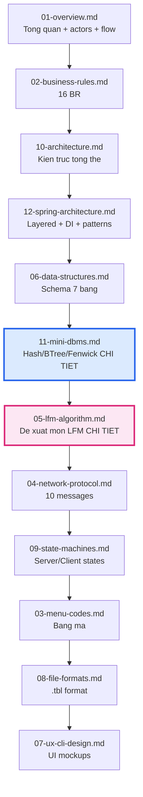
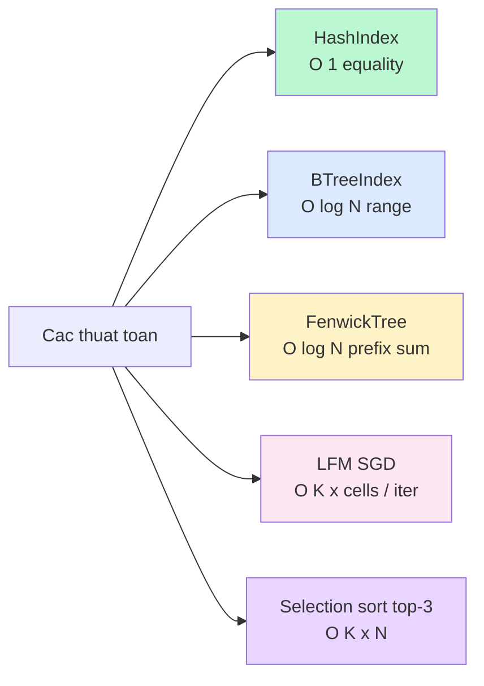

# 00 · Knowledge Base Index

Bản đồ điều hướng cho 13 file tài liệu trong [.claude/knowledge/](.).
Đối tượng đọc: thầy chấm đồ án PBL1 — DUT, đề 702.

## Đọc theo thứ tự

> **Hai tài liệu trọng tâm về thuật toán** (đậm trên sơ đồ):
> - [11-mini-dbms.md](11-mini-dbms.md) — phân tích **HashIndex / B-tree / Fenwick tree** (cấu trúc dữ liệu lưu trữ).
> - [05-lfm-algorithm.md](05-lfm-algorithm.md) — phân tích **Latent Factor Model** (thuật toán đề xuất món ăn).

## Tra cứu theo chủ đề

### Theo nghiệp vụ (đọc đề bài cần biết gì)

| Chủ đề | File | Mục gốc trong đặc tả |
|---|---|---|
| Đề tài là gì, có ai tham gia | [01-overview.md](01-overview.md) | §1, §3, §4.1 |
| 16 quy tắc nghiệp vụ (BR01–BR16) | [02-business-rules.md](02-business-rules.md) | §4.2 |
| Bảng mã món P01/B01/... | [03-menu-codes.md](03-menu-codes.md) | §2.2 |
| Mở/đóng ca, mã giao dịch | [02-business-rules.md](02-business-rules.md) §2.4 | §16, BR05–BR08 |
| Giảm giá 25% khi ≥ 2tr | [02-business-rules.md](02-business-rules.md) §2.3 | BR04 |
| Báo cáo cuối ca | [08-file-formats.md](08-file-formats.md) §8.6 | BR07 |
| UX không gõ tiếng Việt | [07-ux-cli-design.md](07-ux-cli-design.md) §7.1 | §2, BR16 |

### Theo kỹ thuật

| Chủ đề | File |
|---|---|
| Kiến trúc tổng thể | [10-architecture.md](10-architecture.md) |
| Spring-style layered + DI + patterns | [12-spring-architecture.md](12-spring-architecture.md) |
| **Thuật toán đề xuất món (LFM)** | **[05-lfm-algorithm.md](05-lfm-algorithm.md)** |
| **Thuật toán index (Hash/BTree/Fenwick)** | **[11-mini-dbms.md](11-mini-dbms.md)** |
| Schema 7 bảng + ER diagram | [06-data-structures.md](06-data-structures.md) |
| TCP protocol, 10 lệnh, sequence | [04-network-protocol.md](04-network-protocol.md) |
| State machine client + server | [09-state-machines.md](09-state-machines.md) |
| File `.tbl` format binary | [08-file-formats.md](08-file-formats.md) §8.3 |
| Mockup UI client + server | [07-ux-cli-design.md](07-ux-cli-design.md) |
| **Cách triển khai dashboard** (event flow, rebuildAggregates, BTree usage demo) | [07-ux-cli-design.md §7.5–§7.6](07-ux-cli-design.md) |

### Theo tác vụ thường gặp

| Tác vụ | File cần đọc |
|---|---|
| Thêm message protocol mới | [04-network-protocol.md](04-network-protocol.md) §4.7 + [12-spring-architecture.md](12-spring-architecture.md) §12.8.1 |
| Thêm bảng mới | [06-data-structures.md](06-data-structures.md) + [12-spring-architecture.md](12-spring-architecture.md) §12.8.2 |
| Thêm món vào menu | [03-menu-codes.md](03-menu-codes.md) §3.7 |
| Hiểu LFM training/online update | [05-lfm-algorithm.md](05-lfm-algorithm.md) §5.6 |
| Sửa logic giảm giá | [02-business-rules.md](02-business-rules.md) §2.3 (BR04) |
| Migrate format `.dat` cũ → `.tbl` | [08-file-formats.md](08-file-formats.md) §8.8 |
| Query lịch sử khách trong khoảng ngày | [11-mini-dbms.md](11-mini-dbms.md) §11.3.6 (BTree range) |
| Tùy biến Top Sellers / Top Customers panel | [07-ux-cli-design.md §7.5.3–§7.5.4](07-ux-cli-design.md) |
| Thêm IPC event mới (server → dashboard) | [07-ux-cli-design.md §7.6.2](07-ux-cli-design.md) |

## Bảng so sánh các thuật toán đã dùng

| Thuật toán | Use case | Độ phức tạp | File |
|---|---|---|---|
| **HashIndex** (separate chaining) | Login by phone, lookup menu code | O(1) avg | [11-mini-dbms.md](11-mini-dbms.md) §11.2 |
| **B-tree** (T = 31) | Range query theo user_id, ts | O(log_T N + k) | [11-mini-dbms.md](11-mini-dbms.md) §11.3 |
| **Fenwick tree** | Doanh thu lũy kế | O(log N) | [11-mini-dbms.md](11-mini-dbms.md) §11.4 |
| **Latent Factor Model + SGD** | Đề xuất món cá nhân hóa | O(K) per cell update | [05-lfm-algorithm.md](05-lfm-algorithm.md) |
| **Top-K selection sort** | Lấy top-3 gợi ý | O(K × \|I\|) | [05-lfm-algorithm.md](05-lfm-algorithm.md) §5.7 |
| **CRC32** | Schema hash | O(N) | [08-file-formats.md](08-file-formats.md) §8.3.5 |
| **FNV-1a hash** | Hash cho HashIndex | O(N) | [11-mini-dbms.md](11-mini-dbms.md) §11.2.2 |

## Tài liệu ngoài KB

| File | Vai trò |
|---|---|
| [phan-tich-du-an-702.md](../../phan-tich-du-an-702.md) | Đặc tả gốc 1117 dòng — source of truth nghiệp vụ. Đọc khi KB thiếu chi tiết. |
| [README.md](../../README.md) | Hướng dẫn build + run dự án. |
| [docs/ML_ENGINE_DESIGN.md](../../docs/ML_ENGINE_DESIGN.md) | Thiết kế ML engine sâu hơn (vòng đời model, 3 luồng update). |
| [docs/STORAGE_REFACTOR_DESIGN.md](../../docs/STORAGE_REFACTOR_DESIGN.md) | Thiết kế refactor sang mini-DBMS. |
| [matrix_factorization.py](../../matrix_factorization.py) | Reference Python implementation cho LFM. |

## Cấu trúc tài liệu — 13 file

| # | File | Tóm tắt |
|---|---|---|
| 00 | [00-index.md](00-index.md) | (file này) — bản đồ điều hướng |
| 01 | [01-overview.md](01-overview.md) | Tổng quan đề tài, actors, flow chính |
| 02 | [02-business-rules.md](02-business-rules.md) | 16 BR + flowchart Mermaid |
| 03 | [03-menu-codes.md](03-menu-codes.md) | Bảng mã món, validation, broadcast |
| 04 | [04-network-protocol.md](04-network-protocol.md) | 10 messages, format, sequence diagrams |
| 05 | [05-lfm-algorithm.md](05-lfm-algorithm.md) | **Thuật toán đề xuất món (LFM)** |
| 06 | [06-data-structures.md](06-data-structures.md) | Schema 7 bảng, ER diagram |
| 07 | [07-ux-cli-design.md](07-ux-cli-design.md) | Mockup UI client + server |
| 08 | [08-file-formats.md](08-file-formats.md) | Format `.tbl`, log, report |
| 09 | [09-state-machines.md](09-state-machines.md) | State machines client + server |
| 10 | [10-architecture.md](10-architecture.md) | Kiến trúc tổng + cây thư mục |
| 11 | [11-mini-dbms.md](11-mini-dbms.md) | **Thuật toán index — Hash, B-tree, Fenwick** |
| 12 | [12-spring-architecture.md](12-spring-architecture.md) | Spring layered + DI + patterns |
