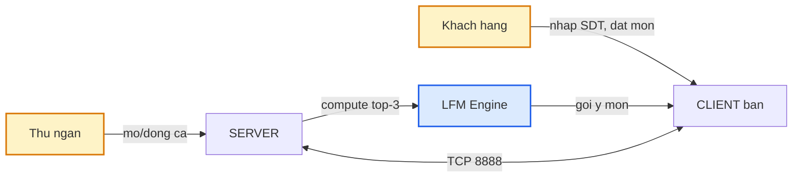
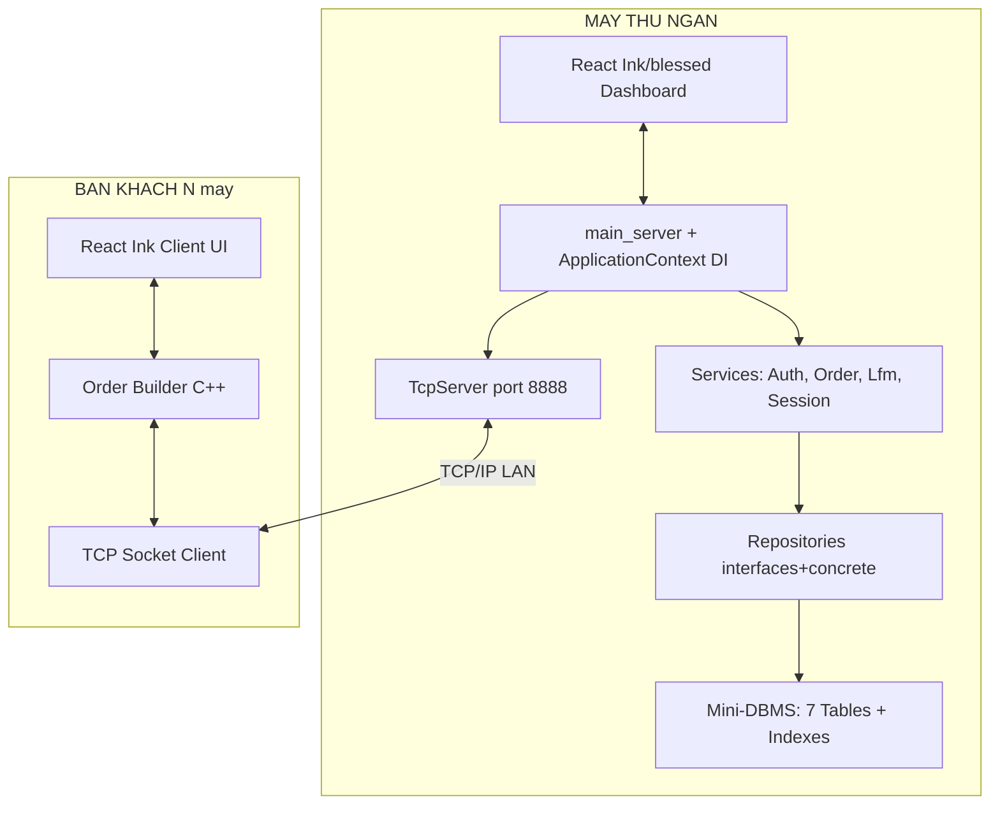
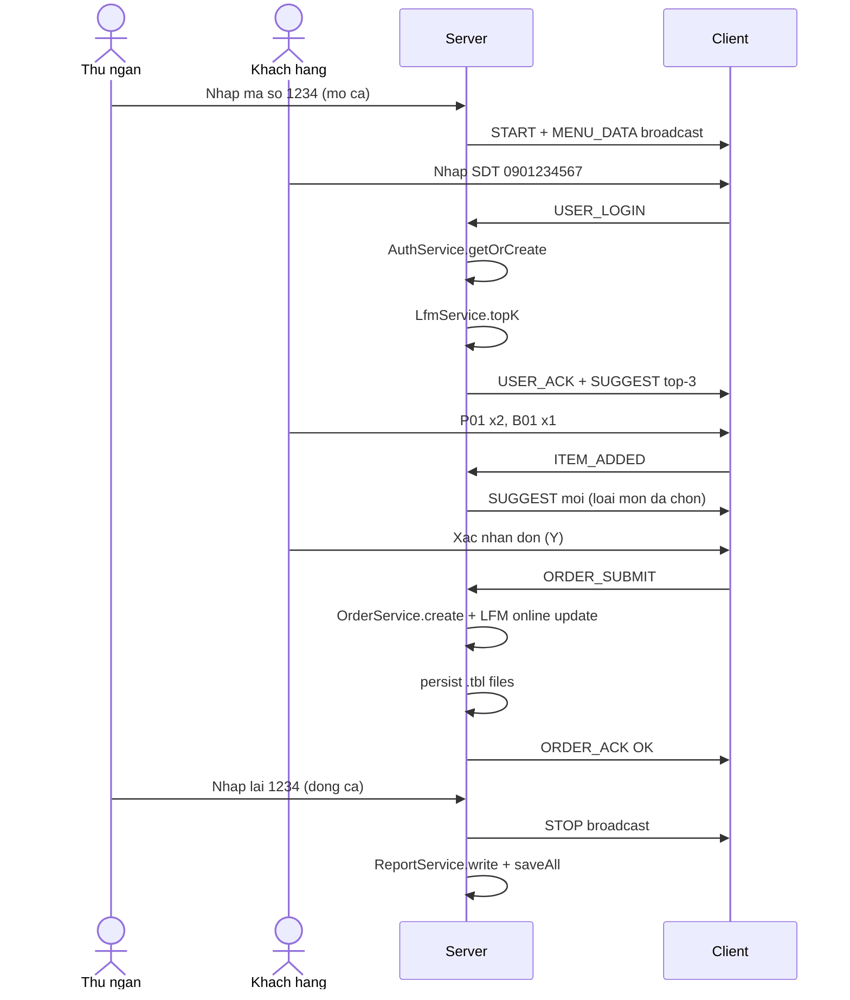

# 01 · Tổng quan dự án

## 1.1 Bối cảnh & mục tiêu

Đề tài **PBL1 — đề 702** của Trường Đại học Bách khoa Đà Nẵng yêu cầu xây dựng một
hệ thống **đặt món nhà hàng trên mạng LAN** với các đặc điểm cốt lõi:

1. Mô hình **client-server** trên TCP/IP — 1 máy thu ngân (server) + N máy bàn khách (client).
2. Lưu trữ **cục bộ trên máy** (không có DBMS bên ngoài), nhưng phải đảm bảo dữ liệu
   được persist xuyên ca và truy vấn nhanh.
3. **Cá nhân hóa gợi ý món** dựa trên lịch sử đặt hàng theo số điện thoại — sử dụng
   thuật toán **Latent Factor Model (Matrix Factorization)** với cập nhật trực tuyến.
4. Giao diện terminal sạch sẽ (React Ink) cho khách hàng, dashboard quản trị
   (blessed-contrib) cho thu ngân.

| Thuộc tính | Nội dung |
|---|---|
| Tên dự án | Restaurant Ordering System — LFM Recommendations |
| Mã đề | 702 (DUT) |
| Ngôn ngữ chính | C++17 (core, socket, ML, mini-DBMS) |
| Giao diện | React Ink + blessed-contrib (Node.js 18+) |
| Lưu trữ | **Mini-DBMS tự xây** — Tables + B-tree/Hash/Fenwick indexes, persistence `.tbl` |
| Kiến trúc | **Spring-style layered** — Controller → Service → Repository → Database |
| ML | **Latent Factor Model** (Matrix Factorization, K=10, SGD online) |
| Xác thực | Số điện thoại 10 chữ số → `user_id` cho LFM |
| Build | CMake 3.15+, MinGW-W64 trên Windows |

## 1.2 Ba actor chính

| Actor | Vai trò | Vị trí |
|---|---|---|
| **Thu ngân** | Mở/đóng ca, theo dõi đơn live, đóng ca xuất báo cáo | Máy server |
| **Khách hàng** | Đăng nhập SDT, chọn món, nhận hóa đơn | Máy bàn (client) |
| **Latent Factor Engine** | Học từ lịch sử, gợi ý top-3 món | Chạy trong server |

## 1.3 Kiến trúc rút gọn

Chi tiết các tầng xem [10-architecture.md](10-architecture.md) và [12-spring-architecture.md](12-spring-architecture.md).

## 1.4 Flow chính (end-to-end)

## 1.5 Đóng góp kỹ thuật chính

Dự án mở rộng ra ba mảng kỹ thuật trọng tâm:

1. **Mini-DBMS thuần C++ tự cài đặt** — xem [11-mini-dbms.md](11-mini-dbms.md):
   - Bảng có schema cố định, lưu xuống file nhị phân `.tbl` với magic header + CRC32.
   - 3 cấu trúc index: **HashIndex**, **BTreeIndex**, **FenwickTree**.
   - Truy vấn theo khóa: O(1) cho equality, O(log N + k) cho range.

2. **Latent Factor Model gợi ý món ăn** — xem [05-lfm-algorithm.md](05-lfm-algorithm.md):
   - Phân rã ma trận R ≈ P · Qᵀ với K=10 chiều ẩn.
   - Implicit feedback: rating = log(1 + số lần đặt).
   - Stochastic Gradient Descent với early stopping.
   - Cập nhật trực tuyến (online learning) sau mỗi đơn.

3. **Kiến trúc Spring-style phân tầng** — xem [12-spring-architecture.md](12-spring-architecture.md):
   - Controller → Service → Repository tách biệt.
   - Dependency Injection thủ công qua ApplicationContext.
   - Interface segregation: service phụ thuộc abstract repository.

## 1.6 Cấu trúc tài liệu

| File | Nội dung |
|---|---|
| [00-index.md](00-index.md) | Bản đồ chủ đề |
| [01-overview.md](01-overview.md) | (file này) |
| [02-business-rules.md](02-business-rules.md) | 16 quy tắc nghiệp vụ + flowchart |
| [03-menu-codes.md](03-menu-codes.md) | Bảng mã món + validation |
| [04-network-protocol.md](04-network-protocol.md) | 10 message types + sequence diagram |
| [05-lfm-algorithm.md](05-lfm-algorithm.md) | **Thuật toán đề xuất món (LFM)** |
| [06-data-structures.md](06-data-structures.md) | Schema 7 bảng + ER diagram |
| [07-ux-cli-design.md](07-ux-cli-design.md) | Mockup UI + ràng buộc UX |
| [08-file-formats.md](08-file-formats.md) | `.tbl`, `.txt`, log, báo cáo |
| [09-state-machines.md](09-state-machines.md) | State machines client + server |
| [10-architecture.md](10-architecture.md) | Diagram tổng + cây thư mục |
| [11-mini-dbms.md](11-mini-dbms.md) | **Thuật toán index** chi tiết |
| [12-spring-architecture.md](12-spring-architecture.md) | Layered architecture + DI |

## 1.7 Tài liệu tham khảo

- [phan-tich-du-an-702.md](../../phan-tich-du-an-702.md) — đặc tả gốc 1117 dòng.
- [docs/ML_ENGINE_DESIGN.md](../../docs/ML_ENGINE_DESIGN.md) — thiết kế ML engine.
- [matrix_factorization.py](../../matrix_factorization.py) — tham chiếu LFM bằng Python.
- [README.md](../../README.md) — hướng dẫn build + run.
