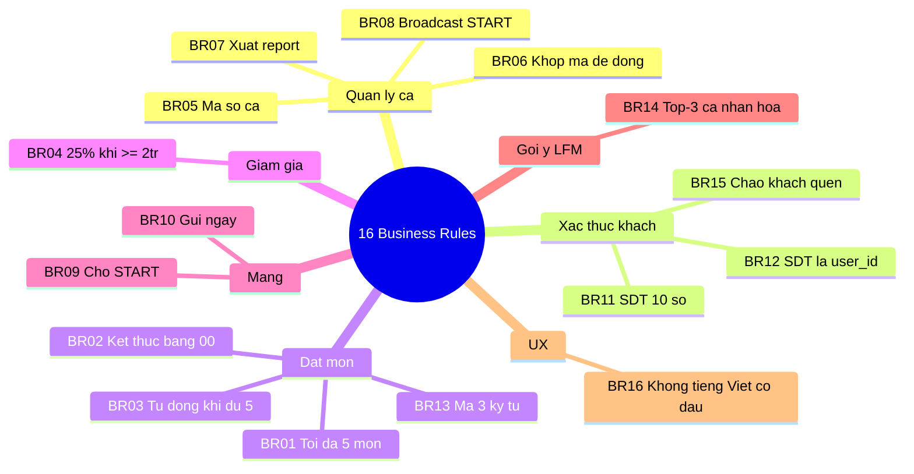
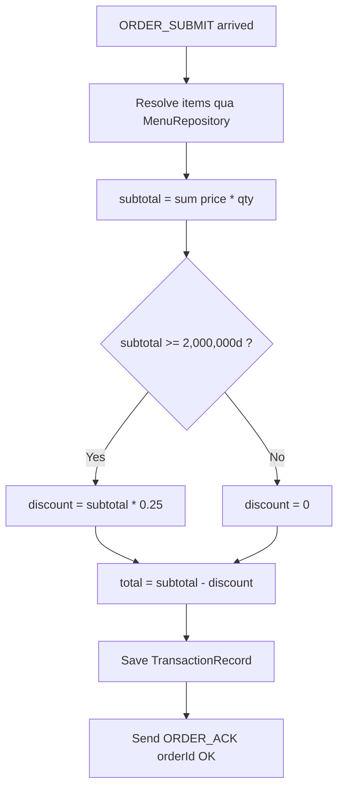
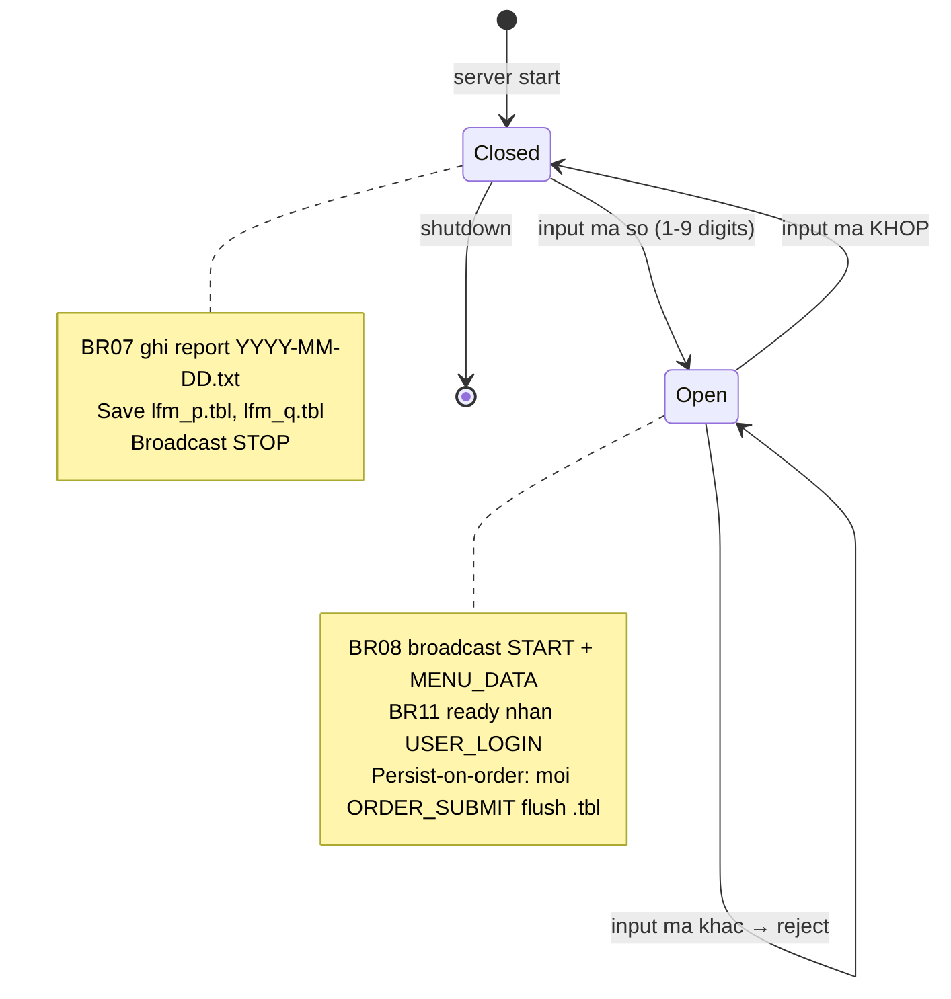
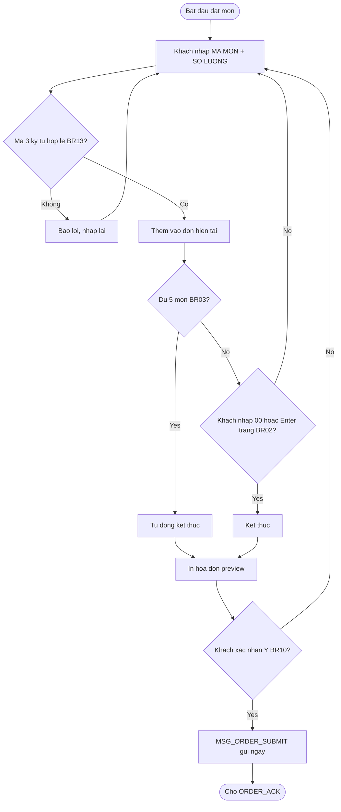

# 02 · Business Rules — Quy tắc nghiệp vụ

Toàn bộ 16 quy tắc bắt buộc theo đặc tả [phan-tich-du-an-702.md](../../phan-tich-du-an-702.md) §4.2.

## 2.1 Bảng tổng hợp 16 BR

| ID | Quy tắc | Cài đặt |
|---|---|---|
| **BR01** | Khách chỉ được đặt tối đa **5 món** mỗi đơn | `MAX_ITEMS = 5` trong [shared/constants.h](../../shared/constants.h) |
| **BR02** | Nhấn Enter trắng hoặc nhập `00` để kết thúc chọn món | [client/input_handler.cpp](../../client/input_handler.cpp) |
| **BR03** | Đủ 5 món → tự động kết thúc, in hóa đơn ngay | OrderBuilder client-side |
| **BR04** | Tổng đơn ≥ 2.000.000đ → giảm **25%** | `OrderService::computeDiscount` |
| **BR05** | Ca làm việc định danh bằng **mã số** (1–9 chữ số) | `SessionService::open` |
| **BR06** | Đóng ca: nhập lại đúng mã số đã mở | `SessionService::close` |
| **BR07** | Toàn bộ đơn ghi ra file khi kết thúc ca | `ReportService::writeForCurrentSession` |
| **BR08** | Server nhận mã giao dịch → broadcast `START` tới tất cả Client | `SessionLifecycle::start` |
| **BR09** | Client **chỉ hoạt động** sau khi nhận tín hiệu `START` | Client state machine |
| **BR10** | Mỗi đơn từ Client gửi về Server **ngay lập tức** qua TCP | `MSG_ORDER_SUBMIT` |
| **BR11** | Khách phải nhập **SDT 10 chữ số** trước khi đặt món | `AuthService::isValidPhone` |
| **BR12** | SDT là **`user_id`** trong LFM, lưu xuyên ca | `users` table — HashIndex(phone) UNIQUE |
| **BR13** | Món có **mã 3 ký tự** (P01, B02...) | `MenuService::isValidCode` |
| **BR14** | Gợi ý món dùng **LFM** — cá nhân hóa theo SDT | `LfmService::topK` |
| **BR15** | Tra SDT → chào khách quen + gợi ý thông minh hơn | `AuthController::handleLogin` |
| **BR16** | Mọi input chỉ dùng **số** + **ASCII không dấu** | UI client validate |

## 2.2 Phân nhóm theo chức năng

## 2.3 Flowchart: Discount logic (BR04)

## 2.4 State machine: Mở/đóng ca (BR05–BR08)

## 2.5 Flowchart: Đặt món (BR01–BR03, BR13)

## 2.6 Validation summary (BR11, BR13, BR16)

| Field | Quy tắc | Code reference |
|---|---|---|
| SDT | 10 chữ số, bắt đầu '0', ASCII | `AuthService::isValidPhone` |
| Mã món | 3 ký tự: prefix [PBCGADT] + 2 chữ số + tồn tại trong menu | `MenuService::isValidCode` |
| Số lượng | Số nguyên dương ≤ 99 | `OrderController::handleOrderSubmit` |
| Mã ca | 1–9 ký tự, không trống | `SessionService::open` |
| Tên khách | ASCII no diacritics ≤ 39 ký tự | `AuthController::handleRegister` |

**BR16 — Lý do "ASCII only":** Terminal Windows mặc định không hỗ trợ Unicode đầy đủ; ép input ASCII tránh
được bug rendering, đảm bảo hash của SDT/code chính xác và file binary `.tbl` không cần lo encoding.
UI client vẫn hiển thị tiếng Việt có dấu cho khách (vd "Phở Bò"), nhưng input chỉ là số/ASCII.
