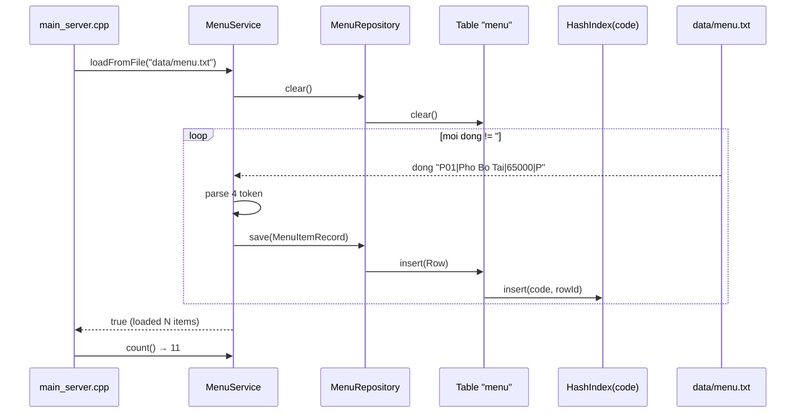

# 03 · Bảng mã món

## 3.1 Quy tắc mã

Mã món gồm **3 ký tự ASCII**: `[Prefix][2 chữ số]`. Cấu trúc này được chọn vì:
- Ngắn gọn, dễ gõ trên bàn phím số.
- Prefix nhóm hiển thị trực quan (P = Phở, B = Bún...).
- Cố định 3 byte → schema `STR(4)` (3 + null) trong bảng `menu`.

| Prefix | Nhóm | Số món tối đa khả dụng |
|---|---|---|
| `P` | Phở | P01–P99 |
| `B` | Bún | B01–B99 |
| `C` | Cơm | C01–C99 |
| `G` | Gỏi | G01–G99 |
| `A` | Ăn vặt | A01–A99 |
| `D` | Đồ uống | D01–D99 |
| `T` | Tráng miệng | T01–T99 |

## 3.2 Bảng 11 món chuẩn (data/menu.txt hiện tại)

| Mã | Tên món | Đơn giá |
|---|---|---|
| `P01` | Phở Bò Tái | 65.000đ |
| `P02` | Phở Gà | 55.000đ |
| `B01` | Bún Bò Huế | 60.000đ |
| `B02` | Bún Riêu | 55.000đ |
| `C01` | Cơm Tấm Sườn Bì | 75.000đ |
| `C02` | Cơm Chiên Dương Châu | 65.000đ |
| `G01` | Gỏi Cuốn (5 cuốn) | 55.000đ |
| `A01` | Chả Giò (10 cái) | 80.000đ |
| `D01` | Trà Đá | 15.000đ |
| `D02` | Nước Ngọt | 20.000đ |
| `T01` | Chè Ba Màu | 25.000đ |

## 3.3 Format `data/menu.txt`

Mỗi dòng 1 món: `MA|TEN|GIA|CATEGORY`

```
# data/menu.txt — Comment dong dau bang #
P01|Pho Bo Tai|65000|P
P02|Pho Ga|55000|P
B01|Bun Bo Hue|60000|B
...
```

Tên có dấu được ghi nguyên văn (ví dụ `Pho Bo Tai` — viết không dấu để hiển thị đẹp trên terminal Windows).
File này là **input tĩnh** — không bị ghi đè bởi server. Chỉ thay đổi khi cập nhật menu thủ công.

## 3.4 Quy trình validate mã món

```mermaid
flowchart TD
    A[Input code] --> B{strlen == 3?}
    B -- No --> X[INVALID]
    B -- Yes --> C{prefix in PBCGADT?}
    C -- No --> X
    C -- Yes --> D{code[1], code[2] are digits?}
    D -- No --> X
    D -- Yes --> E["MenuRepository.findByCode(code)"]
    E --> F{Found in HashIndex?}
    F -- No --> X
    F -- Yes --> Y[VALID]
```

Cài đặt: [server/services/menu_service.cpp](../../server/services/menu_service.cpp) `MenuService::isValidCode`.
Tra cứu trong HashIndex(code) → **O(1)** thời gian.

## 3.5 Sơ đồ dataflow khi load menu



## 3.6 Broadcast MENU_DATA

Khi mở ca, server broadcast danh sách menu cho mọi client. Format payload (xem [04-network-protocol.md](04-network-protocol.md)):

```
P01,Pho Bo Tai,65000|P02,Pho Ga,55000|B01,Bun Bo Hue,60000|...
```

- Phần ngăn cách giữa các món: `|`
- Phần ngăn cách trong 1 món: `,`
- Server gọi `MenuService::serializeForBroadcast()`.

Phía client, `applyMenuData(payload)` parse và **đồng thời** insert vào menu table cục bộ (vì
client cũng dùng HashIndex để validate code khi khách nhập).

## 3.7 Khi thêm món mới

1. Thêm dòng vào `data/menu.txt`.
2. Tăng `MAX_MENU` trong [shared/constants.h](../../shared/constants.h) nếu > 20.
3. Restart server → `loadFromFile` re-populate menu table.
4. Khi client mới connect, server tự broadcast MENU_DATA cập nhật.
5. **LFM:** vector `Q[itemIdx]` cho món mới sẽ random init khi `LfmService::initRandom`.
   Sau khi có vài đơn chứa món mới, online SGD sẽ học vector phù hợp.
