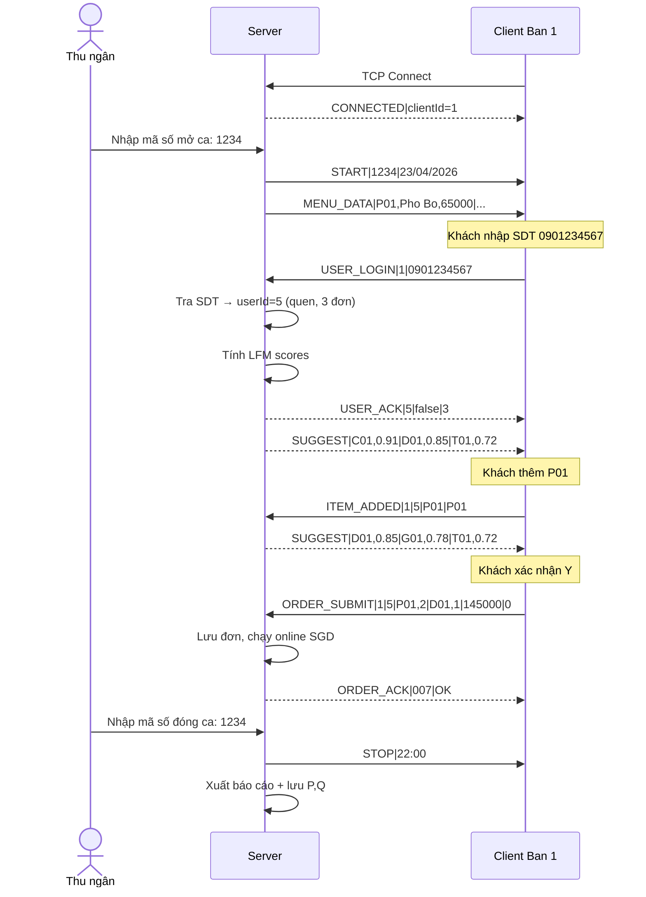

# 04 · Network Protocol

Nguồn: [phan-tich-du-an-702.md](../../phan-tich-du-an-702.md) §8.

## Format tin nhắn

```
[LOAI_LENH]|[NOI_DUNG]\n
```

- Delimiter field: `|`
- Terminator message: `\n`
- Encoding: ASCII (không Vietnamese có dấu trong payload)
- Port mặc định: **8888**

## Bảng 10 lệnh đầy đủ

### Server → Client

| Lệnh | Nội dung | Mô tả |
|---|---|---|
| `START` | `sessionCode\|dateTime` | Mở ca, Client bắt đầu hoạt động |
| `MENU_DATA` | `P01,Pho Bo,65000\|B01,Bun Bo,60000\|...` | Gửi danh sách menu |
| `USER_ACK` | `userId\|isNew\|orderCount\|name` | Xác nhận SDT + info khách (`name` rỗng nếu chưa đăng ký) |
| `SUGGEST` | `P01,0.92\|D01,0.87\|G01,0.71` | Top-3 gợi ý từ LFM (chỉ gửi khi khách đã có tên) |
| `ORDER_ACK` | `orderId\|OK` | Xác nhận đã nhận đơn |
| `STOP` | `dateTime` | Đóng ca |

### Client → Server

| Lệnh | Nội dung | Mô tả |
|---|---|---|
| `USER_LOGIN` | `clientId\|phoneNumber` | Khách nhập SDT |
| `USER_REGISTER` | `clientId\|phone\|name\|desc` | Khách mới gửi tên (ASCII bắt buộc) + mô tả (tùy chọn, có thể rỗng) |
| `ITEM_ADDED` | `clientId\|userId\|itemCode\|currentCodes` | Khách thêm 1 món (trigger gợi ý lại) |
| `ORDER_SUBMIT` | `clientId\|userId\|P01,2\|D01,1\|total\|discount` | Đơn hoàn chỉnh |
| `HEARTBEAT` | `clientId\|timestamp` | Kiểm tra kết nối mỗi 5s |

### Luồng đăng ký khách mới

1. `USER_LOGIN|1|0901234567` → server phát hiện `userName[userId][0]==0` → trả `USER_ACK|5|true|0|` (name rỗng).
2. Client thấy `isNew=true` → hiển thị `NameInput.jsx` → người dùng nhập tên + (tùy chọn) mô tả.
3. `USER_REGISTER|1|0901234567|Nguyen Van A|Dan van phong` → server `setUserName()` + `saveUsers()` → trả `USER_ACK|5|false|0|Nguyen Van A` + `SUGGEST`.
4. Lần login sau (kể cả session khác), `isNew=false` luôn (vì userName đã có) → bỏ qua NameInput.

## Sequence diagram tiêu biểu



## Parser skeleton (C++)

```cpp
// shared/protocol.h
enum MsgType {
    MSG_UNKNOWN = 0,
    MSG_START, MSG_STOP, MSG_MENU_DATA, MSG_USER_ACK,
    MSG_SUGGEST, MSG_ORDER_ACK,
    MSG_USER_LOGIN, MSG_ITEM_ADDED, MSG_ORDER_SUBMIT, MSG_HEARTBEAT,
    MSG_USER_REGISTER
};

struct ParsedMsg {
    MsgType type;
    char    payload[1024];   // phần sau dấu '|' đầu tiên
};

// Trả về false nếu raw không kết thúc bằng '\n' hoặc format sai.
bool parseMessage(const char* raw, ParsedMsg* out);

// Build string "TYPE|payload\n" vào buffer.
int buildMessage(MsgType type, const char* payload, char* out, int outCap);
```

## Nguyên tắc triển khai

1. **Receiver phải buffer** cho đến khi gặp `\n` mới parse — không giả định `recv()` trả về đủ 1 message.
2. **Không trust Client** — server validate lại:
   - SDT: 10 chữ số, bắt đầu `0`.
   - Mã món: tồn tại trong `menuCode[]`.
   - Số lượng: > 0, ≤ 99.
   - Tổng ≤ 5 món / đơn.
3. **Session gate (defense-in-depth):** Mọi handler ngoại trừ `HEARTBEAT` check `isSessionOpen()` ngay đầu vào — drop silent hoặc trả `FAIL` nếu session chưa mở. Xem [09-state-machines.md](09-state-machines.md).
4. **Heartbeat timeout:** nếu > 15s không nhận heartbeat từ một Client → đánh dấu disconnected.
5. **Reconnect:** Client tự retry connect 3 lần cách nhau 2s nếu socket đứt.
6. **Order response order:** `USER_ACK` luôn gửi **trước** `SUGGEST` (Client chờ userId trước khi hiển thị panel gợi ý). Với khách mới (`isNew=true`), **SUGGEST không gửi ngay** — phải đợi `USER_REGISTER` xong mới gửi `USER_ACK` mới + `SUGGEST`.
7. **Persist-on-order:** Server gọi `saveTransactions + saveUsers` ngay sau mỗi `ORDER_SUBMIT` thành công để dashboard đọc được dữ liệu live xuyên phiên.

## Khi thêm lệnh mới

Cập nhật đồng thời:
- [04-network-protocol.md](04-network-protocol.md) (file này)
- `shared/protocol.h` — thêm enum + struct payload
- `server/socket_server.cpp` — thêm handler
- `client/socket_client.cpp` — thêm sender / listener
