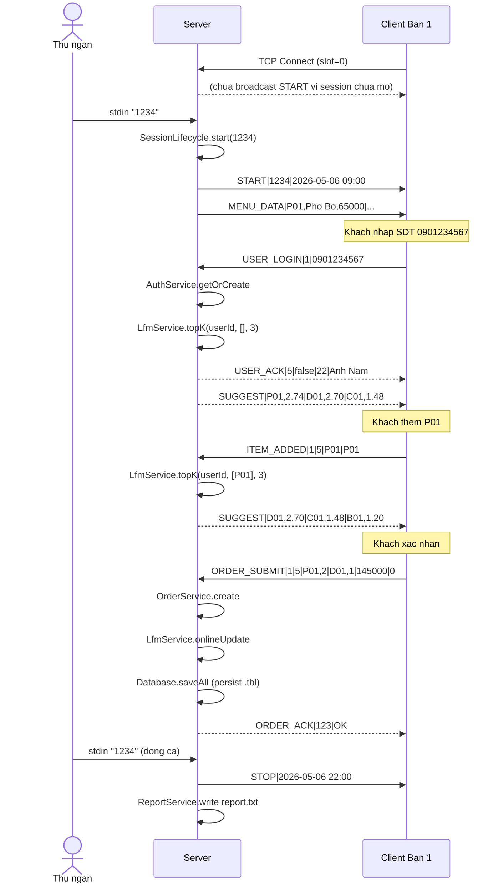
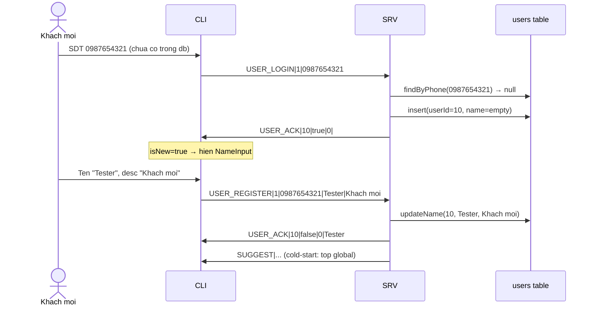
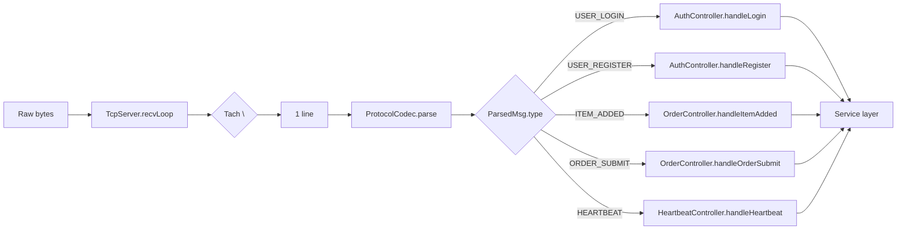

# 04 · Network Protocol

Giao thức trao đổi giữa Server và Client trên TCP/IP cổng **8888**.

## 4.1 Format thông điệp

```
[LOAI_LENH]|[NOI_DUNG]\n
```

| Đặc trưng | Giá trị |
|---|---|
| Encoding | ASCII (không Vietnamese có dấu trong payload) |
| Field separator (trong nội dung) | `|` |
| Message terminator | `\n` (LF) |
| Max length 1 message | 2048 bytes |
| Port mặc định | 8888 |

### Lý do chọn dạng text-line

- Đơn giản để debug (`netcat`, `telnet` đọc được).
- `\n` framing dễ tách ra khỏi TCP stream (đỉ ốt buffer cho đến khi gặp newline).
- Không cần thư viện serialization (Protocol Buffers, FlatBuffers...) — phù hợp ràng buộc đề bài.

## 4.2 Bảng 11 lệnh đầy đủ

### 4.2.1 Server → Client

| Lệnh | Payload | Mô tả |
|---|---|---|
| `START` | `sessionCode\|dateTime` | Mở ca → client bắt đầu hoạt động |
| `MENU_DATA` | `P01,Pho Bo,65000\|B01,Bun Bo,60000\|...` | Danh sách menu |
| `USER_ACK` | `userId\|isNew\|orderCount\|name` | Xác nhận login |
| `SUGGEST` | `P01,0.92\|D01,0.87\|G01,0.71` | Top-3 gợi ý LFM |
| `ORDER_ACK` | `orderId\|OK` hoặc `0\|FAIL` | Phản hồi submit |
| `STOP` | `dateTime` | Đóng ca |

### 4.2.2 Client → Server

| Lệnh | Payload | Mô tả |
|---|---|---|
| `USER_LOGIN` | `clientId\|phoneNumber` | Khách nhập SDT |
| `USER_REGISTER` | `clientId\|phone\|name\|desc` | Khách mới đăng ký tên |
| `ITEM_ADDED` | `clientId\|userId\|itemCode\|currentCodes` | Trigger gợi ý lại |
| `ORDER_SUBMIT` | `clientId\|userId\|P01,2\|D01,1\|total\|discount` | Đơn hoàn chỉnh |
| `HEARTBEAT` | `clientId\|timestamp` | Kiểm tra kết nối (5s/lần) |

## 4.3 Sequence diagram tiêu biểu

### 4.3.1 Khách quen đặt món



### 4.3.2 Khách mới đăng ký



## 4.4 Parser implementation

[shared/protocol.cpp](../../shared/protocol.cpp) cung cấp 2 hàm chính:

```cpp
bool parseMessage(const char* raw, ParsedMsg* out);
int  buildMessage(MsgType type, const char* payload, char* out, int cap);
```

`ParsedMsg` struct:

```cpp
struct ParsedMsg {
    MsgType type;          // enum MsgType
    char    payload[1024]; // phan sau dau '|' dau tien
};
```

Wrapper OOP cho codec ở [server/network/protocol_codec.h](../../server/network/protocol_codec.h)
(class `ProtocolCodec`).

## 4.5 Routing trên server



Cài đặt routing: [server/network/message_router.cpp](../../server/network/message_router.cpp).

## 4.6 Nguyên tắc triển khai

| Quy tắc | Lý do |
|---|---|
| **Receiver phải buffer đến `\n`** | TCP có thể chia 1 message thành nhiều `recv()` |
| **Server không trust Client** | Validate SDT, mã món, số lượng, max items mỗi đơn |
| **Session gate** | Mọi handler ≠ HEARTBEAT phải kiểm tra `sessionService.isOpen()` |
| **Heartbeat timeout 15s** | Không nhận heartbeat sau 15s → đánh dấu disconnect |
| **Reconnect 3 lần** | Client tự retry connect với khoảng cách 2s |
| **Order response order** | `USER_ACK` luôn gửi **trước** `SUGGEST` |
| **Persist-on-order** | Sau mỗi `ORDER_SUBMIT` thành công, server gọi `Database.saveAll` |

## 4.7 Khi thêm lệnh mới

Cập nhật đồng bộ:

1. [shared/protocol.h](../../shared/protocol.h) — thêm enum value
2. [shared/protocol.cpp](../../shared/protocol.cpp) — thêm tên vào `NAMES[]`
3. [server/network/message_router.cpp](../../server/network/message_router.cpp) — thêm case
4. Tạo handler trong controller phù hợp
5. Cập nhật file này (04-network-protocol.md)
