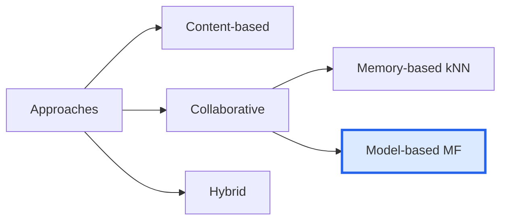
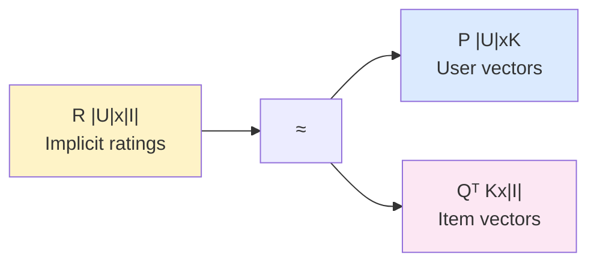
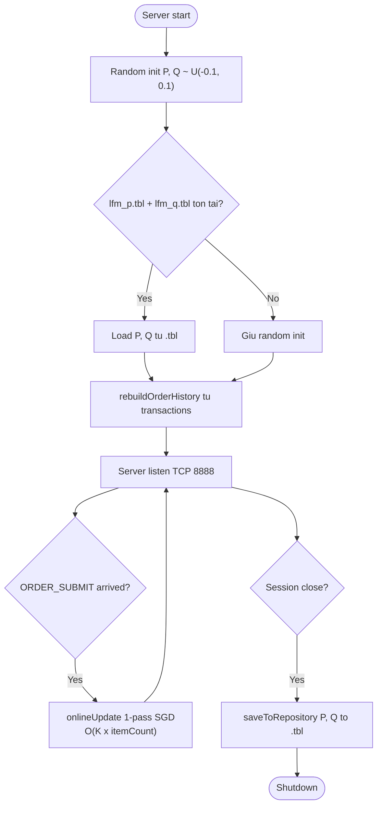
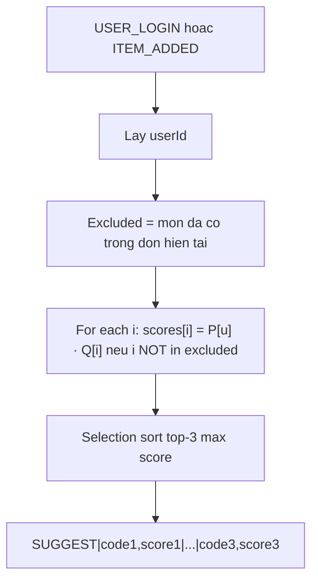

# 05 · Latent Factor Model — Thuật toán đề xuất món ăn

> **Đây là phần đề xuất (recommendation engine) của hệ thống.**
> Mục tiêu: với mỗi khách hàng (định danh bằng SDT), gợi ý top-K món ăn phù hợp
> nhất dựa trên lịch sử đặt hàng cá nhân + mô hình học cộng đồng.

## 5.1 Bài toán đề xuất

Cho:
- Tập **U** = {khách hàng}, kích thước |U|.
- Tập **I** = {món ăn}, kích thước |I|.
- Ma trận tương tác **R ∈ ℝ^(|U|×|I|)**, trong đó `R[u][i]` mô tả mức độ thích món `i` của khách `u`.

Đầu ra: với mỗi khách `u`, chọn ra **K món** chưa được khách thêm vào đơn hiện tại có
giá trị `R̂[u][i]` cao nhất.

Đặc thù dự án:
- **Implicit feedback**: không có hệ thống đánh sao 1–5; chỉ có lượt khách đặt món.
- **Sparse**: ma trận R rất thưa — đa số khách chỉ đặt vài món.
- **Cold start**: khách mới (P[u] chưa học) cần xử lý riêng.
- **Streaming**: dữ liệu mới phát sinh sau mỗi đơn — cần cập nhật incremental.

## 5.2 Tại sao chọn Latent Factor Model?



| Phương pháp | Ưu | Nhược | Phù hợp dự án? |
|---|---|---|---|
| **Content-based** | Không cần lịch sử, dùng feature món | Cần tagging features | ❌ menu chỉ có code+price |
| **Memory-based (kNN)** | Đơn giản, dễ giải thích | O(\|U\|²) similarity | ❌ với 1000 user là 10⁶ phép tính |
| **Latent Factor (MF)** | Sparse-friendly, scale O(K·(U+I)) | Cần tuning hyperparam | ✅ chọn |

**LFM phù hợp** vì:

1. Nhỏ gọn — mỗi user/item chỉ K=10 floats → 40 bytes.
2. Online update O(K) per (u,i) cell — cập nhật ngay sau mỗi đơn.
3. Khám phá pattern không hiển nhiên (vd "khách thích Phở thường thích Trà Đá").
4. Reference Python code có sẵn — dễ port sang C++.

## 5.3 Mô hình toán học

Phân rã ma trận tương tác **R** thành 2 ma trận latent:

```
R [|U|×|I|]  ≈  P [|U|×K]  ·  Qᵀ [K×|I|]
```



- **K** (mặc định **10**) = số chiều ẩn (latent dimensions).
- `P[u] ∈ ℝ^K` = vector latent biểu diễn sở thích của khách `u`.
- `Q[i] ∈ ℝ^K` = vector latent biểu diễn đặc trưng của món `i`.

### 5.3.1 Predict

```
R̂[u][i] = P[u] · Q[i] = Σ_{k=0..K-1} P[u][k] × Q[i][k]
```

### 5.3.2 Loss function

```
L(P, Q) = Σ_{(u,i): r_ui ≠ 0} ( r_ui − P[u]·Q[i] )²
        + λ ( ‖P‖² + ‖Q‖² )
```

Số hạng 1: bình phương sai số trên các cell đã quan sát.
Số hạng 2: L2 regularization (`λ = REG = 0.02`) chống overfit.

### 5.3.3 Suy diễn gradient

Đặt `e_ui = r_ui − P[u]·Q[i]`. Đạo hàm theo `P[u][k]`:

```
∂L/∂P[u][k] = -2 · e_ui · Q[i][k] + 2λ · P[u][k]
```

Tương tự cho `Q[i][k]`:

```
∂L/∂Q[i][k] = -2 · e_ui · P[u][k] + 2λ · Q[i][k]
```

### 5.3.4 SGD update rule

Update mỗi cell `(u, i, r_ui)` với learning rate `η = LR = 0.01` (gộp factor 2 vào):

```
e = r_ui − P[u]·Q[i]

P[u][k] ← P[u][k] + η ( e · Q[i][k] − λ · P[u][k] )
Q[i][k] ← Q[i][k] + η ( e · P[u][k] − λ · Q[i][k] )
```

**Lưu ý:** khi update đồng thời, dùng `P[u][k]` **cũ** trong công thức `Q[i][k]`
để tránh "vết loang" — xem [matrix_factorization.py:61-66](../../matrix_factorization.py#L61-L66).

## 5.4 Implicit feedback transformation

Vì không có rating sao, ta dùng:

```
r_ui = log(1 + count_ui)
```

trong đó `count_ui` = số lần khách `u` đã đặt món `i`. Hàm `log(1+x)` chọn vì:
- Kéo giá trị về scale nhỏ hợp lý.
- Phản ánh "ngưỡng giảm dần" — đặt 10 lần không gấp đôi giá trị 5 lần.
- Smooth tại 0: khi `count = 0`, `r = 0`.

| count_ui | r_ui |
|---|---|
| 0 | 0.00 |
| 1 | 0.69 |
| 2 | 1.10 |
| 5 | 1.79 |
| 10 | 2.40 |
| 22 | 3.14 |

## 5.5 Tham số mặc định

| Tham số | Ký hiệu | Giá trị | Vai trò |
|---|---|---|---|
| Latent dimensions | K | **10** | Số chiều ẩn |
| Learning rate | LR | **0.01** | Tốc độ cập nhật SGD |
| L2 regularization | REG | **0.02** | Chống overfit |
| Max iterations | MAX_ITER | **50** | Epoch tối đa khi train từ đầu |
| Patience | PATIENCE | **10** | Early stopping |
| Min delta | MIN_DELTA | **1e-4** | Ngưỡng cải thiện loss |

Định nghĩa tại [shared/constants.h](../../shared/constants.h).

## 5.6 Pipeline training



### 5.6.1 Batch training (chỉ chạy nếu retrain toàn bộ)

```cpp
for (int iter = 0; iter < maxIter; iter++) {
    for (int u = 0; u < userCount; u++) {
        for (int i = 0; i < menuCount; i++) {
            if (orderHistory_[u][i] <= 0) continue;
            float r_ui  = logf(1.0f + orderHistory_[u][i]);
            float r_hat = dot(P_[u], Q_[i], K);
            float err   = r_ui - r_hat;
            for (int k = 0; k < K; k++) {
                float p_old = P_[u][k];
                float q_old = Q_[i][k];
                P_[u][k] += LR * (err * q_old - REG * p_old);
                Q_[i][k] += LR * (err * p_old - REG * q_old);
            }
        }
    }
    float loss = computeLoss();
    if (loss < prev_loss - MIN_DELTA) prev_loss = loss;
    else if (++no_improve >= PATIENCE) break;  // early stop
}
```

Cài đặt: [server/services/lfm_service.cpp](../../server/services/lfm_service.cpp) `LfmService::trainBatch`.

### 5.6.2 Online update (sau mỗi đơn)

```cpp
void LfmService::onlineUpdate(int64_t userId,
                              const std::vector<int>& itemIndices,
                              const std::vector<int>& quantities)
{
    for (size_t idx = 0; idx < itemIndices.size(); idx++) {
        int i = itemIndices[idx];
        int newCount = orderHistory_[userId][i] + quantities[idx];
        float r_ui  = logf(1.0f + (float)newCount);
        float r_hat = dot(P_[userId], Q_[i], K);
        float err   = r_ui - r_hat;
        for (int k = 0; k < K; k++) {
            float p_old = P_[userId][k];
            float q_old = Q_[i][k];
            P_[userId][k] += LR * (err * q_old - REG * p_old);
            Q_[i][k]      += LR * (err * p_old - REG * q_old);
        }
        orderHistory_[userId][i] = newCount;
    }
}
```

**Chi phí:** O(K × itemCount). Với K=10, itemCount ≤ 5 → ~50 phép tính/đơn. Không nhận thấy độ trễ.

## 5.7 Top-K extraction

Khi cần gợi ý cho khách `u`:



Cài đặt:

```cpp
std::vector<std::pair<int64_t, float>>
LfmService::topK(int64_t userId, const std::vector<int64_t>& excluded, int topK) const
{
    bool skip[MAX_MENU] = {false};
    for (int64_t e : excluded) if (e >= 0 && e < menuCount) skip[e] = true;

    float scores[MAX_MENU] = {0};
    for (int i = 0; i < menuCount; i++)
        if (!skip[i]) scores[i] = predict(userId, i);

    bool used[MAX_MENU] = {false};
    std::vector<std::pair<int64_t, float>> out;
    for (int r = 0; r < topK; r++) {
        int   best = -1;
        float bestScore = -1e30f;
        for (int i = 0; i < menuCount; i++) {
            if (used[i] || skip[i]) continue;
            if (scores[i] > bestScore) { bestScore = scores[i]; best = i; }
        }
        if (best < 0) break;
        out.emplace_back(best, bestScore);
        used[best] = true;
    }
    return out;
}
```

**Chi phí:** O(|I| × K + topK × |I|). Với |I|=20, K=10, topK=3 → ~260 phép tính. **O(1) thực tế.**

## 5.8 Cold start

| Trường hợp | Xử lý |
|---|---|
| Khách mới, chưa từng đặt | `P[u]` random uniform [-0.1, +0.1] → score đều khá nhỏ; gợi ý gần "top phổ biến" |
| Món mới thêm | `Q[i]` random init; sau vài đơn, online SGD học vector phù hợp |
| Database rỗng | `LfmService::initRandom(seed)` random toàn bộ |

```cpp
// AuthController::handleLogin
if (isNew) lfmService_.initUserVector(userId);
sendUserAck(slot, userId, isNew, ...);
if (!isNew) sendSuggestions(slot, userId);
// Khach moi: chua goi suggestion ngay vi UI se chuyen sang NameInput.
```

## 5.9 Persistence

Hai bảng riêng cho P và Q (xem [11-mini-dbms.md](11-mini-dbms.md)):

| Bảng | Schema | Mục đích |
|---|---|---|
| `lfm_p` | `user_id INT64, vec BLOB(K*4 bytes)` | Mỗi row = 1 vector P[u] |
| `lfm_q` | `item_idx INT64, vec BLOB(K*4 bytes)` | Mỗi row = 1 vector Q[i] |

Vector `K=10` floats được pack thành **40 bytes** BLOB. HashIndex unique trên id để load nhanh.

## 5.10 Phân tích độ phức tạp

| Thao tác | Chi phí | Lý do |
|---|---|---|
| `predict(u, i)` | O(K) = O(10) | 1 dot product 2 vector K-chiều |
| `onlineUpdate` | O(K × itemCount) ≤ O(50) | 1 pass SGD trên itemCount cell |
| `topK(u, excluded, 3)` | O(\|I\| × K + 3·\|I\|) ≈ O(260) | Tính score + selection sort |
| `trainBatch(maxIter)` | O(maxIter × \|U\| × \|I\| × K) | Chạy lúc seed/migration |
| `loadFromRepository` | O(\|U\| + \|I\|) | Linear scan 2 bảng |
| `saveToRepository` | O(\|U\| + \|I\|) | Tương tự |

Với |U|=1000, |I|=20, K=10:
- 1 đơn submit: < 1ms LFM overhead.
- 1 lần gợi ý: < 1ms.
- Train từ đầu: ~50 epochs × 20k cells × 10 ops = 10M ops ≈ vài giây.

## 5.11 Demo kết quả thực tế

Sau khi seed 10 personas + ~180 transactions (lệnh `./build/seed_data.exe`):

```
TOP-3 GOI Y PREVIEW
  0901234567 (Anh Nam   ): D01 3.39, P01 3.38, C01 2.00,  ← khach Phở Bò + Trà Đá
  0912345678 (Chi Lan   ): C01 3.01, D02 2.98, G01 2.24,  ← khach Cơm Tấm + Nước Ngọt
  0923456789 (Bac Hung  ): B01 2.55, T01 2.36, B02 2.17,  ← khach Bún + Chè
  0934567890 (Chi Mai   ): G01 2.80, D02 2.70, C01 2.64,
  0945678901 (Anh Minh  ): D01 2.61, C01 2.41, P01 2.22,
  0956789012 (Co Tu     ): P02 3.14, T01 2.82, D02 2.36,  ← khach Phở Gà + Chè
  0967890123 (Anh Tuan  ): B01 2.65, D01 2.52, P01 2.43,
  0978901234 (Chi Hoa   ): C02 2.46, G01 2.39, D02 2.17,
  0989012345 (Bac Sau   ): C01 2.90, A01 2.69, D01 2.40,
  0990123456 (Anh Khoa  ): P01 1.46, D01 1.22, B01 0.80,  ← cold-start (3 don)
```

**Quan sát:**
- Mỗi khách có top-3 phản ánh đúng pattern ăn của mình.
- Anh Khoa (cold-start) có score thấp hơn hẳn (1.46 max so với 3.39 của Anh Nam) — chính xác.

## 5.12 Mapping Python → C++

| Python (`matrix_factorization.py`) | C++ (`LfmService`) | Ghi chú |
|---|---|---|
| `MatrixFactorization` (class) | `LfmService` (class) | Vẫn class trong C++ refactor |
| `fit(X)` | `trainBatch(maxIter)` | Batch SGD |
| `_online_update(cells)` | `onlineUpdate(userId, items, qty)` | Gọi mỗi `ORDER_SUBMIT` |
| `add_users(...)` | `initUserVector(userId)` | Cold-start user |
| `predict(u, i)` | `predict(userId, itemIdx)` | Public method |
| `compute_loss(X)` | `computeLoss()` | In ra cuối train |
| `np.save/load` | `saveToRepository / loadFromRepository` | Qua `LfmRepository` |

## 5.13 Hướng mở rộng

Nếu cần nâng cao chất lượng đề xuất, có thể tham khảo:

1. **Bias terms**: thêm `b_u`, `b_i`, `μ` (global mean) → `R̂ = μ + b_u + b_i + P[u]·Q[i]`.
   Cải thiện khi có user/item bias mạnh (vd khách "siêu thân thiết" hoặc món "best-seller toàn shop").
2. **ALS (Alternating Least Squares)** thay SGD: hội tụ nhanh hơn cho data dense, song song hóa tốt.
3. **BPR (Bayesian Personalized Ranking)**: tối ưu trực tiếp metric ranking thay vì squared error — phù hợp implicit feedback hơn.
4. **Hybrid với content features**: kết hợp Q[i] học được + vector category one-hot → cold-start món mới tốt hơn.

## 5.14 Tài liệu liên quan

- [matrix_factorization.py](../../matrix_factorization.py) — Python reference impl.
- [docs/ML_ENGINE_DESIGN.md](../../docs/ML_ENGINE_DESIGN.md) — thiết kế ML engine sâu hơn.
- [server/services/lfm_service.cpp](../../server/services/lfm_service.cpp) — cài đặt C++.
- [11-mini-dbms.md](11-mini-dbms.md) — bảng `lfm_p`, `lfm_q` và HashIndex.
