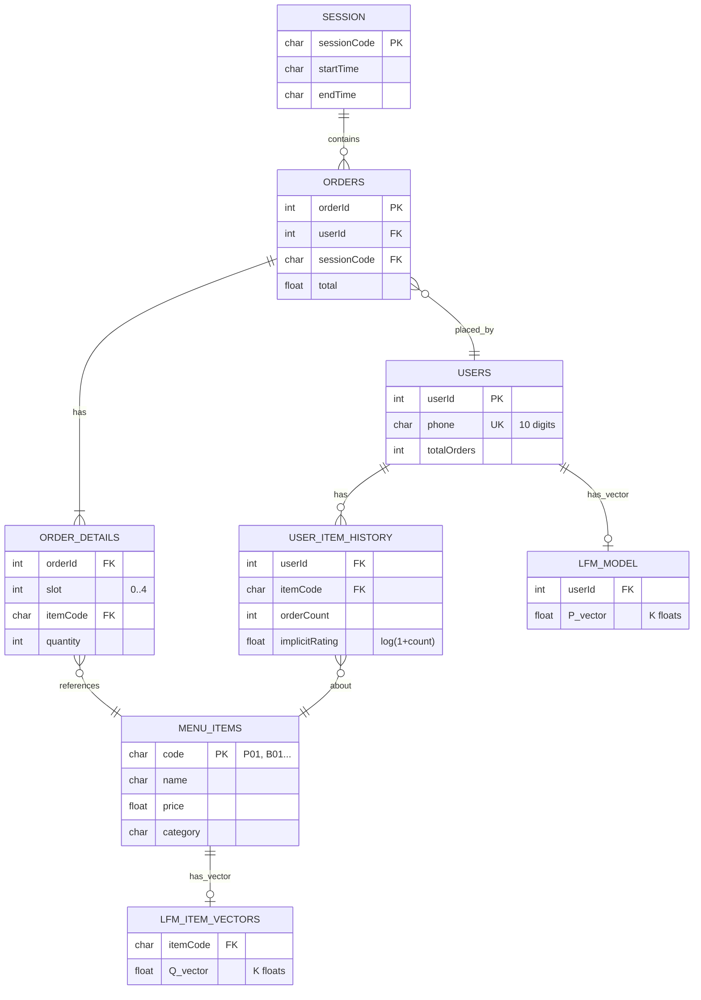

# 06 · Data Structures (Parallel Arrays)

Nguồn: [phan-tich-du-an-702.md](../../phan-tich-du-an-702.md) §11.

## Tại sao parallel arrays?

Đề bài DUT PBL1 ràng buộc dùng **C/C++ cơ bản** — không sử dụng OOP nặng (class hierarchy, STL phức tạp, `std::vector` nơi mảng tĩnh đủ dùng). Cách tổ chức:

- Mỗi "thuộc tính" của entity là 1 mảng riêng.
- Index `i` trong mọi mảng liên quan trỏ đến cùng một entity.
- Vd: `userPhone[5]` và `userTotalOrders[5]` cùng mô tả user thứ 5.

Ưu điểm: đơn giản, không cần cấp phát động, dễ serialize/deserialize ra file binary.

## Constants

```cpp
const int MAX_MENU    = 20;   // tối đa 20 món
const int MAX_ORDERS  = 1000; // tối đa 1000 đơn / ca (session-only)
const int MAX_ITEMS   = 5;    // tối đa 5 món / đơn (BR01)
const int MAX_CLIENTS = 20;   // tối đa 20 bàn
const int MAX_USERS   = 1000; // tối đa 1000 SDT khác nhau
const int MAX_TXN     = 5000; // transactions persistent xuyên ca
const int NAME_LEN    = 40;   // char buffer cho userName[]
const int DESC_LEN    = 80;   // char buffer cho userDesc[]
const int K           = 10;   // latent dimensions
const float LR        = 0.01f;
const float REG       = 0.02f;
const int   MAX_ITER  = 50;
```

## Menu

```cpp
char  menuCode[MAX_MENU][4];       // "P01\0", "B01\0"...
char  menuName[MAX_MENU][50];      // "Pho Bo Tai" (ASCII no-diacritics)
float menuPrice[MAX_MENU];
char  menuCategory[MAX_MENU];      // 'P','B','C','G','A','D','T'
int   menuCount = 0;
```

## Users (mapping SDT → userId)

```cpp
char  userPhone[MAX_USERS][11];           // "0901234567\0"
char  userName[MAX_USERS][NAME_LEN];      // "Nguyen Van A\0" — set khi dang ky
char  userDesc[MAX_USERS][DESC_LEN];      // mo ta tuy chon
int   userTotalOrders[MAX_USERS];         // số đơn lịch sử
int   userCount = 0;

// Aggregate cache: số lần user u đã đặt món i
// DERIVED tu txn*[] (rebuildOrderHistory), khong con persist truc tiep.
int   orderHistory[MAX_USERS][MAX_MENU];
```

**New user flow:**
- `getOrCreateUser(phone)` tạo user với `userName[]=""`, `userDesc[]=""`.
- Client thấy `USER_ACK.isNew=true` → hỏi tên → gửi `USER_REGISTER`.
- Server `setUserName(userId, name, desc)` + `saveUsers()`.
- Lần sau login: `isNew = (userName[userId][0] == '\0')` — nghĩa là đã có tên thì không phải mới.

## Latent Factor Model matrices

```cpp
float P[MAX_USERS][K];   // User latent matrix
float Q[MAX_MENU][K];    // Item latent matrix
```

## Orders — session-only (reset mỗi ca)

```cpp
int   orderId[MAX_ORDERS];
int   orderUserId[MAX_ORDERS];
char  orderPhone[MAX_ORDERS][11];
int   orderClientId[MAX_ORDERS];
char  orderTime[MAX_ORDERS][20];   // "2026-04-23 10:35"

// Chi tiết từng món trong đơn (parallel arrays 2D)
char  orderItemCode[MAX_ORDERS][MAX_ITEMS][4];
int   orderItemQty[MAX_ORDERS][MAX_ITEMS];
float orderItemPrice[MAX_ORDERS][MAX_ITEMS];
int   orderItemCount[MAX_ORDERS]; // số món thực tế trong đơn (≤ 5)

float orderSubtotal[MAX_ORDERS];
float orderDiscount[MAX_ORDERS];
float orderTotal[MAX_ORDERS];
int   totalOrders = 0;
```

## Transactions — persistent xuyên ca (NEW)

Source of truth cho lịch sử đặt món per-order. **Khác** `order*[]` ở trên (chỉ session). Khi `ORDER_SUBMIT`: `createOrder()` vừa populate `order*[]` (cho report cuối ca) vừa gọi `appendTransaction()` push vào `txn*[]` (persist).

```cpp
int   txnCount;
int   txnUserIdx[MAX_TXN];                 // index vào userPhone[]
char  txnTime[MAX_TXN][20];                // "2026-04-23 10:35:22"
char  txnSessionCode[MAX_TXN][10];         // mã ca
int   txnItemCount[MAX_TXN];               // 1..MAX_ITEMS
char  txnItemCode[MAX_TXN][MAX_ITEMS][4];
int   txnItemQty[MAX_TXN][MAX_ITEMS];
float txnSubtotal[MAX_TXN];
float txnDiscount[MAX_TXN];
float txnTotal[MAX_TXN];
```

**API** ([server/transaction_store.h](../../server/transaction_store.h)):
- `appendTransaction(userIdx, time, sessCode, count, codes, qtys, sub, disc, total)` → push 1 txn.
- `saveTransactions("data/transactions.dat")` / `loadTransactions(...)` — binary.
- `rebuildOrderHistory()` — scan `txn*[]` và dựng lại `orderHistory[u][i]` aggregate cho LFM.

**Life-cycle:**
- Startup: `loadUsers()` → `loadTransactions()` → `rebuildOrderHistory()` → `lfmTrain()`.
- Runtime: sau `ORDER_SUBMIT`, `appendTransaction()` được gọi; `lfmOnlineUpdate()` tiếp tục tăng `orderHistory` cache như cũ (không đụng `txn*[]` về phần cache).
- Session close: `saveTransactions("data/transactions.dat")` + `saveUsers("data/users.dat")`.

## Session

```cpp
char sessionCode[10];    // "1234"
char sessionStart[20];   // "2026-04-23 07:00"
char sessionEnd[20];
```

## ER diagram



## Quy ước index

- `userId ∈ [0, userCount)` — ID nội bộ, không phải SDT.
- `itemIdx ∈ [0, menuCount)` — index trong `menuCode[]`. Khác với `itemCode` là string.
- `orderId = totalOrders + 1` khi tạo đơn mới → cộng dồn suốt ca, reset mỗi ca.
- `clientId` là slot socket trong `clientSockets[MAX_CLIENTS]`.

## Serialize / deserialize

| Array | File | Format |
|---|---|---|
| `userPhone[]`, `userName[]`, `userDesc[]`, `userTotalOrders[]` | `data/users.dat` | Binary. `orderHistory[][]` KHÔNG còn ở đây (derived từ txns) |
| `txn*[]` (toàn bộ) | `data/transactions.dat` | Binary, persistent xuyên ca |
| Mỗi đơn (human log) | `data/transactions.log` | Text append-only, audit trail |
| `P[][]` | `data/lfm_P.dat` | Binary: `[userCount][K] × float` |
| `Q[][]` | `data/lfm_Q.dat` | Binary: `[menuCount][K] × float` |
| Toàn bộ đơn ca | `data/reports/report_YYYY-MM-DD.txt` | Text (xem [08-file-formats.md](08-file-formats.md)) |
