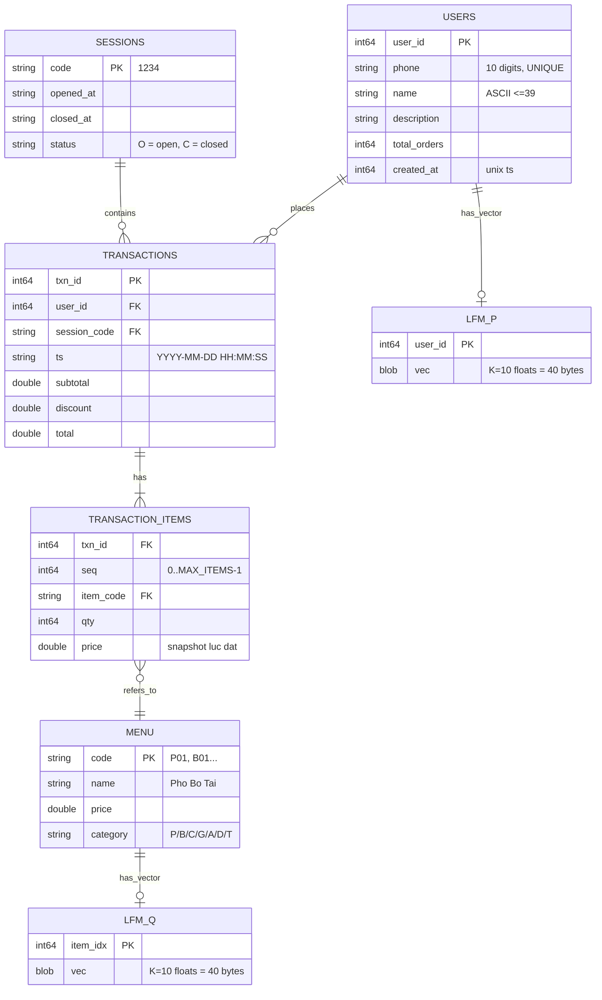
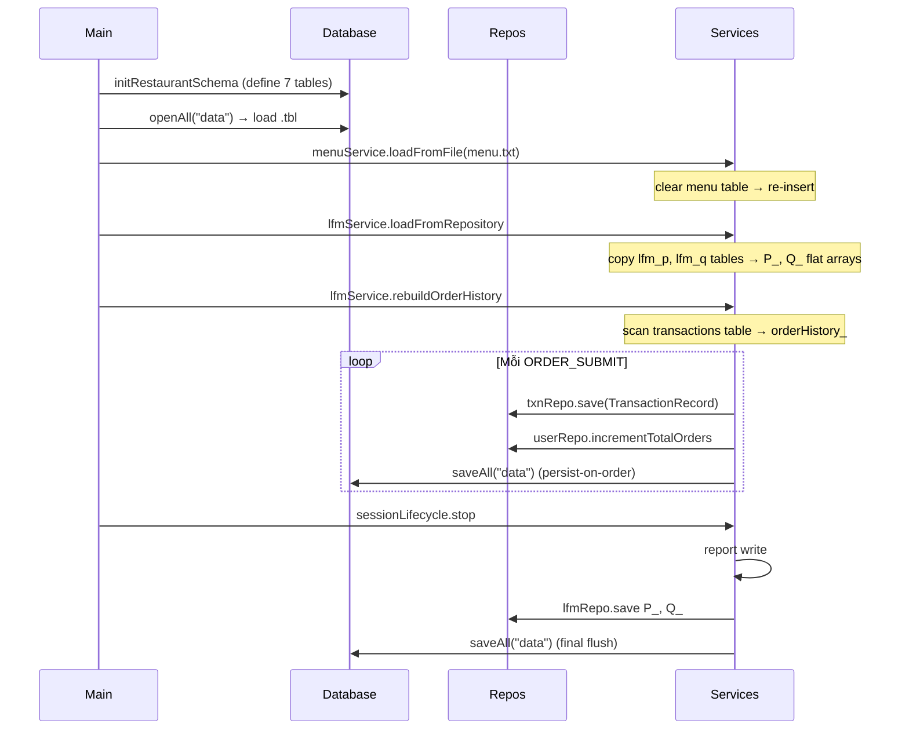

# 06 · Data Structures — Schema & ER Diagram

## 6.1 Tổng quan

Sau refactor sang mini-DBMS, dữ liệu được tổ chức thành **7 bảng** với schema cố định, lưu xuống
file nhị phân `.tbl`. Mỗi bảng có 1 hoặc nhiều index (HashIndex hoặc BTreeIndex) tùy access pattern.

Các Record struct (POJO) tương ứng với từng bảng được khai báo tại
[server/repositories/i_*_repository.h](../../server/repositories/) — đây là **plain data carriers**
(Java DTO style), không có business method.

## 6.2 Sơ đồ tổng các bảng



## 6.3 Constants

```cpp
// shared/constants.h
const int   MAX_MENU      = 20;
const int   MAX_USERS     = 1000;
const int   MAX_TXN       = 5000;
const int   MAX_ITEMS     = 5;            // BR01
const int   MAX_CLIENTS   = 20;
const int   NAME_LEN      = 40;
const int   DESC_LEN      = 80;

const int   K             = 10;            // LFM dim
const float LR            = 0.01f;
const float REG           = 0.02f;
const int   MAX_ITER      = 50;
const float MIN_DELTA     = 1e-4f;
const int   PATIENCE      = 10;

const float DISCOUNT_THRESHOLD = 2000000.0f;
const float DISCOUNT_RATE      = 0.25f;
const int   DEFAULT_PORT       = 8888;
```

## 6.4 Bảng `users` (chi tiết)

```cpp
// server/repositories/i_user_repository.h
struct UserRecord {
    int64_t     userId;       // tương ứng cột user_id
    std::string phone;        // SDT 10 chữ số
    std::string name;         // tên (rỗng nếu chưa register)
    std::string description;  // mô tả tùy chọn
    int64_t     totalOrders;  // số đơn lịch sử
    int64_t     createdAt;    // unix timestamp
};
```

**Indexes:**
- `HashIndex(user_id)` UNIQUE — tra theo userId O(1).
- `HashIndex(phone)` UNIQUE — tra theo SDT O(1) (thay linear scan cũ).

**Storage size:** 8 + 11 + 40 + 80 + 8 + 8 = **155 bytes/row**. 1000 users ≈ 155 KB.

## 6.5 Bảng `menu`

```cpp
struct MenuItemRecord {
    int64_t     menuIdx;    // == position trong table (0..count-1)
    std::string code;       // "P01"
    std::string name;       // "Pho Bo Tai"
    double      price;
    std::string category;   // 1 ký tự
};
```

**Indexes:**
- `HashIndex(code)` UNIQUE PK — `findIndexByCode("P01")` O(1).

**Storage size:** 4 + 50 + 8 + 2 = **64 bytes/row**. 20 món = ~1.3 KB.

## 6.6 Bảng `transactions` + `transaction_items` (1-N)

```cpp
struct TransactionRecord {
    int64_t                    txnId;
    int64_t                    userId;
    std::string                sessionCode;
    std::string                ts;
    double                     subtotal;
    double                     discount;
    double                     total;
    std::vector<TxnItemRecord> items;   // join sẵn từ transaction_items
};

struct TxnItemRecord {
    int64_t     txnId;
    int64_t     seq;        // 0..MAX_ITEMS-1
    std::string itemCode;
    int64_t     qty;
    double      price;      // snapshot lúc đặt
};
```

**Indexes:**

| Bảng | Cột | Loại | Mục đích |
|---|---|---|---|
| `transactions` | `txn_id` | HashIndex UNIQUE | Tra theo PK |
| `transactions` | `user_id` | **BTreeIndex** | Lịch sử đặt món của 1 SDT |
| `transactions` | `ts` | **BTreeIndex** | Báo cáo theo khoảng ngày |
| `transaction_items` | `txn_id` | **BTreeIndex** | Join 1-N nhanh |
| `transaction_items` | `item_code` | **BTreeIndex** | Top-N best sellers |

**Storage:**
- header row: 8+8+10+20+8+8+8 = **70 bytes**.
- item row: 8+8+4+8+8 = **36 bytes**.
- 5000 txns × 70 + 5000×3 items × 36 ≈ 350 KB + 540 KB = **890 KB**.

## 6.7 Bảng `lfm_p` / `lfm_q`

```cpp
struct LfmVectorRecord {
    int64_t            id;     // user_id hoặc item_idx
    std::vector<float> vec;    // length = K = 10
};
```

**Indexes:**
- `HashIndex(user_id)` / `HashIndex(item_idx)` UNIQUE.

**Storage:** 8 + 40 = **48 bytes/row**. 1000 users + 20 items ≈ 49 KB.

## 6.8 Bảng `sessions`

```cpp
struct SessionRecord {
    std::string code;        // "1234"
    std::string openedAt;
    std::string closedAt;
    std::string status;      // "O" hoặc "C"
};
```

**Indexes:**
- `HashIndex(code)` UNIQUE PK.
- `BTreeIndex(opened_at)` — báo cáo theo khoảng thời gian.

**Storage:** 10 + 20 + 20 + 2 = **52 bytes/row**.

## 6.9 In-RAM hot caches (LfmService)

Cho hiệu năng training, `LfmService` giữ thêm 3 mảng phẳng làm cache (sync với tables):

```cpp
// server/services/lfm_service.h
class LfmService {
    float P_[MAX_USERS][K];                // mirror lfm_p
    float Q_[MAX_MENU][K];                 // mirror lfm_q
    int   orderHistory_[MAX_USERS][MAX_MENU];  // aggregate đếm rebuilt
    ...
};
```

| Mảng | Kích thước | Persistence |
|---|---|---|
| `P_` | 1000×10×4 = 40 KB | sync ↔ `lfm_p` table |
| `Q_` | 20×10×4 = 0.8 KB | sync ↔ `lfm_q` table |
| `orderHistory_` | 1000×20×4 = 80 KB | derived từ `transactions` qua `rebuildOrderHistory()` |

`orderHistory_` không persist trực tiếp — luôn rebuild lúc startup từ transactions
để tránh inconsistency.

## 6.10 Quy ước index nội bộ

- `userId ∈ [0, userCount)` — assigned tuần tự khi `getOrCreate(phone)` trả userId mới.
- `menuIdx ∈ [0, menuCount)` — chính là `RowId` trong bảng `menu` sau khi load.
- `txnId ∈ [0, txnCount)` — assigned bởi `TransactionRepository::nextTxnId()`.
- `clientId` ≠ `userId`: `clientId` = slot socket trong TcpServer; `userId` = bảng users.

## 6.11 Mapping bảng → file `.tbl`

| Bảng | File | Persistent |
|---|---|---|
| `menu` | `data/menu.tbl` | mirror `data/menu.txt` (input ưu tiên) |
| `users` | `data/users.tbl` | ✅ |
| `transactions` | `data/transactions.tbl` | ✅ |
| `transaction_items` | `data/transaction_items.tbl` | ✅ |
| `lfm_p` | `data/lfm_p.tbl` | ✅ |
| `lfm_q` | `data/lfm_q.tbl` | ✅ |
| `sessions` | `data/sessions.tbl` | ✅ |

Format chi tiết xem [08-file-formats.md](08-file-formats.md).

## 6.12 Vòng đời dữ liệu


