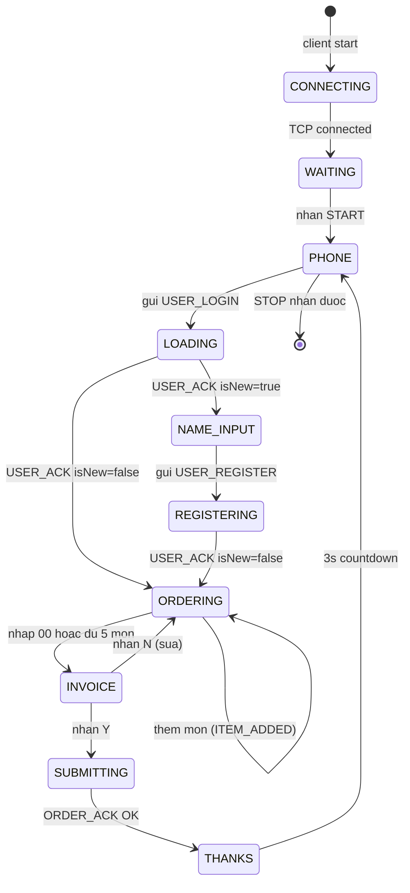
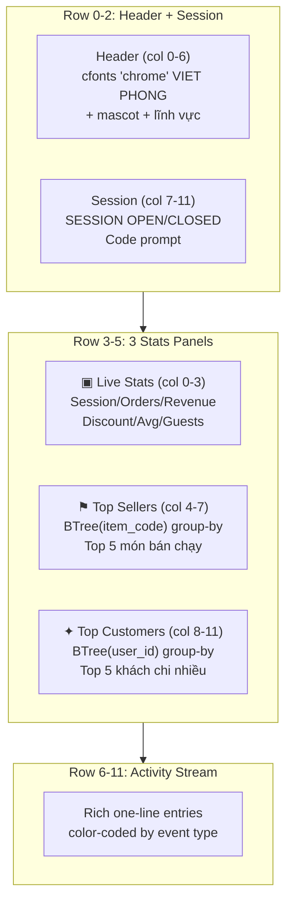
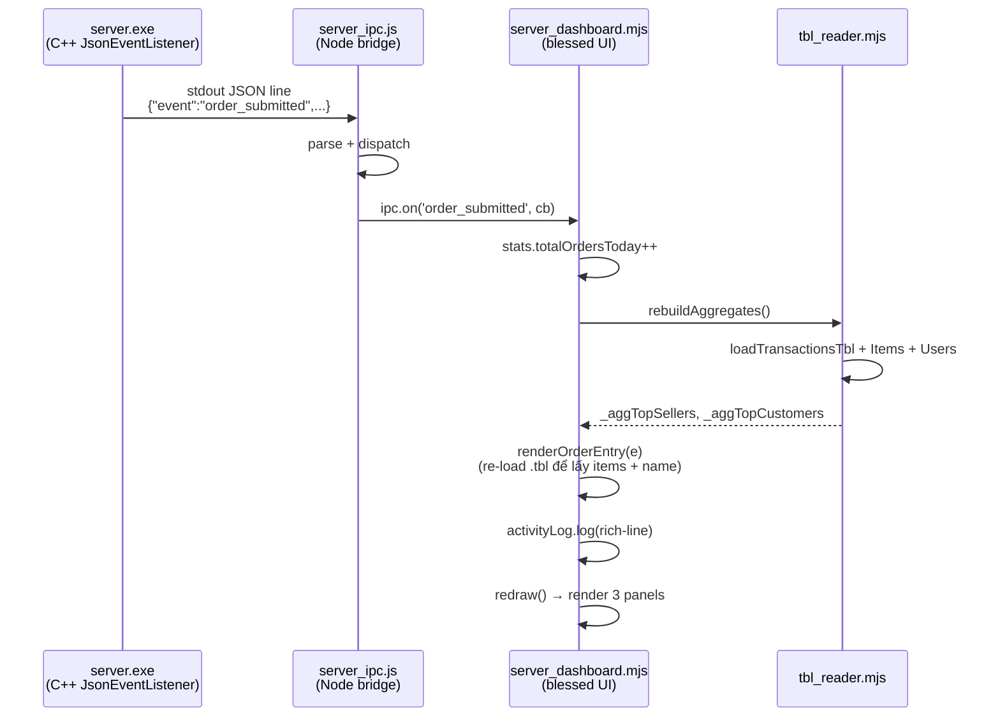

# 07 · UX CLI Design

Tài liệu mô tả nguyên tắc UX, mockup giao diện, ràng buộc đầu vào và **cách triển khai
các tính năng** của hai UI: Server Dashboard (blessed-contrib) và Client UI (React Ink).

## 7.1 Nguyên tắc tối thượng (BR16)

> Mọi thao tác **nhập liệu** chỉ dùng **số** và **mã ASCII không dấu**.

Output (hiển thị) có thể chứa tiếng Việt — chỉ **input** mới bị ràng buộc.

## 7.2 Chính sách ngôn ngữ hiển thị

| Tầng UI | File | Ngôn ngữ | Lý do |
|---|---|---|---|
| **Server Dashboard** | [server_dashboard.mjs](../../cli/src/server_dashboard.mjs) | English | Dành cho thu ngân/dev: technical (`Session OPEN`, `Revenue`) |
| **Client UI** | [ClientApp.jsx](../../cli/src/ClientApp.jsx) | Tiếng Việt có dấu | Dành cho khách: thân thiện (`Chào mừng`, `Hóa đơn`) |

## 7.3 Đối chiếu input design

| Tính năng | Trước (text) | Sau (mã/số) |
|---|---|---|
| Chọn món | "Phở Bò" | **`P01`** + số lượng |
| Xác thực khách | Nhập tên | **SDT 10 chữ số** |
| Kết thúc chọn món | "xong" | **`00`** hoặc Enter |
| Mở/đóng ca | Mã giao dịch text | **Mã số** (vd `1234`) |
| Xác nhận hóa đơn | "có"/"yes" | **`Y`** hoặc Enter |

## 7.4 State machine UI client



## 7.5 Server Dashboard — Layout sau redesign

Dashboard 12-row × 12-col blessed-contrib grid, chia 3 vùng:



### 7.5.1 Header banner

```
+- Viet Phong Server -----------------------+
|  ╦  ╦ ╦ ╔═╗ ╔╦╗   ╔═╗ ╦ ╦ ╔═╗ ╔╗╔ ╔═╗     |
|  ╚╗╔╝ ║ ║╣   ║    ╠═╝ ╠═╣ ║ ║ ║║║ ║ ╦     |
|   ╚╝  ╩ ╚═╝  ╩    ╩   ╩ ╩ ╚═╝ ╝╚╝ ╚═╝     |
| (=^.^=)  F&B Smart Order  ·  LFM Recom...   |
+---------------------------------------------+
```

Big-text "VIET PHONG" dùng cfonts font `chrome` (3 dòng, ~40 chars wide). Hardcoded
trong [server_dashboard.mjs::renderHeader](../../cli/src/server_dashboard.mjs)
để tránh bug auto-wrap của cfonts khi terminal width detection sai.

### 7.5.2 Live Stats panel

```
+- ▣ Live Stats -------+
| Session:        ● 1234|
| Orders today:    42   |
| Revenue today:  2.85M |
| Discounts:       5    |
| Avg ticket:      67k  |
| Unique guests:   38   |
| Active clients:  3/20 |
+----------------------+
```

Tính từ `transactions.tbl` filter theo `session_code = currentCode`. Số liệu chính:
- **Orders today**: count transactions trong ca.
- **Revenue today**: `Σ total` của transactions ca này — đây là use case của
  [Fenwick tree](11-mini-dbms.md#114-fenwicktree-aggregate-prefix-sum-olog-n)
  (hiện đang aggregate JS-side; có thể chuyển sang Fenwick C++ nếu cần performance).
- **Avg ticket**: `revenue / count`.
- **Unique guests**: số `user_id` riêng biệt trong ca (Set count).

### 7.5.3 Top Sellers panel — sử dụng BTree(item_code)

```
+- ⚑ Top Sellers Today --+
| ① P01 Pho Bo Tai  x42  2.730.000d|
| ② D01 Tra Da      x38    570.000d|
| ③ C01 Com Tam     x25  1.875.000d|
|  ④ B01 Bun Bo     x18  1.080.000d|
|  ⑤ G01 Goi Cuon   x12    660.000d|
+------------------------+
```

Logic: load `transaction_items.tbl` qua [tbl_reader.mjs](../../cli/src/tbl_reader.mjs)
→ group theo `item_code` → sum `qty` + sum `qty * price` → sort desc → top 5.

→ Demo capability của **BTree(item_code)** trong `transaction_items` table. Khi server
muốn báo cáo best sellers, nó scan qua items table — index BTree cho phép nhóm theo code
trong O(log N + N) thay vì O(N²) với so sánh mọi cặp.

### 7.5.4 Top Customers panel — sử dụng BTree(user_id)

```
+- ✦ Top Customers ---+
| ① 0989012345 Bac Sau   x21 2.488.000d|
| ② 0901234567 Anh Nam   x22   725.000d|
| ③ 0934567890 Chi Mai   x21   580.000d|
|  ④ 0956789012 Co Tu     x20   420.000d|
|  ⑤ 0945678901 Anh Minh  x23   190.000d|
+----------------------+
```

Logic: load `transactions.tbl` → group theo `user_id` → sum `total` + count →
join với `users.tbl` (lookup name + phone) → sort by total desc → top 5.

→ Demo capability của **BTree(user_id)** trong `transactions` table. Truy vấn nhanh
"đơn của user X" thực chất là scan tất cả txn vẫn rất nhanh nhờ BTree group.

### 7.5.5 Activity Stream — rich notification

Color-coded one-line entries:

```
14:23 ━━ SESSION OPENED · code 1234
14:24 ▼ LOGIN  Table 01 · 0901234567 · 22 prior orders
14:25 ✓ ORDER #182 · Table 01 · 0901234567 Anh Nam · P01x2 + D01x1 · 145.000d
14:30 + REGISTER Table 02 · 0999888777 · Tester (NEW)
14:31 ★ ORDER #183 · Table 02 · 0999888777 Tester · A01x20+C01x5+G01x10 · 1.893.750d (-25%)
14:35 ▼ Table 02  connected
14:40 • Table 01  added  P01
22:00 ━━ SESSION CLOSED · 42 orders · revenue 2.850.000d
```

Mã màu:
| Icon | Sự kiện | Style |
|---|---|---|
| `━━` | Session events | bold blue |
| `▼` | Login / Connect | cyan |
| `+` | Register | magenta |
| `✓` | Đơn thường | green |
| `★` | Đơn lớn (giảm 25%) | yellow + bold |
| `•` | Item added | gray (low signal) |
| `▲` | Disconnect | gray |
| `✗` | Error / reject | red |

## 7.6 Implementation: dashboard feature flow

### 7.6.1 IPC event flow



### 7.6.2 Event name mapping (post Spring refactor)

Server (`json_event_listener.cpp`) emit JSON lines, dashboard subscribe đúng tên:

| Server emit | Dashboard `ipc.on(...)` | Action |
|---|---|---|
| `server_started` | ✓ | set `ready=true`, `loadMenu()` |
| `menu_loaded` | ✓ | log "Menu loaded · N items" |
| `client_connect` | ✓ | `stats.clientsConnected++` + log |
| `client_disconnect` | ✓ | `stats.clientsConnected--` + log |
| `session_opened` | ✓ | `rebuildAggregates()` để load seed |
| `session_closed` | ✓ | log + `process.exit` sau 2.5s |
| `user_login` | ✓ | log + `stats.totalSuggest++` |
| `user_register` | ✓ | log "REGISTER ... NEW" |
| `item_added` | ✓ | log nhỏ (gray) + counter |
| `order_submitted` | ✓ | **rich render** + rebuildAggregates |
| `suggest` | ✓ | track LFM accept rate |
| `heartbeat` | ✓ | silent (no log) |

### 7.6.3 `rebuildAggregates()` — throttling

```javascript
let _aggLastTxnCount = -1;
function rebuildAggregates() {
  const txns = loadTransactionsTbl(pathTxns);
  if (txns.length === _aggLastTxnCount) return;   // no change → skip
  _aggLastTxnCount = txns.length;

  // ... group by item_code → _aggTopSellers
  // ... group by user_id → _aggTopCustomers
  // ... filter by session_code → _aggSessionStats
}
```

Throttle bằng so sánh `txns.length`. Tránh re-read .tbl khi không có đơn mới
(vd dashboard re-render mỗi giây cho timestamp).

### 7.6.4 `renderOrderEntry(e)` — rich format

```javascript
function renderOrderEntry(e) {
  // e = { slot, userId, orderId, items, total, discount }
  // chỉ có itemCount (count) — KHÔNG có items detail
  // → Re-load .tbl để lấy items + user info
  const txns = loadTransactionsTbl(pathTxns);
  const items = indexItemsByTxn(loadTxnItemsTbl(pathTxnItems));
  const users = loadUsersTbl(pathUsers);
  const txnId = e.orderId - 1;   // ORDER_ACK gửi orderId = txnId+1
  const t = txns.find(x => x.txnId === txnId);
  const u = users.find(x => x.userId === t.userId);
  const itemsStr = items.get(txnId).map(it => `${it.code}x${it.qty}`).join(' + ');

  if (e.discount > 0) {
    return `{yellow-fg}{bold}★ ORDER #${e.orderId}{/}{/bold} · ${u.phone} ${u.name} · ${itemsStr} · {bold}${money(e.total)}{/} {magenta-fg}(-25%){/}`;
  }
  return `{green-fg}✓ ORDER #${e.orderId}{/} · ${u.phone} ${u.name} · ${itemsStr} · {bold}${money(e.total)}{/}`;
}
```

### 7.6.5 Wrapper scripts — clean terminal

`tools/run.bat` và `tools/run.sh` sinh wrapper `.bat` tạm trong `tools/_runtmp/`. Nội dung:

```bat
@echo off
title PBL1 Client UI 1
cd /d "<project>\cli"
ping -n 5 127.0.0.1 >nul       :: delay 4s đợi server listen
cls                              :: xóa terminal trước khi npm chạy
call npm start --silent -- 127.0.0.1 1
echo.
echo Client exited. Press any key to close.
pause >nul
```

`--silent` ẩn dòng `> restaurant-cli@0.2.0 start` + `> node --import tsx/esm ...`.
`cls` xóa output `ping` trước React Ink chiếm terminal → UI client sạch sẽ ngay từ đầu.

## 7.7 Client UI mockups (Tiếng Việt)

### 7.7.1 Trạng thái WAITING (chờ START)

```
+-----------------------------------------+
|       BAN 01                            |
|       VIET PHONG RESTAURANT             |
|                                         |
|       * Cho thu ngan mo ca...           |
|         (cho tin hieu START tu Server)  |
+-----------------------------------------+
```

### 7.7.2 Trạng thái PHONE (nhập SDT)

```
+ BAN 01 - DAT MON ----------------------+
| * Vui long nhap SDT (10 chu so):        |
|                                         |
|     [_][_][_][_][_][_][_][_][_][_]      |
|                                         |
| (Vi du: 0901234567)                     |
+----------------------------------------+
```

### 7.7.3 Trạng thái ORDERING

```
+ BAN 01 - SDT 0901234567 - Anh Nam (22 don) +
| THUC DON               | GOI Y CHO BAN     |
| P01 Pho Bo Tai 65.000  | * P01 score 2.74  |
| P02 Pho Ga    55.000   | * D01 score 2.70  |
| B01 Bun Bo    60.000   | * C01 score 1.48  |
| ...                    +-------------------+
| D01 Tra Da    15.000   | DON HIEN TAI:     |
| T01 Che       25.000   | P01 x2  130.000   |
+------------------------+ D01 x1   15.000   |
| Nhap MA + SO LUONG     |                   |
| (vd: P01 2)            | TAM TINH: 145.000 |
| 00 = ket thuc          |                   |
+----------------------------------------+----+
```

### 7.7.4 Trạng thái INVOICE

```
+======== HOA DON ========+
|| BAN 01    SDT 0901234567 ||
||    Anh Nam               ||
||  --------------------    ||
||  P01 Pho Bo Tai x2 130.000||
||  D01 Tra Da    x1  15.000 ||
||  --------------------    ||
||  Tam tinh:    145.000    ||
||  Giam gia:          0    ||
||  TONG:        145.000    ||
||  Nhan Y de gui don       ||
||  Nhan N de sua           ||
+==========================+
```

### 7.7.5 Trạng thái THANKS

```
+----------------------------------------+
|    * CAM ON QUY KHACH!                  |
|    Don hang #007 145.000d               |
|    (Tu dong tro ve trong 3s...)         |
+----------------------------------------+
```

## 7.8 Validate input

| Field | Quy tắc | Lỗi hiển thị |
|---|---|---|
| SDT | 10 chữ số, bắt đầu '0' | "SDT khong hop le, vui long nhap lai" |
| Mã món | 3 ký tự, prefix [PBCGADT], tồn tại | "Ma mon khong ton tai" |
| Số lượng | 1–99 | "So luong phai 1-99" |
| Tên khách | ASCII 2-35 ký tự | "Ten chi dung chu cai khong dau (2-35)" |
| Y/N | 'y'/'Y'/'n'/'N'/Enter | (không error, default Y) |

## 7.9 Heartbeat & disconnect

- Client gửi `HEARTBEAT|clientId|timestamp` mỗi **5s**.
- Nếu mất kết nối > **15s** → hiển thị banner đỏ "Mất kết nối, đang thử lại..." + auto reconnect 3 lần × 2s.

## 7.10 Hot-reload menu

Client nhận `MENU_DATA` → tự động:
1. Clear menu table cục bộ trong [main_client.cpp::applyMenuData](../../client/main_client.cpp).
2. Insert lại từng item với HashIndex(code).
3. Render `MenuDisplay.jsx` với danh sách mới.

Đảm bảo nếu menu.txt bên server thay đổi giữa các session, client tự pickup khi reconnect.
