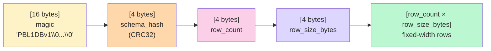

# 08 · File Formats

Tài liệu này định nghĩa các định dạng file mà hệ thống đọc/ghi.

## 8.1 Tổng quan các loại file

| File | Loại | Đọc bởi | Ghi bởi |
|---|---|---|---|
| `data/menu.txt` | Text input | `MenuService::loadFromFile` | (admin sửa thủ công) |
| `data/*.tbl` | Binary table | `Database::openAll` | `Database::saveAll` |
| `data/transactions.log` | Append-only text | (audit) | `OrderService::create` |
| `data/reports/report_*.txt` | Text report | (con người đọc) | `ReportService::writeForCurrentSession` |
| `data/personas.txt` | Text reference | (con người đọc) | `seed_data` tool |

## 8.2 Format `data/menu.txt`

Text plain, mỗi dòng 1 món:

```
# Comment dong dau bang #
P01|Pho Bo Tai|65000|P
P02|Pho Ga|55000|P
B01|Bun Bo Hue|60000|B
B02|Bun Rieu|55000|B
C01|Com Tam Suon Bi|75000|C
...
```

Field separator: `|`. 4 cột: `code | name | price | category`.

## 8.3 Format `.tbl` (mini-DBMS table)

Mỗi bảng → 1 file `data/<name>.tbl` với layout:



### 8.3.1 Header (28 bytes)

| Offset | Kích thước | Trường | Mô tả |
|---|---|---|---|
| 0 | 16 | magic | `"PBL1DBv1"` + 8 bytes 0 (sentinel để verify file đúng format) |
| 16 | 4 | schema_hash | CRC32 của (column name + type + size) — phát hiện schema mismatch |
| 20 | 4 | row_count | Số row đang lưu (uint32 LE) |
| 24 | 4 | row_size_bytes | Tổng bytes 1 row theo schema (uint32 LE) |

### 8.3.2 Body — fixed-width rows

Mỗi row là chuỗi cột nối tiếp, không padding giữa cột (chỉ có padding bên trong STR/BLOB nếu chuỗi ngắn hơn `column.size`):

| Type | Bytes | Encoding |
|---|---|---|
| `INT64` | 8 | little-endian signed |
| `DOUBLE` | 8 | IEEE 754 little-endian |
| `STR(N)` | N | UTF-8/ASCII, null-padded; reader trim ở first NUL |
| `BLOB(N)` | N | raw bytes, **không** trim NUL |

### 8.3.3 Ví dụ — `users.tbl` (155 bytes/row)

| Offset | Bytes | Cột |
|---|---|---|
| 0 | 8 | user_id (INT64) |
| 8 | 11 | phone (STR) |
| 19 | 40 | name (STR) |
| 59 | 80 | description (STR) |
| 139 | 8 | total_orders (INT64) |
| 147 | 8 | created_at (INT64) |

Reader JS phía dashboard ([cli/src/tbl_reader.mjs](../../cli/src/tbl_reader.mjs)) parse đúng layout này.

### 8.3.4 Ví dụ — `lfm_p.tbl` (48 bytes/row)

| Offset | Bytes | Cột |
|---|---|---|
| 0 | 8 | user_id (INT64) |
| 8 | 40 | vec (BLOB = K=10 floats) |

### 8.3.5 Schema hash CRC32

```cpp
// shared/db/schema.cpp::Schema::hash()
uint32_t Schema::hash() const {
    uint32_t c = 0xFFFFFFFF;
    for (const auto& col : columns_) {
        c = crc32_buf(col.name, c);          // tên cột
        c = crc32_buf(&col.type, 1, c);      // type byte
        c = crc32_buf(&col.size, 2, c);      // size 2 bytes
    }
    return c ^ 0xFFFFFFFF;
}
```

Nếu file `.tbl` cũ không match hash → `Table::loadFromFile` từ chối load
(không silent corrupt).

## 8.4 Index persistence

**Indexes KHÔNG được lưu trên file** — luôn rebuild từ rows khi `Table::loadFromFile()`.
Lý do:
- Đơn giản format file (không phải lo serialize hash bucket / B-tree node).
- Rebuild cost nhỏ — 5000 rows × 1µs/insert ≈ 5ms khi server start.
- Tránh divergence khi rows thay đổi mà index chưa update.

## 8.5 Format `data/transactions.log`

Append-only text, 1 dòng/đơn:

```
TIMESTAMP|SESSION_CODE|PHONE|CODE1,QTY1|...|CODEn,QTYn|SUBTOTAL|DISCOUNT|TOTAL
```

Ví dụ:
```
2026-04-23 19:00:23|1234|0901234567|P01,2|D01,1|145000|0|145000
2026-04-23 19:12:01|1234|0938888888|A01,20|C01,5|G01,10|2525000|631250|1893750
```

Đây là **audit trail** dạng text — không re-parse vào hệ thống. Dùng cho:
- `grep` debug nhanh: "khách 0901234567 tháng trước mua gì?"
- `awk` thống kê theo ngày/SDT.

## 8.6 Format báo cáo cuối ca

`data/reports/report_YYYY-MM-DD.txt`:

```
==============================================================
   BAO CAO NGAY 2026-05-06
   Ma giao dich : 1234
   Ca lam viec  : 2026-05-06 09:00:00 - 2026-05-06 22:30:00
==============================================================

DON #001 | SDT: 0901234567 | 2026-05-06 09:15:30
--------------------------------------------------------------
  P01  Pho Bo Tai          x1      65000 =       65000
  D01  Tra Da             x2      15000 =       30000
  Tam tinh: 95000 | Giam: 0 | Tong: 95000

DON #002 | SDT: 0938888888 | 2026-05-06 19:12:01
--------------------------------------------------------------
  A01  Cha Gio (10 cai)   x20      80000 =     1600000
  C01  Com Tam Suon Bi    x5      75000 =      375000
  G01  Goi Cuon (5 cuon)  x10      55000 =      550000
  Tam tinh: 2525000 | Giam: 631250 | Tong: 1893750

... (cac don khac) ...

==============================================================
TONG KET NGAY
  Tong so don        : 42
  Tong doanh thu     : 2.850.000
  Tong giam gia      :   200.000
  Don duoc giam      : 5 / 42
  So SDT khac nhau   : 38
  Mon ban chay       : P01 (85 lan), B01 (62 lan), C01 (45 lan)
==============================================================
LFM MODEL STATS
  Tong users da hoc  : 38
  Latent dimensions  : K=10
==============================================================
```

Top-3 món bán chạy được tính bằng `std::sort` trên `unordered_map<itemCode, count>`.
Trong tương lai có thể dùng `FenwickTree` per item để query nhanh hơn (xem [11-mini-dbms.md](11-mini-dbms.md)).

## 8.7 File `personas.txt` (seed reference)

Sinh bởi `seed_data.exe` để dev kiểm tra dữ liệu mẫu:

```
0901234567 | Anh Nam    | 22 don | Dan van phong, sang Pho Bo + Tra Da
   Don  1 (2026-02-05 09:00:00): P01 x1, B01 x1 = 125000d
   Don  2 (2026-02-08 10:00:00): D01 x2, P01 x1 = 95000d
   ...
   Goi y LFM:  D01 (3.388), P01 (3.382), C01 (1.998)

0912345678 | Chi Lan    | 20 don | Sinh vien, trua Com Tam + Nuoc Ngot
   ...
```

Không persistent (sinh lại mỗi lần seed) — chỉ để con người đọc.

## 8.8 Migration tool

`tools/migrate_legacy.cpp` đọc legacy `.dat` (format cũ) → ghi `.tbl` mới qua repositories.
Chạy 1 lần khi nâng cấp:

```bash
./build/migrate_legacy.exe data/
```

Sau khi xong, có thể xóa `*.dat` và backup nếu muốn.
