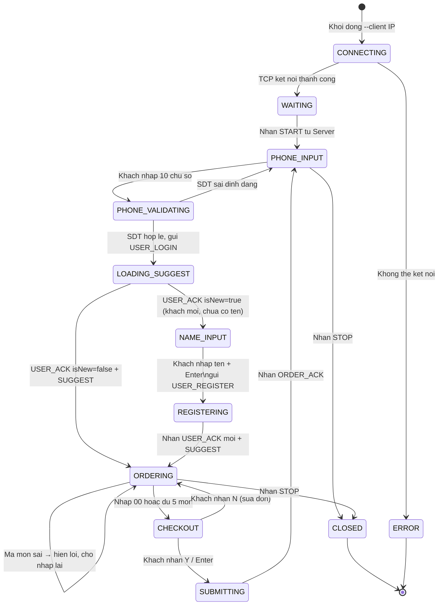
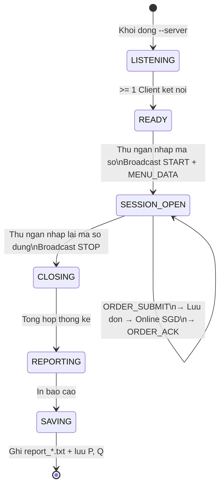

# 09 · State Machines

Nguồn: [phan-tich-du-an-702.md](../../phan-tich-du-an-702.md) §12, §13.

## State machine — Client (Bàn khách)

### Bảng chuyển trạng thái Client

| Từ | Sự kiện | Sang | Action |
|---|---|---|---|
| `CONNECTING` | Socket connect OK | `WAITING` | Bắt đầu heartbeat |
| `CONNECTING` | Socket error | `ERROR` | In lỗi, thoát |
| `WAITING` | Nhận `START` | `PHONE_INPUT` | Hiển thị PhoneInput |
| `PHONE_INPUT` | Enter 10 số | `PHONE_VALIDATING` | Validate |
| `PHONE_VALIDATING` | OK | `LOADING_SUGGEST` | Send `USER_LOGIN` |
| `PHONE_VALIDATING` | Fail | `PHONE_INPUT` | Hiển thị lỗi inline |
| `LOADING_SUGGEST` | Nhận `USER_ACK` với `isNew=true` | `NAME_INPUT` | Hiển thị `NameInput` component |
| `LOADING_SUGGEST` | Nhận `USER_ACK` với `isNew=false` + `SUGGEST` | `ORDERING` | Show menu + panel, chào bằng tên |
| `NAME_INPUT` | Enter name + optional desc | `REGISTERING` | Send `USER_REGISTER` |
| `REGISTERING` | Nhận `USER_ACK` mới + `SUGGEST` | `ORDERING` | Show menu + panel |
| `ORDERING` | Thêm món hợp lệ | `ORDERING` | Send `ITEM_ADDED` |
| `ORDERING` | Nhập `00` hoặc count=5 | `CHECKOUT` | Show Invoice |
| `CHECKOUT` | Press `Y` / Enter | `SUBMITTING` | Send `ORDER_SUBMIT` |
| `CHECKOUT` | Press `N` | `ORDERING` | Giữ đơn, cho sửa |
| `SUBMITTING` | Nhận `ORDER_ACK` | `PHONE_INPUT` | Reset, sẵn sàng khách mới |
| `PHONE_INPUT` / `ORDERING` | Nhận `STOP` | `CLOSED` | Show "Ca ket thuc" |

## State machine — Server (Thu ngân)

### Bảng chuyển trạng thái Server

| Từ | Sự kiện | Sang | Action |
|---|---|---|---|
| `LISTENING` | Client đầu tiên connect | `READY` | Accept, cấp `clientId` |
| `READY` | Thu ngân nhập mã số hợp lệ | `SESSION_OPEN` | Broadcast `START` + `MENU_DATA` |
| `SESSION_OPEN` | Nhận `USER_LOGIN` | `SESSION_OPEN` (loop) | `getOrCreateUser()` → `USER_ACK` → compute top-3 → `SUGGEST` |
| `SESSION_OPEN` | Nhận `ITEM_ADDED` | `SESSION_OPEN` (loop) | Recompute top-3 loại món đã chọn → `SUGGEST` |
| `SESSION_OPEN` | Nhận `ORDER_SUBMIT` | `SESSION_OPEN` (loop) | Save đơn → `onlineUpdate()` → `ORDER_ACK` |
| `SESSION_OPEN` | Thu ngân nhập lại mã số đúng | `CLOSING` | Broadcast `STOP` |
| `CLOSING` | Tổng hợp xong | `REPORTING` | — |
| `REPORTING` | In console | `SAVING` | — |
| `SAVING` | Ghi file xong | `[*]` | Thoát process |

## Trạng thái đồng thời

- Server duy trì **`MAX_CLIENTS` state machine Client** song song — mỗi `clientSockets[i]` có state riêng.
- Server state ≠ Client state — Server ở `SESSION_OPEN` trong khi từng Client có thể đang ở `PHONE_INPUT`, `ORDERING`, `CHECKOUT` độc lập.

## Session gate (defense-in-depth)

Client state machine đã enforce: `WAITING → PHONE_INPUT` chỉ xảy ra khi nhận `MSG_START` → user không thể gửi `USER_LOGIN` trước khi thu ngân mở ca.

Server-side **gate bổ sung** trong [socket_server.cpp](../../server/socket_server.cpp): các handler check `isSessionOpen()` ngay đầu vào, reject nếu ca chưa mở:

| Handler | Hành vi khi `!isSessionOpen()` |
|---|---|
| `handleUserLogin` | Silent drop, log `REJECT USER_LOGIN` |
| `handleUserRegister` | Silent drop, log `REJECT USER_REGISTER` |
| `handleItemAdded` | Silent drop |
| `handleOrderSubmit` | Trả `ORDER_ACK\|0\|FAIL`, log `REJECT ORDER_SUBMIT` |

Dashboard ([server_dashboard.mjs](../../cli/src/server_dashboard.mjs)) cũng gate: `Tab` không mở được Customers panel khi session chưa open — in log cảnh báo.

## Timeout & recovery

| Tình huống | Xử lý |
|---|---|
| Client không gửi heartbeat 15s | Server đánh dấu socket slot free, không close session |
| Client reconnect sau disconnect | Cấp lại `clientId`, gửi lại `START` + `MENU_DATA` + (nếu trước đó đang ORDERING, state reset về `PHONE_INPUT`) |
| Server crash | Client tự retry 3 lần, mỗi lần cách 2s → nếu fail thì chuyển `ERROR` |
| Thu ngân nhập sai mã đóng ca | Giữ nguyên `SESSION_OPEN`, prompt nhập lại |
