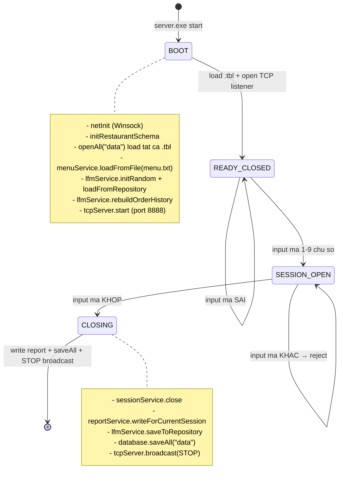
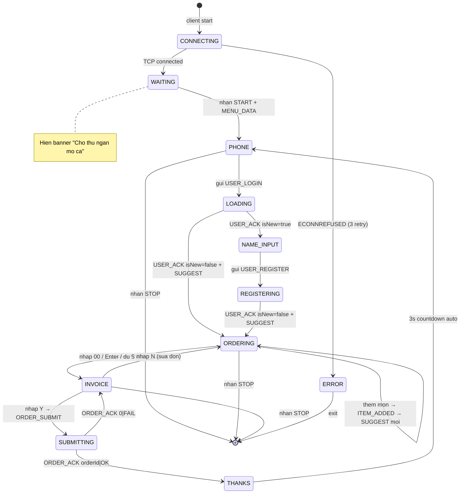
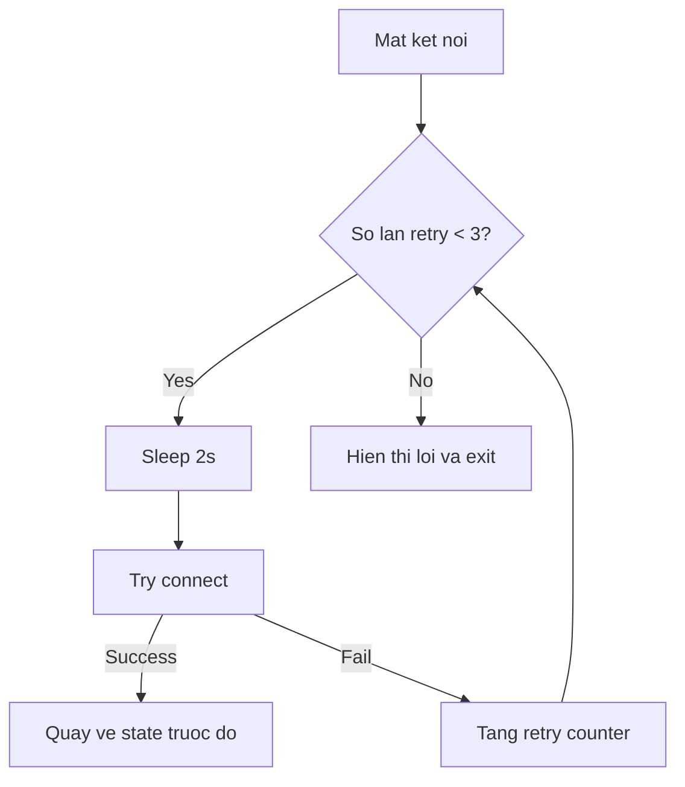
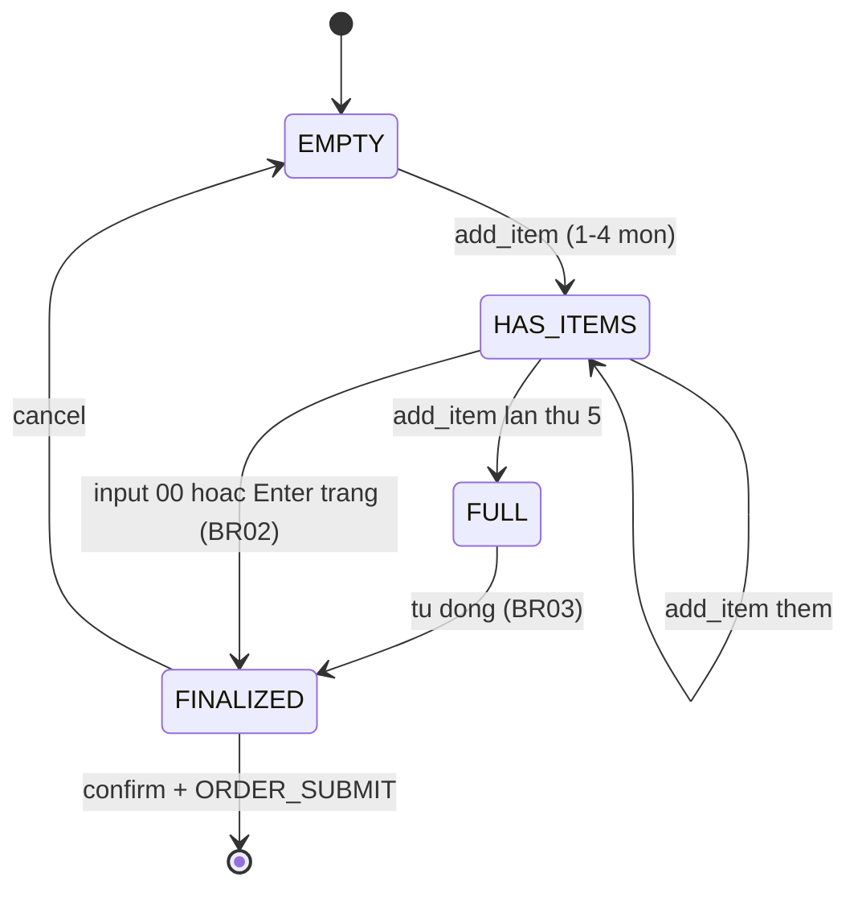
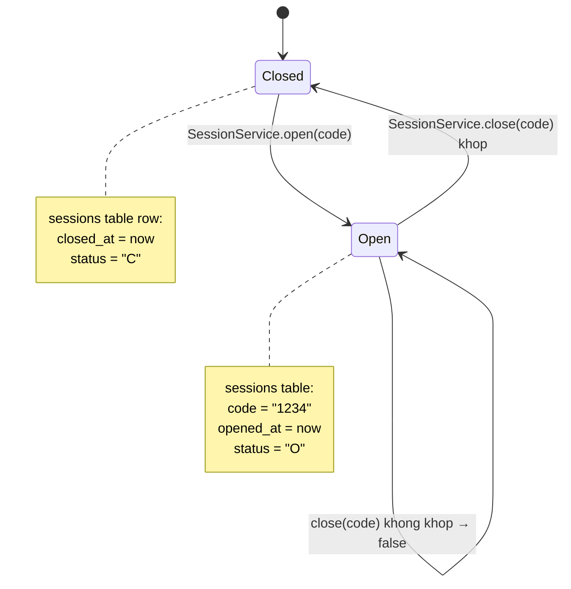
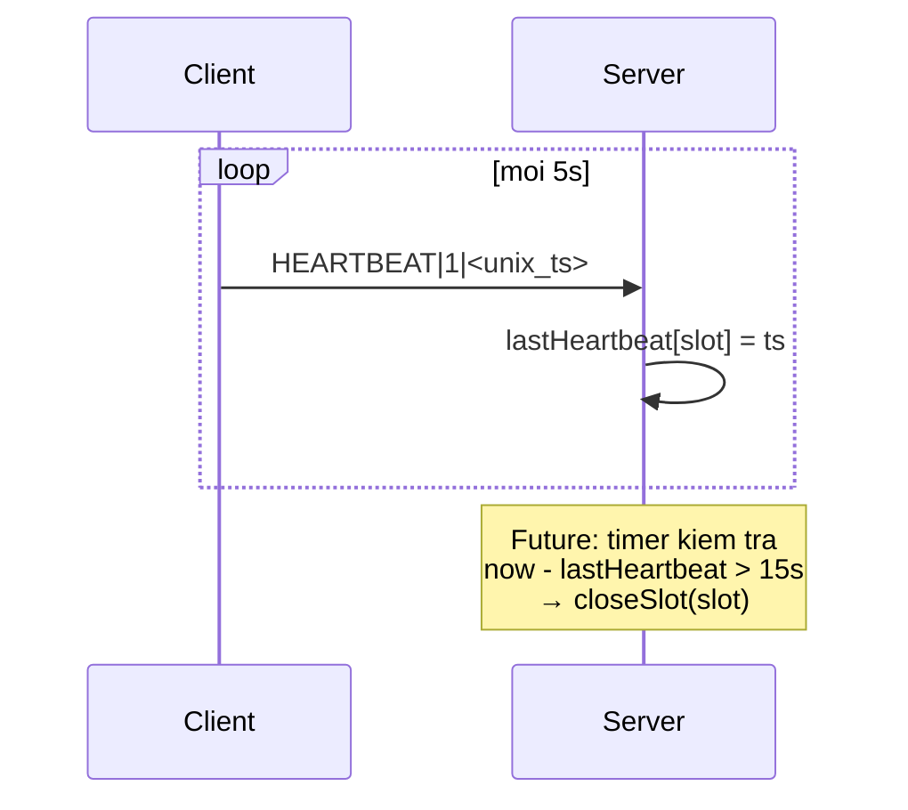

# 09 · State Machines

Tài liệu trình bày state machines của 2 actor chính: **Server** và **Client**.

## 9.1 Server state machine



### 9.1.1 Server actions per state

| State | Hành động cho phép |
|---|---|
| `BOOT` | Init network, schema, load data |
| `READY_CLOSED` | Accept TCP connect; reject mọi message ngoại trừ `HEARTBEAT` (vẫn ghi log nhưng không xử lý logic) |
| `SESSION_OPEN` | Xử lý đầy đủ tất cả 5 lệnh từ client; persist mỗi đơn submit |
| `CLOSING` | Save report + flush .tbl + broadcast STOP |

### 9.1.2 Server-side message gating

Mỗi controller có guard `sessionService_.isOpen()`:

```cpp
void AuthController::handleLogin(int slot, const std::string& payload) {
    if (!sessionService_.isOpen()) return;   // session gate
    ...
}
```

Tránh xử lý nhầm khi session chưa mở (vd client cũ còn cache reconnect lúc server vừa restart).

## 9.2 Client state machine



### 9.2.1 Client states và UI component tương ứng

| State | Component | Mô tả |
|---|---|---|
| `CONNECTING` | Spinner banner | Đang mở socket |
| `WAITING` | `WaitingScreen.jsx` | Chờ START từ server |
| `PHONE` | `PhoneInput.jsx` | 10 ô nhập SDT |
| `LOADING` | Spinner | Chờ USER_ACK + SUGGEST |
| `NAME_INPUT` | `NameInput.jsx` | Khách mới nhập tên + desc |
| `REGISTERING` | Spinner | Đang lưu thông tin |
| `ORDERING` | `MenuDisplay` + `SuggestPanel` + `OrderSummary` | Chính: chọn món |
| `INVOICE` | `Invoice.jsx` | Hiển thị hóa đơn để xác nhận |
| `SUBMITTING` | Spinner | Đang gửi ORDER_SUBMIT |
| `THANKS` | `DailySummary.jsx` | "Cảm ơn quý khách" + countdown |

### 9.2.2 Reconnect logic



## 9.3 Order builder state (client-side, in-memory)



`ClientOrder` struct trong [client/order_builder.h](../../client/order_builder.h):

```cpp
struct ClientOrder {
    char  codes[MAX_ITEMS][4];      // "P01\0", ...
    int   qtys[MAX_ITEMS];
    float prices[MAX_ITEMS];        // snapshot lúc thêm
    char  names[MAX_ITEMS][50];     // tên hiển thị
    int   count;                    // 0..MAX_ITEMS
    float subtotal, discount, total;
};
```

## 9.4 Session state (server-side)



Persist trong bảng `sessions` (xem [06-data-structures.md](06-data-structures.md) §6.8).

## 9.5 Heartbeat health check

Mỗi client gửi `HEARTBEAT|clientId|timestamp` mỗi **5 giây**.



Hiện tại `HeartbeatController` chỉ log sự kiện. Logic timeout-disconnect chưa enforce
chặt — đang để TCP layer tự phát hiện connection drop qua `recv() <= 0`.

## 9.6 Lý do tách state machines

- **Tách rời bố cục UI ↔ business logic**: state ở client là frontend concern,
  state ở server là transaction concern. Mixing → khó debug.
- **Server không lưu client state**: server chỉ biết "slot X đang active hay không";
  state đặt món của client tự quản trên client (ClientOrder struct). Trừ khi `ORDER_SUBMIT`
  gửi lên, server không biết khách đang chọn món gì.
- **Idempotent**: client có thể restart giữa session, kết nối lại, chọn lại từ đầu —
  server không cần khôi phục state đặt món dở.
