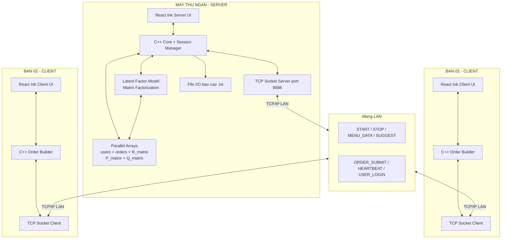

# 10 · Architecture

Nguồn: [phan-tich-du-an-702.md](../../phan-tich-du-an-702.md) §3, §14, §17.

## System diagram tổng thể



## Cây thư mục dự án

```
pbl1_recommendation_system_using_lantent_factor/
│
├── CLAUDE.md                          # Overview + index cho Claude agent
├── README.md                          # Huong dan build + run du an
├── docs/ML_ENGINE_DESIGN.md          # Thiet ke ML engine (Python reference)
├── phan-tich-du-an-702.md            # Đặc tả gốc (source of truth)
├── matrix_factorization.py           # LFM Python reference impl
├── CMakeLists.txt                    # Build C++
│
├── .claude/
│   ├── settings.json                 # Permissions
│   ├── agents/                       # 3 subagent chuyên biệt
│   └── knowledge/                    # KB chia theo chủ đề
│
├── server/                           # C++ entry --server
│   ├── main_server.cpp
│   ├── socket_server.h / .cpp        # TCP listener
│   ├── session.h / .cpp              # Mở/đóng ca
│   ├── order_store.h / .cpp          # Lưu đơn
│   ├── user_store.h / .cpp           # SDT → userId
│   ├── lfm.h / .cpp                  # Latent Factor Model
│   ├── phone_validator.h / .cpp
│   ├── file_manager.h / .cpp         # Xuất .txt + save .dat
│   └── menu.h / .cpp
│
├── client/                           # C++ entry --client IP
│   ├── main_client.cpp
│   ├── socket_client.h / .cpp
│   ├── order_builder.h / .cpp
│   ├── input_handler.h / .cpp
│   └── display.h / .cpp
│
├── shared/                           # Header dùng chung
│   ├── protocol.h                    # enum MsgType + parser
│   ├── menu_item.h
│   └── utils.h / .cpp
│
├── cli/                              # React Ink UI wrapper
│   ├── package.json
│   └── src/
│       ├── ServerApp.jsx
│       ├── ClientApp.jsx
│       ├── ipc.js                    # Wrap stdio JSON
│       └── components/
│           ├── WaitingScreen.jsx
│           ├── PhoneInput.jsx
│           ├── MenuDisplay.jsx
│           ├── SuggestPanel.jsx
│           ├── OrderSummary.jsx
│           ├── Invoice.jsx
│           └── DailySummary.jsx
│
└── data/
    ├── menu.txt
    ├── users.dat
    ├── lfm_P.dat
    ├── lfm_Q.dat
    └── reports/
        └── report_YYYY-MM-DD.txt
```

## Bảng công nghệ

| Thành phần | Công nghệ | Ghi chú |
|---|---|---|
| Core logic | C/C++ 17 | Parallel arrays, không OOP nặng |
| TCP Socket | Winsock2 (Windows) / POSIX (Linux dev) | Target chính: Windows |
| CLI UI | React Ink (Node.js 18+) | JSX render terminal |
| Latent Factor ML | C++ thuần, không thư viện | Tham chiếu `matrix_factorization.py` |
| Validate SDT | C++ thủ công (10 chữ số, bắt đầu `0`) | Không regex (ràng buộc) |
| File I/O | C++ `<fstream>` | Text `.txt`, binary `.dat` |
| Build | CMake 3.15+ + Node.js | `cmake --build`, `npm run dev` |

## Phân chia trách nhiệm

### Server
- Chứa **toàn bộ business logic**: session, order validation, giảm giá 25%, LFM, persistence.
- Là **source of truth** cho menu, user data, model.
- Không trust input từ Client → validate lại mọi field.

### Client
- "Dumb terminal": chỉ render + gửi input thô lên Server.
- Cache cục bộ: menu hiện tại (nhận từ `MENU_DATA`), đơn đang build.
- Không tự tính giảm giá → chỉ hiển thị sau khi Server xác nhận (hoặc compute local để preview, nhưng số chính thức phải đợi `ORDER_ACK`).

### Shared
- Header-only types + parser — dùng chung bởi cả server và client.
- Tránh logic phụ thuộc state → chỉ struct + function pure.

## Build flow

```bash
# Configure
cmake -S . -B build

# Build server + client
cmake --build build --target server
cmake --build build --target client

# Run (2 terminal khác nhau)
./build/server --server                       # Máy thu ngân
./build/client --client 192.168.1.100         # Máy bàn khách

# React Ink UI (song song C++ core, pipe qua stdio)
cd cli && npm install
npm run server     # Chạy ServerApp.jsx
npm run client     # Chạy ClientApp.jsx
```

## Deployment

- LAN nội bộ nhà hàng, không lên Internet.
- Server có IP tĩnh (vd 192.168.1.100), Clients kết nối bằng IP đó.
- Firewall Windows phải mở port 8888.
- Không HTTPS / TLS (trong scope đề bài).
