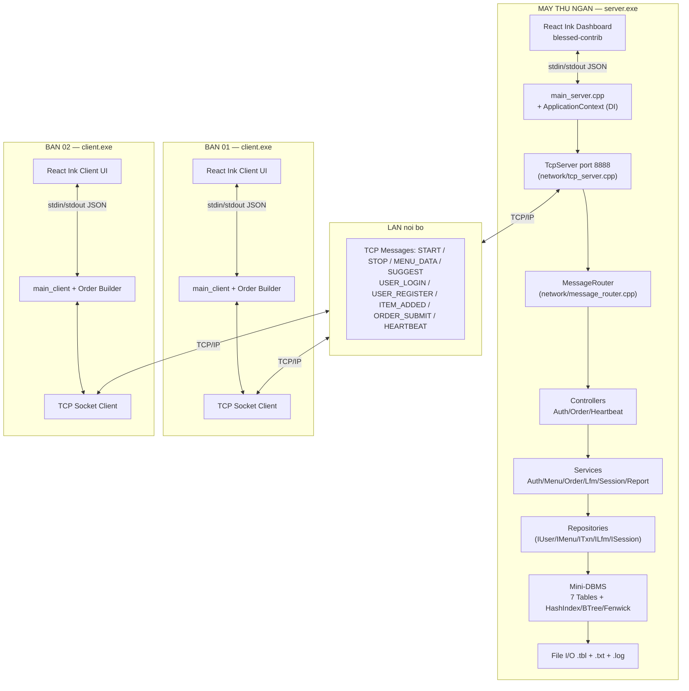
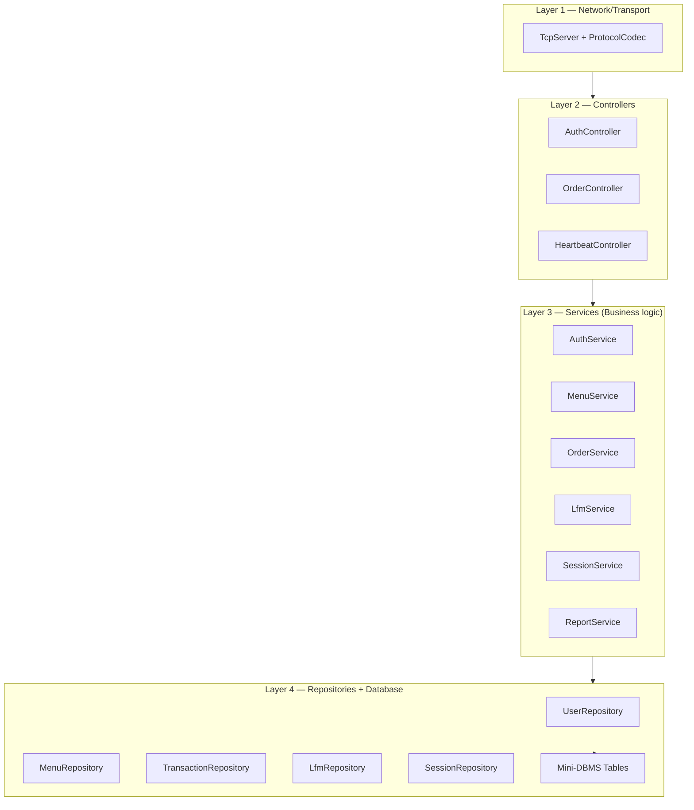
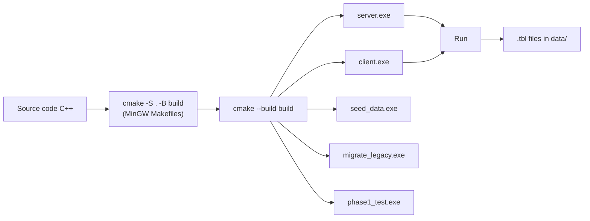

# 10 · Architecture — Kiến trúc tổng thể

## 10.1 Sơ đồ hệ thống



## 10.2 Phân tầng (4 layers)



Mỗi layer chỉ "nhìn xuống" tầng dưới, không skip layer. Chi tiết trong [12-spring-architecture.md](12-spring-architecture.md).

## 10.3 Cây thư mục dự án

```
pbl1_recommendation_system_using_lantent_factor/
│
├── CLAUDE.md                          # Overview + index cho AI agent
├── README.md                          # Huong dan build + run
├── CMakeLists.txt                     # Build config (5 targets)
├── docs/
│   ├── ML_ENGINE_DESIGN.md            # Thiet ke ML engine
│   └── STORAGE_REFACTOR_DESIGN.md
├── phan-tich-du-an-702.md             # Đặc tả gốc (1117 dòng)
├── matrix_factorization.py            # LFM Python reference
│
├── .claude/
│   ├── settings.json
│   ├── agents/                        # Subagents chuyên biệt
│   └── knowledge/                     # 13 file KB chia theo chủ đề
│
├── server/                            # Server-side (Spring-style)
│   ├── main_server.cpp                # Entry point
│   ├── controllers/
│   │   ├── auth_controller.{h,cpp}
│   │   ├── order_controller.{h,cpp}
│   │   └── heartbeat_controller.{h,cpp}
│   ├── services/
│   │   ├── menu_service.{h,cpp}
│   │   ├── auth_service.{h,cpp}
│   │   ├── order_service.{h,cpp}
│   │   ├── lfm_service.{h,cpp}
│   │   ├── session_service.{h,cpp}
│   │   └── report_service.{h,cpp}
│   ├── repositories/
│   │   ├── i_user_repository.h
│   │   ├── user_repository.{h,cpp}
│   │   ├── i_menu_repository.h, menu_repository.{h,cpp}
│   │   ├── i_transaction_repository.h, transaction_repository.{h,cpp}
│   │   ├── i_lfm_repository.h, lfm_repository.{h,cpp}
│   │   └── i_session_repository.h, session_repository.{h,cpp}
│   ├── dto/
│   │   ├── auth_dto.h
│   │   ├── order_dto.h
│   │   ├── menu_dto.h
│   │   └── session_dto.h
│   ├── network/
│   │   ├── protocol_codec.{h,cpp}
│   │   ├── tcp_server.{h,cpp}
│   │   └── message_router.{h,cpp}
│   ├── infra/
│   │   ├── application_context.{h,cpp}
│   │   ├── event_listener.h
│   │   ├── text_log_listener.{h,cpp}
│   │   ├── json_event_listener.{h,cpp}
│   │   └── session_lifecycle.{h,cpp}
│   ├── menu.{h,cpp}                   # legacy free-fn shim cho client
│   └── phone_validator.{h,cpp}        # legacy free-fn shim cho client
│
├── client/                            # Client-side (giu Don gian)
│   ├── main_client.cpp                # text + JSON mode
│   ├── socket_client.{h,cpp}
│   ├── order_builder.{h,cpp}
│   ├── input_handler.{h,cpp}
│   └── display.{h,cpp}
│
├── shared/                            # Dung chung
│   ├── constants.h                    # MAX_USERS, K, LR, ...
│   ├── protocol.{h,cpp}               # parseMessage / buildMessage
│   ├── net.{h,cpp}                    # Winsock init wrapper
│   ├── utils.{h,cpp}                  # trimNewline, splitByPipe, ...
│   ├── json.{h,cpp}                   # JSON helpers
│   ├── state.{h,cpp}                  # legacy parallel-array shim cho client
│   └── db/                            # Mini-DBMS layer
│       ├── value.{h,cpp}              # Variant int64/double/string/blob
│       ├── column.h, schema.{h,cpp}
│       ├── codec.{h,cpp}              # Binary I/O LE
│       ├── row.{h,cpp}
│       ├── index.h
│       ├── hash_index.{h,cpp}         # Separate-chaining
│       ├── btree_index.{h,cpp}        # Order-31 B-tree
│       ├── fenwick.{h,cpp}            # BIT
│       ├── table.{h,cpp}              # CRUD + indexes + persist
│       ├── database.{h,cpp}           # Singleton registry
│       └── db_schema.{h,cpp}          # 7 tables + indexes definition
│
├── cli/                               # React Ink UI (Node.js)
│   ├── package.json
│   └── src/
│       ├── ServerApp.jsx              # React Ink server (alt)
│       ├── ClientApp.jsx              # React Ink client
│       ├── server_dashboard.mjs       # blessed-contrib dashboard
│       ├── server_ipc.js
│       ├── ipc.js
│       ├── tbl_reader.mjs             # Đọc .tbl từ JS
│       └── components/
│           ├── WaitingScreen.jsx
│           ├── PhoneInput.jsx
│           ├── NameInput.jsx
│           ├── MenuDisplay.jsx
│           ├── SuggestPanel.jsx
│           ├── OrderSummary.jsx
│           ├── Invoice.jsx
│           └── DailySummary.jsx
│
├── tools/
│   ├── seed_data.cpp                  # Sinh 10 personas + ~180 txns + train LFM
│   ├── migrate_legacy.cpp             # .dat (legacy) → .tbl (mới)
│   ├── run.sh / run.bat               # One-shot build + seed + spawn UI
│   ├── reset.sh / reset.bat           # Clean + reseed
│   └── demo.sh
│
├── tests/
│   └── phase1_test.cpp                # Smoke test repos + services
│
└── data/
    ├── menu.txt                       # Input menu (admin sửa)
    ├── *.tbl                          # 7 file table persist
    ├── transactions.log               # Audit log text
    ├── personas.txt                   # Snapshot seed (đọc tay)
    └── reports/
        └── report_YYYY-MM-DD.txt
```

## 10.4 Bảng công nghệ

| Layer | Tech | Ghi chú |
|---|---|---|
| Core logic | C++17 | OOP, std::vector, std::variant, std::optional |
| TCP Socket | Winsock2 (Windows) / POSIX | Wrap qua `TcpServer` class |
| ML | C++ thuần, không thư viện ngoài | Reference `matrix_factorization.py` |
| Mini-DBMS | C++ tự cài đặt | HashIndex/BTree/Fenwick manual |
| CLI UI | React Ink + blessed-contrib | Node.js 18+, JSX render terminal |
| Build | CMake 3.15+, MinGW-W64 | 5 targets |
| Pkg | npm 10+ | cli/node_modules |

## 10.5 Build artifacts (5 binaries)

| Binary | Mục đích |
|---|---|
| `build/server.exe` | Full Spring stack — listen TCP 8888 |
| `build/client.exe` | Client UI; text mode hoặc `--json` |
| `build/seed_data.exe` | Sinh 10 personas + 181 txns + train LFM |
| `build/migrate_legacy.exe` | Convert `.dat` cũ → `.tbl` mới |
| `build/phase1_test.exe` | Smoke test repositories + services |

## 10.6 Build flow



## 10.7 Phân chia trách nhiệm

### Server
- **Source of truth** cho menu, user data, model, sessions.
- Toàn bộ business logic (validation, discount 25%, LFM, persist).
- Không trust input từ client → validate lại mọi field trong controllers.
- Persist `.tbl` ngay sau mỗi `ORDER_SUBMIT` (persist-on-order).

### Client
- "Dumb terminal": chỉ render + gửi input thô lên server.
- Cache cục bộ:
  - Menu hiện tại (nhận từ `MENU_DATA`).
  - Order đang build (`ClientOrder` struct).
- Không tự tính giảm giá là số chính thức (compute local để preview, số chính thức từ `ORDER_ACK`).

### Shared
- Protocol parser + JSON helpers + constants — pure functions, không state.
- `shared/db/` là persistence layer dùng chung server + client (client cần để cache menu).

## 10.8 Deployment

- LAN nội bộ nhà hàng, không lên Internet.
- Server có IP tĩnh (vd 192.168.1.100), Clients kết nối bằng IP đó.
- Firewall Windows phải mở port 8888 inbound.
- Không TLS/HTTPS (trong scope đề bài).
- Có thể chạy trên 1 máy (server + nhiều client tab) hoặc nhiều máy thật.

## 10.9 Run scripts

| Script | Tác dụng |
|---|---|
| `tools/run.sh N` | Git Bash: build + seed + spawn server + N clients |
| `tools/run.bat N` | cmd: tương đương cho Windows native |
| `tools/reset.sh` | Xóa `.tbl`, `transactions.log`, `reports/*` + reseed |

Chi tiết: [README.md](../../README.md).
