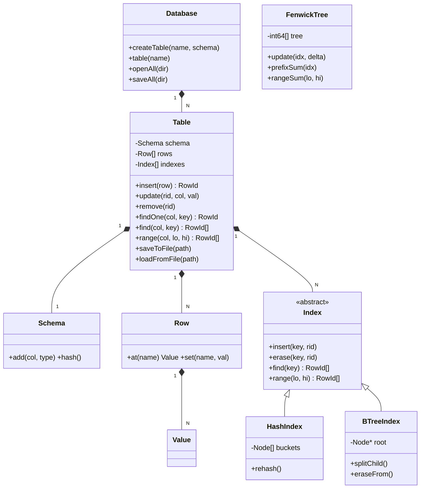
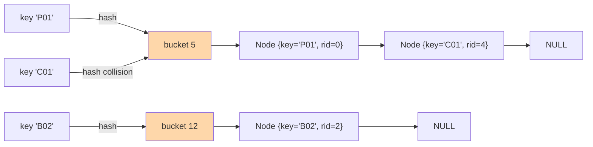
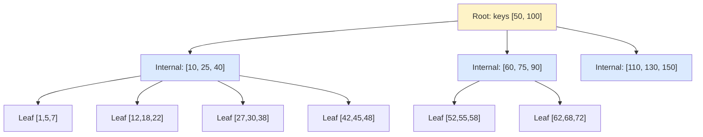
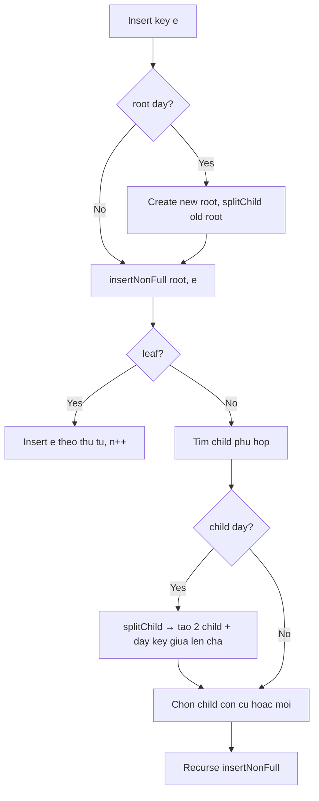
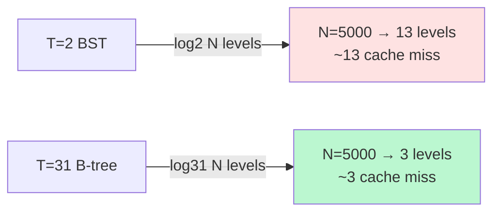
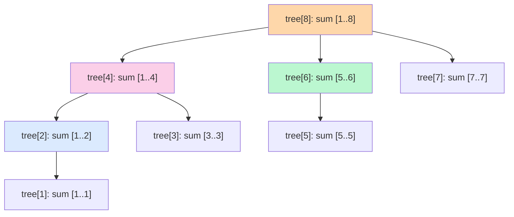

# 11 · Mini-DBMS — Cấu trúc dữ liệu & thuật toán index

> **Đây là phần thuật toán lưu trữ và truy vấn của hệ thống.**
> Mục tiêu: cung cấp các cấu trúc dữ liệu hiệu quả (HashIndex, B-tree, Fenwick tree)
> để tăng tốc các truy vấn thường gặp (login theo SDT, lọc đơn theo SDT/ngày, tổng doanh thu).

## 11.1 Giới thiệu

Sau refactor, dự án có một **mini-DBMS thuần C++** trong [shared/db/](../../shared/db/),
cung cấp:
- **Bảng** (Table) với schema cố định, lưu xuống file nhị phân `.tbl`.
- 3 cấu trúc index: **HashIndex**, **BTreeIndex**, **FenwickTree**.
- API kiểu Repository: insert, update, find, range, scanAll.

Class hierarchy:



`FenwickTree` đứng độc lập (không qua `Index` interface) — dùng cho aggregate queries.

## 11.2 HashIndex — Tra cứu O(1)

### 11.2.1 Mục đích

- Tra cứu **equality** trên cột có giá trị duy nhất hoặc lookup nhanh.
- Áp dụng cho: `users.user_id`, `users.phone`, `menu.code`, `transactions.txn_id`,
  `lfm_p.user_id`, `lfm_q.item_idx`, `sessions.code`.

### 11.2.2 Thuật toán: Hash table với separate chaining



- **Hàm hash:** FNV-1a 64-bit trên byte representation của Value.
- **Bucket:** mỗi bucket là 1 linked list (separate chaining).
- **Dynamic resize:** rehash khi load factor vượt 0.75 (×2 buckets).

### 11.2.3 Cấu trúc node

```cpp
struct Node {
    Value  key;
    RowId  rid;
    Node*  next;
};
std::vector<Node*> buckets_;
```

### 11.2.4 Thao tác chính

```cpp
void HashIndex::insert(const Value& key, RowId rid) {
    if (loadFactor() > 0.75) rehash(buckets_.size() * 2);
    size_t b = bucketOf(key);

    if (unique_) {
        for (Node* h = buckets_[b]; h; h = h->next)
            if (h->key == key)
                throw std::runtime_error("UNIQUE violation");
    }
    Node* node = new Node(key, rid);
    node->next = buckets_[b];
    buckets_[b] = node;
}

std::vector<RowId> HashIndex::find(const Value& key) const {
    std::vector<RowId> out;
    size_t b = bucketOf(key);
    for (Node* h = buckets_[b]; h; h = h->next)
        if (h->key == key) out.push_back(h->rid);
    return out;
}
```

### 11.2.5 Phân tích độ phức tạp

| Thao tác | Trung bình | Worst case |
|---|---|---|
| `insert(key, rid)` | **O(1)** | O(N) khi tất cả collide |
| `find(key)` | **O(1)** | O(N) |
| `erase(key, rid)` | **O(1)** | O(N) |
| `rehash` | **O(N)** | O(N) (xảy ra hiếm khi 2× capacity) |

Với hash function chất lượng (FNV-1a) + load factor < 0.75, expected probe length là 1.x.
Tệ nhất là trường hợp adversarial input cố tình collide — không xảy ra với SDT/code thực tế.

### 11.2.6 Ưu - nhược

| Ưu | Nhược |
|---|---|
| O(1) trung bình cho lookup/insert/erase | Không hỗ trợ range query |
| Dễ cài đặt, ít bug | Cần rehash khi đầy → spike latency |
| Memory hiệu quả với load factor hợp lý | Worst case O(N) nếu hash kém |

### 11.2.7 Tại sao dùng HashIndex cho `phone` thay vì BTree?

- Dữ liệu lookup là phone **chính xác**, không cần range ("tất cả khách có SDT bắt đầu 090...").
- Số lượng user nhỏ (~1000) → cả Hash và BTree đều rất nhanh, nhưng Hash đơn giản hơn.
- Insert/erase O(1) hash phù hợp persist-on-order (mỗi đơn có thể tạo user mới).

## 11.3 BTreeIndex — Range query O(log N + k)

### 11.3.1 Mục đích

- Tra cứu **equality** + **range** trên cột có thứ tự (số, timestamp).
- Áp dụng cho:
  - `transactions.user_id` → "lịch sử đặt món của 1 SDT" (find equality).
  - `transactions.ts` → "đơn trong khoảng ngày" (range).
  - `transaction_items.txn_id` → "join 1 txn với items" (find).
  - `transaction_items.item_code` → "top-N best sellers" (find).
  - `sessions.opened_at` → "ca trong tháng" (range).

### 11.3.2 Thuật toán: B-tree bậc T = 31

B-tree là cây cân bằng đa nhánh, mỗi node chứa **T-1 đến 2T-1 keys** (T = "minimum degree").
Với T = 31: mỗi node 30–61 keys, node trong (internal) có 31–62 con.



### 11.3.3 Cấu trúc Entry và Node

```cpp
struct Entry {
    Value key;
    RowId rid;
    bool less(const Entry& o) const {
        if (key < o.key) return true;
        if (o.key < key) return false;
        return rid < o.rid;   // tie-break theo rid → cho phép duplicate keys
    }
};

struct Node {
    bool   leaf;
    int    n;                              // số entry hiện có
    Entry  entries[2*T-1];                 // 0..n-1
    Node*  children[2*T];                  // 0..n
};
```

**Lưu ý:** entries sắp tăng dần theo `(key, rid)`. Cho phép **duplicate keys** vì
nhiều user có thể có cùng `total_orders`, hoặc nhiều txn cùng timestamp.

### 11.3.4 Insert (chia node đầy)



### 11.3.5 Find equality

```cpp
void BTreeIndex::collectKey(Node* node, const Value& key, std::vector<RowId>& out) const {
    if (!node) return;
    int i = 0;
    while (i < node->n && node->entries[i].key < key) i++;
    if (!node->leaf) collectKey(node->children[i], key, out);
    while (i < node->n && node->entries[i].equalKey(key)) {
        out.push_back(node->entries[i].rid);
        if (!node->leaf) collectKey(node->children[i + 1], key, out);
        i++;
    }
}
```

Time complexity: O(log_T N + k) với k = số entry khớp.

### 11.3.6 Range query [lo, hi]

```cpp
void BTreeIndex::collectRange(Node* node, const Value& lo, const Value& hi,
                               std::vector<RowId>& out) const {
    if (!node) return;
    int i = 0;
    while (i < node->n && node->entries[i].key < lo) i++;
    if (!node->leaf) collectRange(node->children[i], lo, hi, out);
    while (i < node->n && !(hi < node->entries[i].key)) {
        if (!(node->entries[i].key < lo)) out.push_back(node->entries[i].rid);
        if (!node->leaf) collectRange(node->children[i + 1], lo, hi, out);
        i++;
    }
}
```

### 11.3.7 Phân tích độ phức tạp

| Thao tác | Chi phí |
|---|---|
| `insert(key, rid)` | O(log_T N) |
| `find(key)` | O(log_T N + k) (k = số match) |
| `range(lo, hi)` | O(log_T N + k) |
| `erase(key, rid)` | O(log_T N) |

Với T = 31, log_T(5000) ≈ 2.6 → tối đa 3 cấp cho 5000 transactions. Cực nhanh.

### 11.3.8 Tại sao chọn T = 31 (không 2 như BST cơ bản)?



- Mỗi node ~61 keys × ~16 bytes/entry ≈ **1KB** — vừa với 1 cache line block.
- log_31(5000) ≈ 3 vs log_2(5000) ≈ 13 → ít cache miss hơn.
- Đề bài thực hành dạy B-tree → đúng kỳ vọng.

### 11.3.9 Ưu - nhược

| Ưu | Nhược |
|---|---|
| Range query hiệu quả O(log N + k) | Cài đặt phức tạp (insert/erase nhiều case) |
| Cân bằng tự động — không cần rebalance riêng | Tốn nhiều memory hơn binary search tree |
| Cache-friendly (node lớn) | Insert/erase chậm hơn HashIndex equality |

## 11.4 FenwickTree — Aggregate prefix-sum O(log N)

### 11.4.1 Mục đích

- Truy vấn **prefix sum** hoặc **range sum** với cập nhật điểm hiệu quả.
- Áp dụng cho:
  - **Doanh thu lũy kế** theo txn_id: `revenue[1..k]` = tổng doanh thu k txn đầu.
  - **Đếm sản phẩm bán** theo item_idx: số lần bán món i tích lũy.
  - Báo cáo "tổng doanh thu giữa txn 100..200" → `prefixSum(200) - prefixSum(99)`.

### 11.4.2 Thuật toán: Binary Indexed Tree (BIT)

Mỗi index `i` (1-indexed) phụ trách 1 đoạn có độ dài `lowbit(i)` = `i & (-i)`:



| i (binary) | lowbit | Coverage |
|---|---|---|
| 1 (001) | 1 | [1, 1] |
| 2 (010) | 2 | [1, 2] |
| 3 (011) | 1 | [3, 3] |
| 4 (100) | 4 | [1, 4] |
| 5 (101) | 1 | [5, 5] |
| 6 (110) | 2 | [5, 6] |
| 7 (111) | 1 | [7, 7] |
| 8 (1000) | 8 | [1, 8] |

### 11.4.3 Update — O(log N)

```cpp
void FenwickTree::update(size_t idx, int64_t delta) {
    for (size_t i = idx; i <= n_; i += (i & (~i + 1)))
        tree_[i] += delta;
}
```

Đường đi từ idx lên gốc: i → i + lowbit(i) → ... → ≤ N.

### 11.4.4 PrefixSum — O(log N)

```cpp
int64_t FenwickTree::prefixSum(size_t idx) const {
    int64_t s = 0;
    for (size_t i = idx; i > 0; i -= (i & (~i + 1))) s += tree_[i];
    return s;
}
```

Đường đi từ idx về 0: i → i - lowbit(i) → ... → 0.

### 11.4.5 RangeSum [lo, hi]

```cpp
int64_t FenwickTree::rangeSum(size_t lo, size_t hi) const {
    return prefixSum(hi) - prefixSum(lo - 1);
}
```

### 11.4.6 Phân tích độ phức tạp

| Thao tác | Chi phí |
|---|---|
| `update(idx, delta)` | O(log N) |
| `prefixSum(idx)` | O(log N) |
| `rangeSum(lo, hi)` | O(log N) |
| Memory | O(N) |

So sánh với mảng tiền xử lý:

| Cấu trúc | update | prefixSum | rangeSum |
|---|---|---|---|
| Mảng cộng dồn | O(N) | O(1) | O(1) |
| **Fenwick tree** | **O(log N)** | **O(log N)** | **O(log N)** |
| Segment tree | O(log N) | O(log N) | O(log N) (cài phức tạp hơn) |

Fenwick "trung dung": hỗ trợ update + query đều log N, code chỉ ~20 dòng.

### 11.4.7 Use case dự án

Trong [server/services/order_service.cpp](../../server/services/order_service.cpp) (sau khi mở rộng),
mỗi đơn có thể `update(txnId, total)` để Fenwick lưu prefix sum doanh thu. Khi báo cáo:

```cpp
int64_t revenueLastWeek = revenueBIT.rangeSum(weekStartTxn, weekEndTxn);
```

Hiện tại báo cáo cuối ca chỉ tính trong session — nên đang dùng linear scan. Mở rộng sẽ
chuyển sang Fenwick khi số txn lớn.

## 11.5 Persistence: file `.tbl`

Mỗi bảng → 1 file `data/<name>.tbl`:

```
[16 bytes magic]   "PBL1DBv1\0\0\0\0\0\0\0\0"
[4 bytes uint32]   schema_hash (CRC32)
[4 bytes uint32]   row_count
[4 bytes uint32]   row_size_bytes
[row_count × row_size_bytes]   fixed-width rows
```

**Indexes KHÔNG được lưu trên file** — luôn rebuild từ rows khi `Table::loadFromFile()`.

Chi tiết: [08-file-formats.md](08-file-formats.md).

## 11.6 So sánh tổng kết — chọn index nào?

```mermaid
flowchart TD
    Q[Co query nao?] --> E{Equality?}
    E -- "Co" --> H[HashIndex O(1)]
    E -- "Khong" --> R{Range?}
    R -- "Co" --> B[BTreeIndex O(log N + k)]
    R -- "Khong, chi sum" --> F[FenwickTree O(log N)]

    style H fill:#bbf7d0
    style B fill:#dbeafe
    style F fill:#fef3c7
```

| Cột | Index chọn | Lý do |
|---|---|---|
| `users.phone` | HashIndex UNIQUE | Login O(1) per request — hot path |
| `users.user_id` | HashIndex UNIQUE | findById O(1) khi update tiotalOrders |
| `menu.code` | HashIndex UNIQUE | Validate code per item add — rất nóng |
| `transactions.txn_id` | HashIndex UNIQUE | findById |
| `transactions.user_id` | **BTree** | Tìm tất cả đơn của 1 SDT (dashboard) |
| `transactions.ts` | **BTree** | Range theo ngày (báo cáo) |
| `transaction_items.txn_id` | **BTree** | Join 1-N |
| `transaction_items.item_code` | **BTree** | Top-N best sellers |
| `lfm_p.user_id` | HashIndex UNIQUE | Load vector LFM theo user |
| `lfm_q.item_idx` | HashIndex UNIQUE | Load vector LFM theo món |
| `sessions.code` | HashIndex UNIQUE | findByCode |
| `sessions.opened_at` | **BTree** | Range theo tháng |

## 11.7 Hướng mở rộng

1. **B+tree** thay B-tree: leaves liên kết → range query không cần đệ quy.
2. **Bloom filter** trước HashIndex: tăng tốc check "không tồn tại" với O(1) constant rất nhỏ.
3. **Persist indexes**: lưu cấu trúc index xuống file `.idx` để startup nhanh hơn (hiện rebuild ~5ms).
4. **Skip List** thay BTree cho ít allocation hơn (mỗi node nhỏ).
5. **Trie / Radix tree** cho prefix search trên SDT/code.

## 11.8 Tài liệu liên quan

- [shared/db/](../../shared/db/) — toàn bộ source code mini-DBMS.
- [06-data-structures.md](06-data-structures.md) — schema 7 bảng + index nào dùng đâu.
- [08-file-formats.md](08-file-formats.md) — chi tiết format `.tbl`.
- [12-spring-architecture.md](12-spring-architecture.md) — repositories sử dụng các index này như thế nào.
