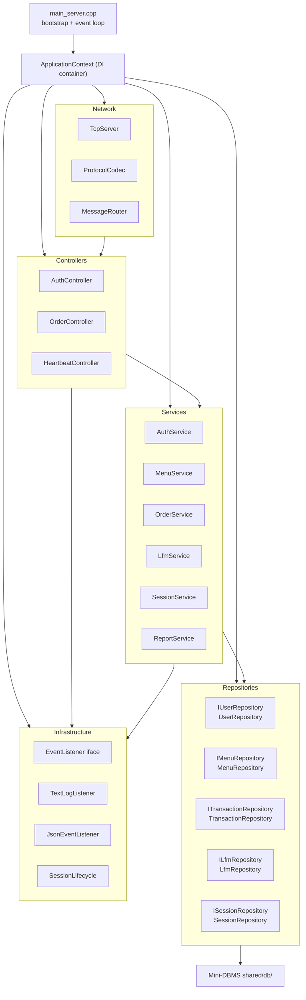
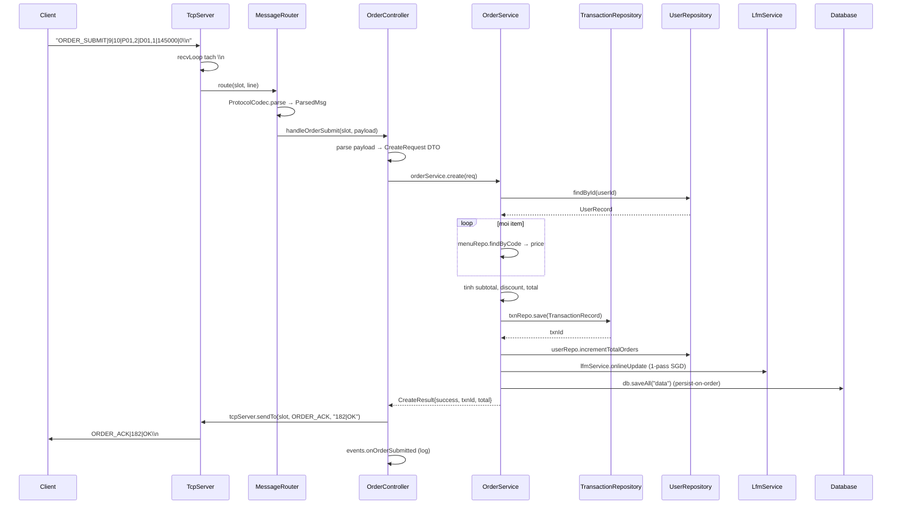
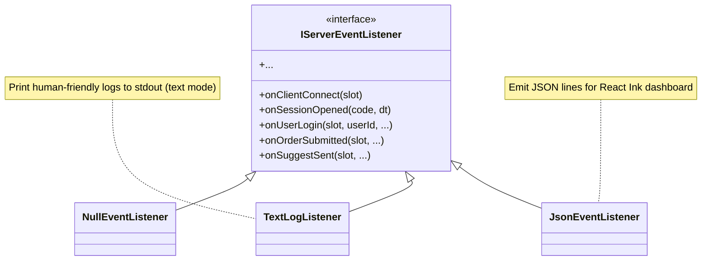

# 12 · Spring-style Layered Architecture

Tài liệu mô tả kiến trúc phân tầng kiểu Spring Boot áp dụng cho server. Mục tiêu:
- Tách biệt rõ trách nhiệm.
- Dependency Injection thủ công qua `ApplicationContext`.
- Interfaces (DIP) → có thể swap implementation, dễ test.
- Áp dụng các pattern OOP cổ điển (Observer, Strategy, Repository, DTO).

## 12.1 Sơ đồ tầng tổng thể



## 12.2 Trách nhiệm từng tầng

| Tầng | Trách nhiệm | Không nên có |
|---|---|---|
| **main_server** | Bootstrap (init network, schema, openAll), tạo ApplicationContext, run event loop | Business logic |
| **Network** | TCP listener, parse/serialize protocol, route message → controller | Validation, DB access |
| **Controllers** | Parse payload thành DTO, gọi service, format response | Business rules, DB |
| **Services** | Business logic (validation, discount, LFM training, session) | Trực tiếp gọi `db::Table` |
| **Repositories** | Wrap `db::Table` qua interface; chuyển Row ↔ Record | Business logic |
| **Database** | Persistence + indexes (Hash/BTree/Fenwick) | Domain knowledge (chỉ schema) |
| **Infrastructure** | Cross-cutting concerns: logging, lifecycle, DI wiring | Domain |

## 12.3 Cấu trúc thư mục

```
server/
├── main_server.cpp                 # entry, bootstrap + event loop
├── controllers/
│   ├── auth_controller.{h,cpp}      USER_LOGIN / USER_REGISTER
│   ├── order_controller.{h,cpp}     ITEM_ADDED / ORDER_SUBMIT
│   └── heartbeat_controller.{h,cpp} HEARTBEAT
├── services/
│   ├── menu_service.{h,cpp}         load/validate/serialize menu
│   ├── auth_service.{h,cpp}         getOrCreate/login/register
│   ├── order_service.{h,cpp}        create + discount + persist
│   ├── lfm_service.{h,cpp}          train/predict/topK + flat P/Q
│   ├── session_service.{h,cpp}      open/close + state
│   └── report_service.{h,cpp}       write daily report
├── repositories/                   # DIP với interfaces
│   ├── i_user_repository.h, user_repository.{h,cpp}
│   ├── i_menu_repository.h, menu_repository.{h,cpp}
│   ├── i_transaction_repository.h, transaction_repository.{h,cpp}
│   ├── i_lfm_repository.h, lfm_repository.{h,cpp}
│   └── i_session_repository.h, session_repository.{h,cpp}
├── dto/                            # request/response objects
│   ├── auth_dto.h
│   ├── order_dto.h
│   ├── menu_dto.h
│   └── session_dto.h
├── network/
│   ├── protocol_codec.{h,cpp}       parse/build "TYPE|content\\n"
│   ├── tcp_server.{h,cpp}           listener + slot management
│   └── message_router.{h,cpp}       dispatch ParsedMsg → controller
└── infra/
    ├── application_context.{h,cpp}  DI container
    ├── event_listener.h             IServerEventListener (Observer)
    ├── text_log_listener.{h,cpp}    text mode logger
    ├── json_event_listener.{h,cpp}  JSON mode emitter (cho dashboard)
    └── session_lifecycle.{h,cpp}    open/close + broadcast START/STOP
```

## 12.4 Patterns đã áp dụng

| Pattern | Cài đặt | File ví dụ |
|---|---|---|
| **Dependency Injection** | `ApplicationContext` constructor wire toàn bộ | [application_context.cpp](../../server/infra/application_context.cpp) |
| **Interface segregation (DIP)** | `IUserRepository` ← `UserRepository` | [i_user_repository.h](../../server/repositories/i_user_repository.h) |
| **Single Responsibility** | Repo = data; Service = business; Controller = transport→business | toàn bộ |
| **Observer** | `IServerEventListener` ← `TextLogListener`/`JsonEventListener` | [event_listener.h](../../server/infra/event_listener.h) |
| **Strategy** | `Index` abstract base ← `HashIndex`/`BTreeIndex` | [shared/db/index.h](../../shared/db/index.h) |
| **Repository pattern** | Mọi data access đi qua `IXxxRepository` | repositories/ |
| **DTO** | `LoginRequest`, `OrderResponse`, ... | dto/ |
| **Singleton** | `Database::instance()` cho legacy access | [database.h](../../shared/db/database.h) |
| **Lifecycle** | `SessionLifecycle` orchestrator gộp service + broadcast | [session_lifecycle.cpp](../../server/infra/session_lifecycle.cpp) |

## 12.5 Flow của 1 request: ORDER_SUBMIT



## 12.6 ApplicationContext — DI container

```cpp
// server/infra/application_context.h
class ApplicationContext {
public:
    ApplicationContext(db::Database& db,
                       IServerEventListener& events,
                       int port);

    TcpServer&            tcpServer();
    MessageRouter&        router();
    SessionLifecycle&     sessionLifecycle();
    SessionService&       sessionService();
    MenuService&          menuService();
    LfmService&           lfmService();
    AuthService&          authService();
    OrderService&         orderService();
    ReportService&        reportService();

private:
    // 5 repositories owned (unique_ptr)
    std::unique_ptr<UserRepository>         userRepo_;
    std::unique_ptr<MenuRepository>         menuRepo_;
    std::unique_ptr<TransactionRepository>  txnRepo_;
    std::unique_ptr<LfmRepository>          lfmRepo_;
    std::unique_ptr<SessionRepository>      sessionRepo_;

    // 6 services
    std::unique_ptr<MenuService>            menuSvc_;
    std::unique_ptr<AuthService>            authSvc_;
    std::unique_ptr<LfmService>             lfmSvc_;
    std::unique_ptr<SessionService>         sessionSvc_;
    std::unique_ptr<OrderService>           orderSvc_;
    std::unique_ptr<ReportService>          reportSvc_;

    // 3 controllers
    std::unique_ptr<AuthController>         authCtrl_;
    std::unique_ptr<OrderController>        orderCtrl_;
    std::unique_ptr<HeartbeatController>    heartbeatCtrl_;

    // network + lifecycle
    std::unique_ptr<TcpServer>              tcp_;
    std::unique_ptr<MessageRouter>          router_;
    std::unique_ptr<SessionLifecycle>       lifecycle_;
};
```

Constructor wire theo đúng thứ tự dependency:

```cpp
ApplicationContext::ApplicationContext(db::Database& db, IServerEventListener& events, int port)
    : db_(db), events_(events)
{
    // Layer 4: Repositories (chỉ phụ thuộc db)
    userRepo_    = std::make_unique<UserRepository>(db);
    menuRepo_    = std::make_unique<MenuRepository>(db);
    txnRepo_     = std::make_unique<TransactionRepository>(db);
    lfmRepo_     = std::make_unique<LfmRepository>(db);
    sessionRepo_ = std::make_unique<SessionRepository>(db);

    // Layer 3: Services (phụ thuộc repos qua interface)
    menuSvc_    = std::make_unique<MenuService>(*menuRepo_);
    authSvc_    = std::make_unique<AuthService>(*userRepo_);
    lfmSvc_     = std::make_unique<LfmService>(*lfmRepo_, *userRepo_, *menuRepo_, *txnRepo_);
    sessionSvc_ = std::make_unique<SessionService>(*sessionRepo_);
    orderSvc_   = std::make_unique<OrderService>(*userRepo_, *menuRepo_, *txnRepo_, *lfmSvc_, db);
    reportSvc_  = std::make_unique<ReportService>(*userRepo_, *menuRepo_, *txnRepo_, *sessionSvc_);

    // Layer 1: Network
    tcp_ = std::make_unique<TcpServer>(port);

    // Layer 2: Controllers
    authCtrl_      = std::make_unique<AuthController>(*authSvc_, *menuSvc_, *lfmSvc_,
                                                       *sessionSvc_, *tcp_, events_);
    orderCtrl_     = std::make_unique<OrderController>(*orderSvc_, *menuSvc_, *lfmSvc_,
                                                        *sessionSvc_, *tcp_, events_);
    heartbeatCtrl_ = std::make_unique<HeartbeatController>(events_);

    // Router + lifecycle
    router_    = std::make_unique<MessageRouter>(*authCtrl_, *orderCtrl_, *heartbeatCtrl_, events_);
    lifecycle_ = std::make_unique<SessionLifecycle>(*sessionSvc_, *menuSvc_, *lfmSvc_,
                                                     *reportSvc_, *tcp_, db, events_);

    // Wire TcpServer hooks
    tcp_->setOnConnect([this](int slot){ /* replay START + MENU_DATA neu open */ });
    tcp_->setOnDisconnect([this](int slot){ events_.onClientDisconnect(slot); });
    tcp_->setOnLine([this](int slot, const std::string& line){ router_->route(slot, line); });
}
```

## 12.7 Observer pattern: EventListener



```cpp
// main_server.cpp
std::unique_ptr<IServerEventListener> listener;
if (jsonMode) listener = std::make_unique<JsonEventListener>();
else          listener = std::make_unique<TextLogListener>();

ApplicationContext ctx(db, *listener, DEFAULT_PORT);
```

→ Cùng codebase, đổi listener = đổi format output. Không cần sửa controller/service.

## 12.8 Khi cần thêm chức năng

### 12.8.1 Thêm message type mới

1. Update [shared/protocol.h](../../shared/protocol.h) enum.
2. Thêm method vào controller phù hợp (`xxxController::handleXxx`).
3. Update [server/network/message_router.cpp](../../server/network/message_router.cpp) `switch`.

### 12.8.2 Thêm bảng mới

1. Update [shared/db/db_schema.cpp](../../shared/db/db_schema.cpp) — thêm schema + indexes.
2. Tạo `IXxxRepository` interface + `XxxRepository` concrete.
3. Add vào `ApplicationContext` constructor wiring.

### 12.8.3 Thêm service mới

1. Tạo `XxxService.{h,cpp}` với constructor injection từ repos cần dùng.
2. Add vào `ApplicationContext`.
3. Inject vào controllers nào cần dùng.

### 12.8.4 Thêm event mới

1. Thêm method virtual vào `IServerEventListener` (default = no-op).
2. Override trong `TextLogListener` + `JsonEventListener`.

## 12.9 Build artifacts

| Binary | Source | Mục đích |
|---|---|---|
| `build/server.exe` | full Spring stack | listen TCP 8888 |
| `build/client.exe` | minimal subset (menu.cpp + db) | client UI |
| `build/seed_data.exe` | repos + services trực tiếp (không network) | sinh data mẫu |
| `build/migrate_legacy.exe` | repos đọc .dat → ghi .tbl | migrate format |
| `build/phase1_test.exe` | smoke test repos + services | regression test |

Tất cả share `${SHARED_SOURCES} + ${DB_SOURCES} + ${REPOSITORY_SOURCES} + ${SERVICE_SOURCES}`.
Server thêm controllers + network + infra.

## 12.10 Trade-offs

| Pro | Con |
|---|---|
| Tách biệt rõ → dễ thêm/sửa từng module | ~50 file C++ trong server/ |
| Interface segregation → testable, mock-friendly | Compile time tăng ~3× so với baseline |
| Consistent pattern theo Spring → dễ onboard | Indirection nhiều → lookup hơi chậm với mới đọc |
| Event-driven log → text/json swap dễ | Code nhiều boilerplate |

Trade-off chấp nhận được vì:
- Project ~6000 dòng C++ (server) — không quá nhỏ để layering bị over-engineering.
- Mục tiêu academic: thầy DUT thấy được Spring-style pattern + DSA showcase.
- Maintain dài hạn dễ hơn nếu mở rộng (thêm bảng, thêm message, thêm service).
