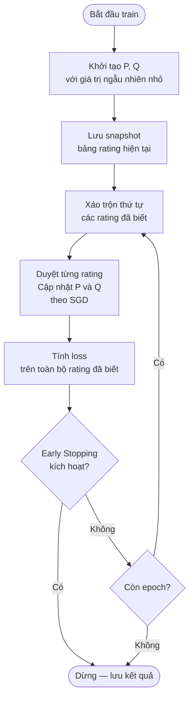
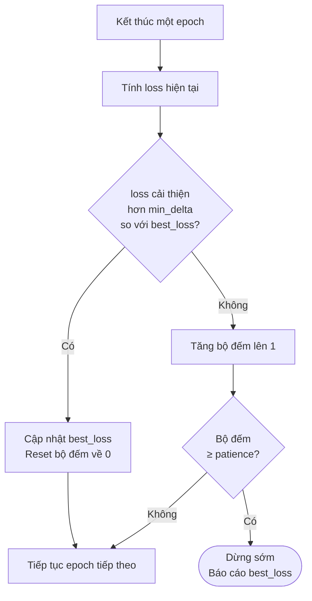
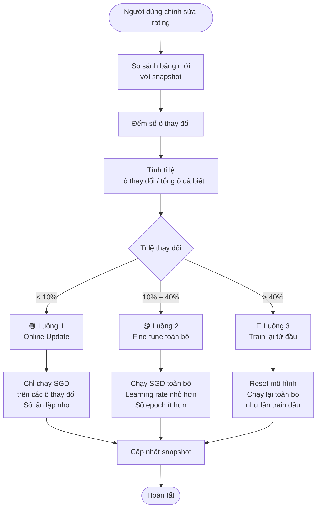
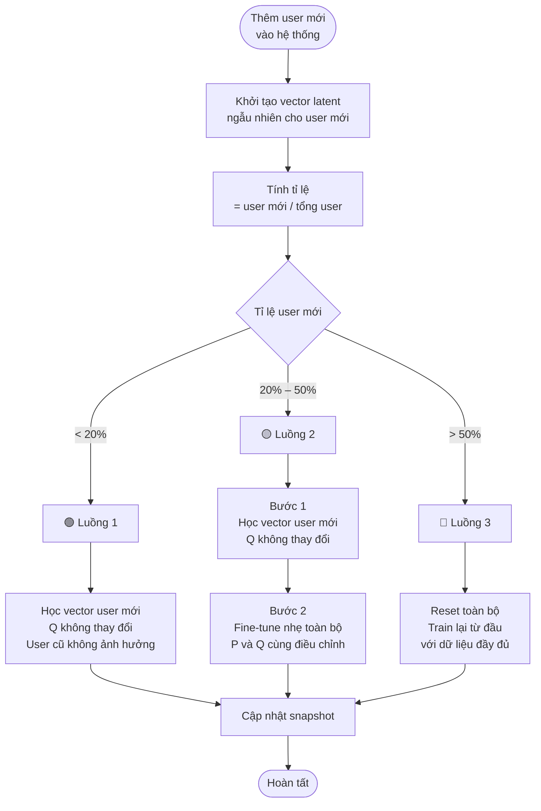
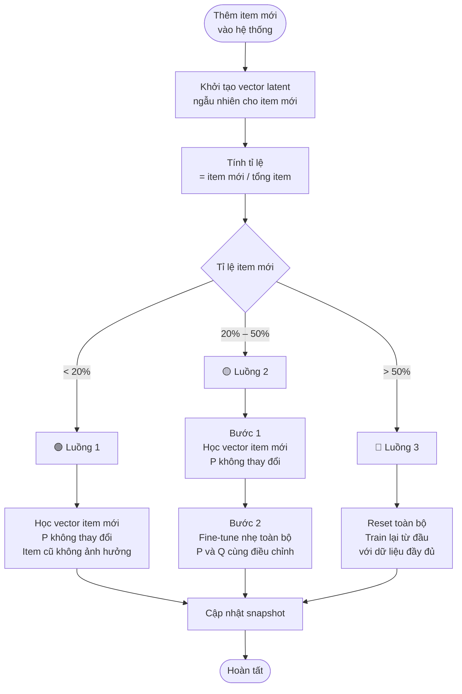
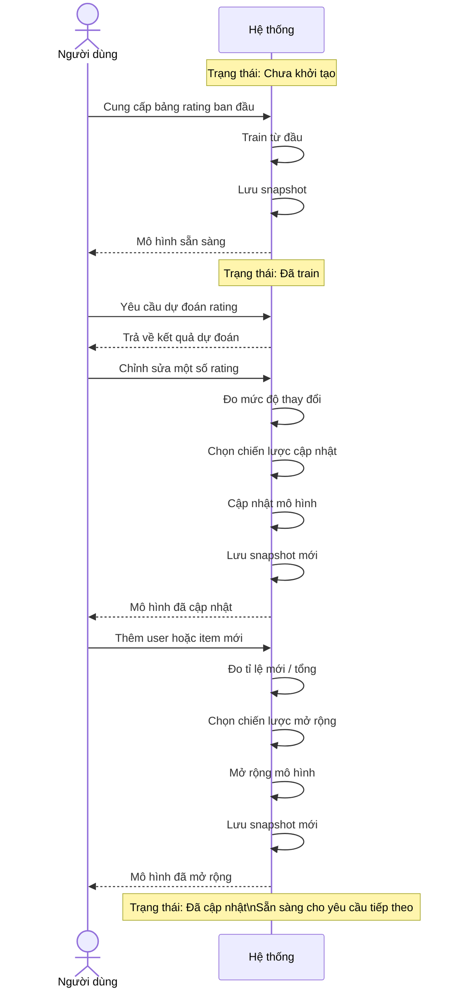

# Matrix Factorization — Tài liệu thiết kế hệ thống

---

## Mục lục

- [Tổng quan](#tổng-quan)
- [Các tính năng](#các-tính-năng)
  - [Tính năng 1: Train mô hình](#tính-năng-1-train-mô-hình)
  - [Tính năng 2: Early Stopping](#tính-năng-2-early-stopping)
  - [Tính năng 3: Cập nhật khi dữ liệu thay đổi](#tính-năng-3-cập-nhật-khi-dữ-liệu-thay-đổi)
  - [Tính năng 4: Thêm user mới](#tính-năng-4-thêm-user-mới)
  - [Tính năng 5: Thêm item mới](#tính-năng-5-thêm-item-mới)
- [Vòng đời đầy đủ của mô hình](#vòng-đời-đầy-đủ-của-mô-hình)

---

## Tổng quan

Hệ thống giải bài toán **Collaborative Filtering**: dự đoán rating cho các cặp user–item chưa được đánh giá, dựa trên các rating đã có. Phương pháp sử dụng là Matrix Factorization — phân tích bảng rating thành hai không gian ẩn đại diện cho user và item, sau đó dùng tích của chúng để lấp đầy các ô còn trống.

Điểm cốt lõi trong thiết kế: **mô hình không cần train lại từ đầu** mỗi khi dữ liệu thay đổi. Hệ thống tự động phân tích mức độ thay đổi và chọn chiến lược cập nhật phù hợp — tiết kiệm tài nguyên trong khi vẫn đảm bảo độ chính xác.

---

## Các tính năng

---

### Tính năng 1: Train mô hình

**Mục đích:** Học cấu trúc ẩn của toàn bộ bảng rating từ đầu — xây dựng biểu diễn latent cho mọi user và item hiện có.

**Thiết kế:**

Quá trình train dùng Stochastic Gradient Descent (SGD) — tối ưu hóa từng rating một thay vì toàn bộ cùng lúc. Sau mỗi epoch, hệ thống lưu lại snapshot của bảng rating hiện tại để làm cơ sở so sánh cho các lần cập nhật về sau.

Hàm loss cần tối thiểu hóa:

$$L = \sum_{(i,j) \in \Omega} (X_{ij} - \hat{X}_{ij})^2 + \lambda(\|P\|^2 + \|Q\|^2)$$

Số hạng thứ nhất đo sai số trên các rating đã biết. Số hạng thứ hai (regularization) ngăn mô hình phóng to tham số vô hạn chỉ để khớp dữ liệu training — đây là điều kiện bắt buộc để dự đoán tốt các ô chưa biết.

**Workflow:**

---

### Tính năng 2: Early Stopping

**Mục đích:** Tự động dừng quá trình train khi mô hình không còn cải thiện, tránh lãng phí tài nguyên và tránh hiện tượng loss tăng trở lại sau khi đã đạt điểm tối ưu.

**Thiết kế:**

Có hai ngưỡng điều khiển:

- **`patience`** — số epoch liên tiếp được phép không cải thiện trước khi dừng
- **`min_delta`** — mức cải thiện tối thiểu được coi là "có ý nghĩa". Cần thiết vì loss dao động nhỏ (ví dụ `1.0646 → 1.0645`) không phản ánh mô hình thực sự học thêm được gì.

Hai tham số này hoạt động độc lập: `patience` kiểm soát **thời gian chờ**, `min_delta` kiểm soát **tiêu chuẩn cải thiện**.

**Workflow:**

---

### Tính năng 3: Cập nhật khi dữ liệu thay đổi

**Mục đích:** Phản ánh các thay đổi rating của người dùng vào mô hình mà không cần train lại từ đầu.

**Thiết kế:**

Khi người dùng chỉnh sửa rating, không phải lúc nào cũng cần chạy lại toàn bộ quá trình train. Hệ thống so sánh bảng rating mới với snapshot lần train trước, tính tỉ lệ thay đổi, rồi chọn một trong ba chiến lược:

| Tỉ lệ thay đổi | Chiến lược | Lý do |
|---|---|---|
| < 10% | Online Update | Thay đổi nhỏ lẻ, chỉ cần điều chỉnh đúng các ô bị ảnh hưởng |
| 10% – 40% | Fine-tune toàn bộ | Đủ lớn để ảnh hưởng cấu trúc chung, cần SGD toàn bộ nhưng ít epoch vì điểm xuất phát đã tốt |
| > 40% | Train lại từ đầu | Quá nhiều thay đổi, cấu trúc P và Q cũ không còn phản ánh đúng dữ liệu |

**Workflow:**

---

### Tính năng 4: Thêm user mới

**Mục đích:** Tích hợp user mới vào mô hình đang chạy mà không làm mất kiến thức đã học về các user và item cũ.

**Thiết kế:**

Khi thêm user mới, không gian latent (được mã hóa trong Q) đã được xây dựng từ toàn bộ lịch sử rating cũ. User mới chỉ cần **tìm vị trí của mình trong không gian đó** — không cần xây dựng lại không gian từ đầu.

Chiến lược được chọn dựa trên tỉ lệ user mới so với tổng số user:

| Tỉ lệ user mới | Chiến lược | Lý do |
|---|---|---|
| < 20% | Chỉ học vector user mới, giữ nguyên Q | Không gian latent cũ đủ để mô tả user mới |
| 20% – 50% | Học vector mới → Fine-tune toàn bộ | Lượng user mới đủ lớn để điều chỉnh nhẹ không gian latent |
| > 50% | Train lại từ đầu | Quá nhiều user mới, không gian latent cũ không còn đại diện tốt |

**Workflow:**

---

### Tính năng 5: Thêm item mới

**Mục đích:** Tích hợp item mới vào mô hình đang chạy mà không làm mất kiến thức đã học về các user và item cũ.

**Thiết kế:**

Hoàn toàn đối xứng với tính năng thêm user. Lần này không gian latent của user (P) được giữ cố định, item mới học vị trí của mình trong không gian đó thông qua Q.

| Tỉ lệ item mới | Chiến lược | Lý do |
|---|---|---|
| < 20% | Chỉ học vector item mới, giữ nguyên P | Không gian latent cũ đủ để mô tả item mới |
| 20% – 50% | Học vector mới → Fine-tune toàn bộ | Cần điều chỉnh nhẹ không gian latent để nhất quán |
| > 50% | Train lại từ đầu | Quá nhiều item mới, cần xây dựng lại toàn bộ |

**Workflow:**

---

## Vòng đời đầy đủ của mô hình

Sơ đồ dưới mô tả toàn bộ các trạng thái mô hình có thể đi qua trong suốt quá trình vận hành:

**Nguyên tắc xuyên suốt trong thiết kế:**

- Snapshot được cập nhật sau mỗi thao tác, đảm bảo hệ thống luôn có cơ sở chính xác để so sánh.
- Mọi chiến lược cập nhật đều tái sử dụng cùng một engine SGD với các tham số khác nhau — không có logic train riêng biệt cho từng trường hợp.
- Early Stopping hoạt động tự động ở mọi luồng, không cần cấu hình thêm khi chuyển luồng.
