# 📋 PHAN TICH DU AN - DE 702
## Ung Dung Dat Mon An va Thanh Toan Don Hang

---

## 1. TONG QUAN DU AN

| Thuoc tinh | Noi dung |
|---|---|
| **Ten de tai** | Ung dung dat mon an va thanh toan don hang |
| **Ma de** | 702 |
| **Ngon ngu** | C/C++ (core logic + socket) + React Ink (giao dien CLI) |
| **Giao dien** | Terminal / CMD (React Ink) — toi gian hoa nhap lieu tieng Viet |
| **Luu tru** | Mang song song (parallel arrays) + Xuat file |
| **Kien truc mang** | TCP/IP Socket — 1 may **Server** (thu ngan) + N may **Client** (ban khach) |
| **ML tich hop** | **Latent Factor Model** (Matrix Factorization) — goi y mon an ca nhan hoa theo so dien thoai |
| **Xac thuc nguoi dung** | So dien thoai 10 chu so — dinh danh khach hang, lam user_id cho ML |
| **Nhap lieu** | Toan bo chi dung **so** va **ma ASCII** — khong can go tieng Viet |

---

## 2. NGUYEN TAC THIET KE UX: HAN CHE NHAP TIENG VIET

> Day la nguyen tac xuyen suot toan bo he thong. Moi man hinh duoc thiet ke de nguoi dung **chi can bam phim so va Enter**.

### 2.1 Bang doi chieu input — Cu thiet ke vs Moi

| Tinh nang | ❌ Cu (can tieng Viet) | ✅ Moi (chi can so / ma) |
|---|---|---|
| Chon mon an | Nhap ten mon | Nhap **ma mon** (P01, B02...) |
| Xac thuc nguoi dung | Nhap ten khach | Nhap **so dien thoai 10 chu so** |
| Ket thuc chon mon | Nhap "0 0" | Nhan **Enter trang** hoac nhap **00** |
| Mo / dong ca | Nhap ma giao dich chu | Nhap **ma so thuan tuy** (VD: 1234) |
| Chon tuy chon | Doc va nhap text | Chon **so thu tu** (1/2/3) |
| Xac nhan hoa don | Nhap "yes/co" | Nhan **Y** hoac **Enter** |

### 2.2 He thong ma mon an

Mon an duoc dinh danh bang **ma 3 ky tu**: `[Loai][So thu tu 2 chu so]`

| Ma | Ten mon | Don gia |
|---|---|---|
| `P01` | Pho Bo Tai | 65.000d |
| `P02` | Pho Ga | 55.000d |
| `B01` | Bun Bo Hue | 60.000d |
| `B02` | Bun Rieu | 55.000d |
| `C01` | Com Tam Suon Bi | 75.000d |
| `C02` | Com Chien Duong Chau | 65.000d |
| `G01` | Goi Cuon (5 cuon) | 55.000d |
| `A01` | Cha Gio (10 cai) | 80.000d |
| `D01` | Tra Da | 15.000d |
| `D02` | Nuoc Ngot | 20.000d |
| `T01` | Che Ba Mau | 25.000d |

> Prefix: **P** = Pho, **B** = Bun, **C** = Com, **G** = Goi, **A** = An vat, **D** = Do uong, **T** = Trang mieu

---

## 3. KIEN TRUC HE THONG TONG THE

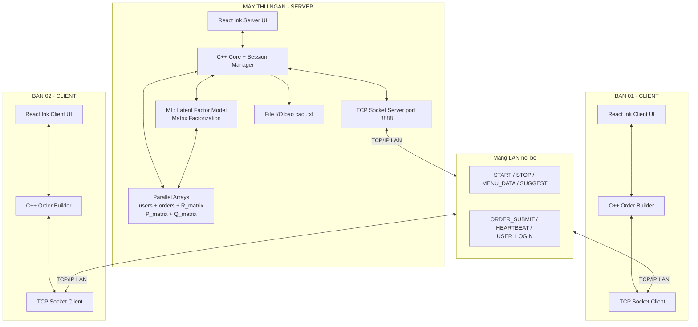

---

## 4. PHAN TICH NGHIEP VU

### 4.1 Cac Actor

| Actor | Vai tro | May |
|---|---|---|
| **Thu ngan** | Mo/dong ca, xem thong ke, quan ly phien lam viec | May Server |
| **Khach hang** | Nhap SDT, xem menu, nhap ma mon, nhan hoa don | May Client (ban) |
| **Latent Factor Engine** | Goi y mon dua tren lich su dat cua tung so dien thoai | Chay tren Server |

### 4.2 Business Rules

| ID | Quy tac |
|---|---|
| BR01 | Khach chi duoc dat toi da **5 mon** moi don hang |
| BR02 | Nhan **Enter trang** hoac nhap **00** de ket thuc chon mon |
| BR03 | Du 5 mon → tu dong ket thuc, in hoa don ngay |
| BR04 | Tong don **>= 2.000.000d** → giam **25%** |
| BR05 | Ca lam viec duoc dinh danh bang **ma so** (VD: 1234) |
| BR06 | Ket thuc ca: nhap lai dung ma so da mo → dong ca |
| BR07 | Toan bo don hang duoc ghi ra **file** khi ket thuc ca |
| BR08 | Server nhan ma giao dich → broadcast `START` toi tat ca Client |
| BR09 | Client **chi hoat dong** sau khi nhan tin hieu `START` tu Server |
| BR10 | Moi don tu Client gui ve Server **ngay lap tuc** qua TCP socket |
| BR11 | **Khach phai nhap so dien thoai (10 chu so)** truoc khi dat mon |
| BR12 | So dien thoai la **user_id** trong mo hinh Latent Factor — luu xuyen ca |
| BR13 | Mon an co **ma 3 ky tu** (VD: P01) — khach chi nhap ma, khong nhap ten |
| BR14 | Goi y mon dung **Latent Factor Model** — ca nhan hoa theo SDT tung khach |
| BR15 | He thong tra cuu lich su SDT → chao mung khach quen va goi y thong minh hon |
| BR16 | Moi thao tac nhap lieu chi dung **so** va **ma ASCII khong dau** |

---

## 5. LUONG HOAT DONG TONG THE

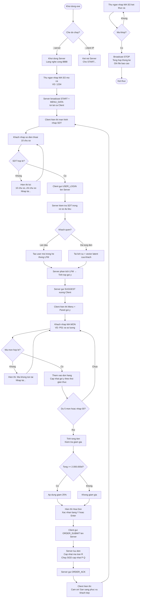

---

## 6. LUONG XAC THUC SO DIEN THOAI

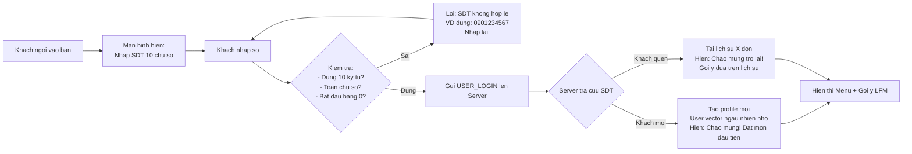

---

## 7. THUAT TOAN LATENT FACTOR MODEL

### 7.1 Tong quan va so sanh voi Item-based CF

| Tieu chi | Item-based CF | **Latent Factor Model** |
|---|---|---|
| Phuong phap | Dem dong xuat hien | Phan tich ma tran ngam dinh |
| Ca nhan hoa | Khong (theo mon) | **Co** (theo tung SDT khach) |
| Du lieu can | Chi can don hang | Can **user_id** (SDT) + don hang |
| Do chinh xac | Trung binh | **Cao hon** voi nhieu du lieu |
| Do phuc tap | O(n²) | O(n × k × iter) |
| Khi du lieu it | Tot | Can >= 5-10 don de chinh xac |
| Phu hop nha hang nay | Khong ro user | **Co user_id = SDT** → Rat phu hop |

### 7.2 Kien truc mo hinh

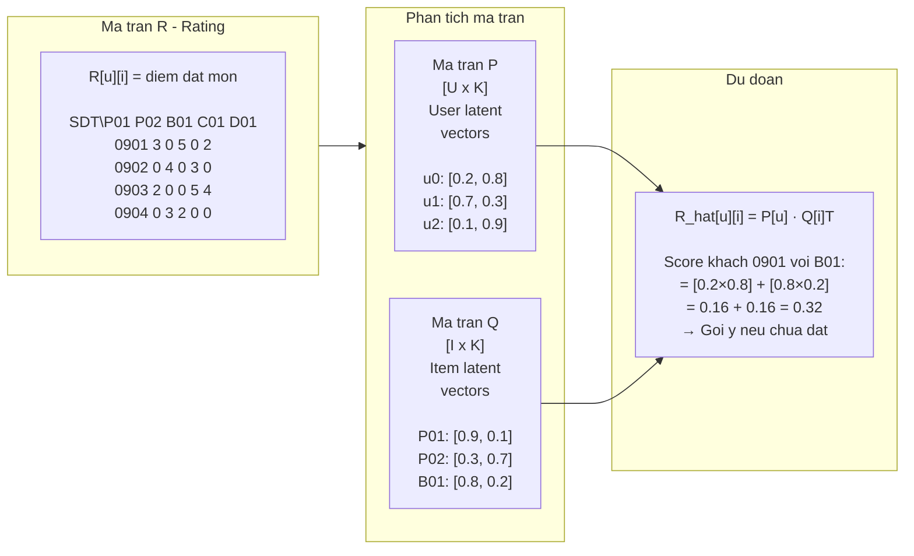

### 7.3 Cach tinh diem R[u][i] tu don hang

Khong co he thong rating 1-5 sao → dung **implicit feedback**:

```
R[u][i] = log(1 + so_lan_dat_mon_i_boi_user_u)
```

| So lan dat | R[u][i] |
|---|---|
| 0 (chua dat) | 0.0 |
| 1 lan | 0.69 |
| 2 lan | 1.10 |
| 5 lan | 1.79 |
| 10 lan | 2.40 |

### 7.4 Huan luyen: Stochastic Gradient Descent (SGD)

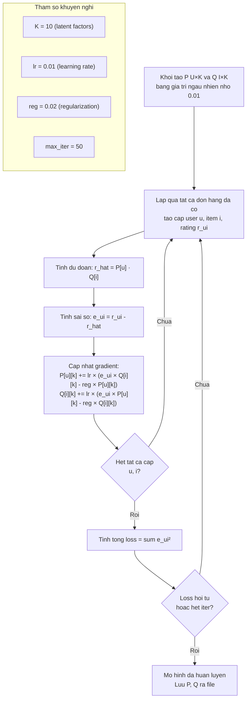

### 7.5 Sinh goi y cho khach moi dat mon

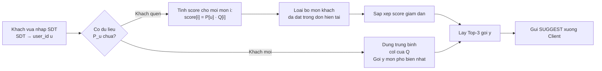

### 7.6 Cap nhat mo hinh online sau moi don

Sau khi nhan `ORDER_SUBMIT`, chay **1 buoc SGD online** de cap nhat ngay:

```cpp
// Online update sau 1 don hang moi
void onlineUpdate(int userId, int* itemIds, int* quantities, int count) {
    for (int idx = 0; idx < count; idx++) {
        int i = itemIds[idx];
        // Tinh rating tu so luong dat
        float r_ui = log(1.0f + orderHistory[userId][i] + quantities[idx]);

        // 1 buoc SGD
        float r_hat = dotProduct(P[userId], Q[i], K);
        float error  = r_ui - r_hat;

        for (int k = 0; k < K; k++) {
            float p_old = P[userId][k];
            float q_old = Q[i][k];
            P[userId][k] += LR * (error * q_old - REG * p_old);
            Q[i][k]      += LR * (error * p_old - REG * q_old);
        }

        // Cap nhat lich su dat mon cua user
        orderHistory[userId][i] += quantities[idx];
    }
}
```

### 7.7 Cau truc du lieu C++ cho LFM

```cpp
// ===== LATENT FACTOR MODEL =====
const int MAX_USERS  = 1000;   // toi da 1000 SDT khac nhau
const int MAX_MENU   = 20;
const int K          = 10;     // so latent factors
const float LR       = 0.01f;  // learning rate
const float REG      = 0.02f;  // regularization

// Ma tran phan tich
float P[MAX_USERS][K];          // User latent matrix [U x K]
float Q[MAX_MENU][K];           // Item latent matrix [I x K]

// Lich su dat mon (implicit rating)
int   orderHistory[MAX_USERS][MAX_MENU]; // so lan dat

// Bang anh xa SDT -> userId
char  phoneNumbers[MAX_USERS][11];       // "0901234567\0"
int   userCount = 0;

// Tra ve userId tu SDT, tao moi neu chua co
int getOrCreateUser(const char* phone) {
    for (int i = 0; i < userCount; i++)
        if (strcmp(phoneNumbers[i], phone) == 0) return i;
    // Tao moi
    strcpy(phoneNumbers[userCount], phone);
    // Khoi tao P[userCount] ngau nhien nho
    for (int k = 0; k < K; k++)
        P[userCount][k] = ((float)rand() / RAND_MAX) * 0.01f;
    return userCount++;
}

// Tinh diem goi y cho 1 user
float predictScore(int userId, int itemId) {
    float score = 0;
    for (int k = 0; k < K; k++)
        score += P[userId][k] * Q[itemId][k];
    return score;
}

// Lay top-K goi y, loai tru mon da co trong don hien tai
int getTopK(int userId, int* excluded, int exCount,
            int* result, int topK) {
    float scores[MAX_MENU];
    bool  skip[MAX_MENU]   = {false};

    for (int e = 0; e < exCount; e++) skip[excluded[e]] = true;

    for (int i = 0; i < menuCount; i++)
        scores[i] = skip[i] ? -1 : predictScore(userId, i);

    // Selection sort de lay top-K
    int found = 0;
    bool used[MAX_MENU] = {false};
    while (found < topK) {
        int   best      = -1;
        float bestScore = -1;
        for (int i = 0; i < menuCount; i++)
            if (!used[i] && scores[i] > bestScore)
                { bestScore = scores[i]; best = i; }
        if (best == -1) break;
        result[found++] = best;
        used[best] = true;
    }
    return found;
}
```

---

## 8. GIAO THUC MANG (Network Protocol)

### 8.1 Dinh dang tin nhan

```
[LOAI_LENH]|[NOI_DUNG]\n
```

### 8.2 Bang lenh day du

| Huong | Lenh | Noi dung | Mo ta |
|---|---|---|---|
| S → C | `START` | `sessionCode\|dateTime` | Mo ca, Client bat dau hoat dong |
| S → C | `MENU_DATA` | `P01,Pho Bo,65000\|B01,Bun Bo,60000\|...` | Gui danh sach menu |
| S → C | `USER_ACK` | `userId\|isNew\|orderCount` | Xac nhan SDT + thong tin khach |
| S → C | `SUGGEST` | `P01,0.92\|D01,0.87\|G01,0.71` | Top-3 goi y tu LFM |
| S → C | `ORDER_ACK` | `orderId\|OK` | Xac nhan da nhan don |
| S → C | `STOP` | `dateTime` | Dong ca |
| C → S | `USER_LOGIN` | `clientId\|phoneNumber` | Khach nhap SDT |
| C → S | `ITEM_ADDED` | `clientId\|userId\|itemCode\|currentCodes` | Khach them 1 mon |
| C → S | `ORDER_SUBMIT` | `clientId\|userId\|P01,2\|D01,1\|total\|discount` | Gui don hoan chinh |
| C → S | `HEARTBEAT` | `clientId\|timestamp` | Kiem tra ket noi moi 5s |

### 8.3 Sequence Diagram giao tiep mang day du

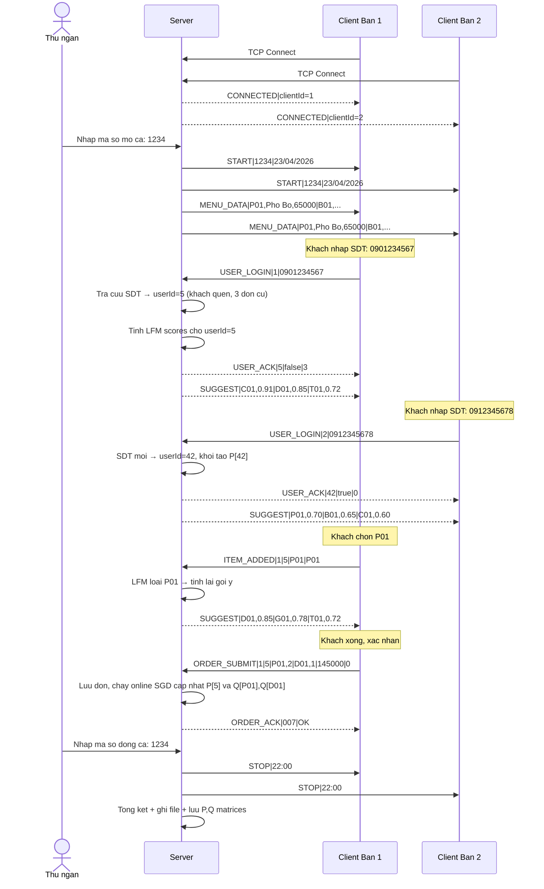

---

## 9. USE CASE DIAGRAM

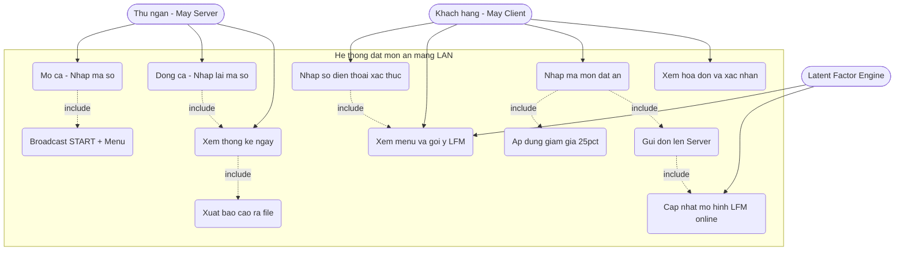

---

## 10. CLASS DIAGRAM (UML)

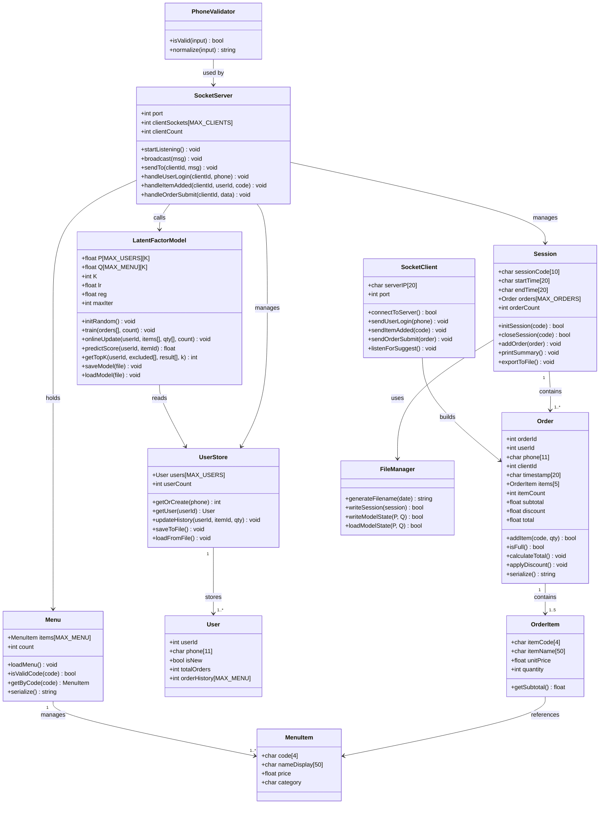

---

## 11. CO SO DU LIEU (Parallel Arrays + File)

### 11.1 ER Diagram

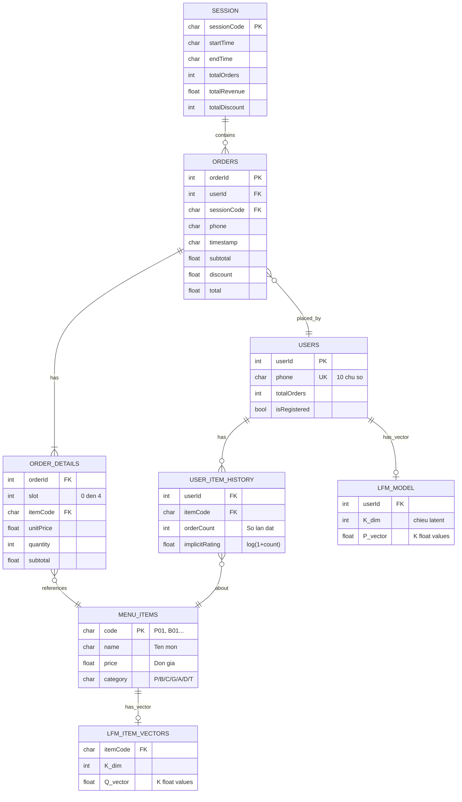

### 11.2 Khai bao C++ day du

```cpp
// ===== CONSTANTS =====
const int MAX_MENU    = 20;
const int MAX_ORDERS  = 1000;
const int MAX_ITEMS   = 5;
const int MAX_CLIENTS = 20;
const int MAX_USERS   = 1000;
const int K           = 10;       // Latent dimensions
const float LR        = 0.01f;
const float REG       = 0.02f;
const int   MAX_ITER  = 50;

// ===== MENU =====
char  menuCode[MAX_MENU][4];       // "P01", "B01"...
char  menuName[MAX_MENU][50];      // Ten mon de hien thi
float menuPrice[MAX_MENU];
char  menuCategory[MAX_MENU];      // 'P','B','C','G','A','D','T'
int   menuCount = 0;

// ===== USERS =====
char  userPhone[MAX_USERS][11];    // "0901234567\0"
int   userTotalOrders[MAX_USERS];
int   userCount = 0;

// Lich su dat mon: orderHistory[u][i] = so lan dat
int   orderHistory[MAX_USERS][MAX_MENU];

// ===== LATENT FACTOR MODEL =====
float P[MAX_USERS][K];             // User latent matrix
float Q[MAX_MENU][K];              // Item latent matrix

// ===== ORDERS =====
int   orderId[MAX_ORDERS];
int   orderUserId[MAX_ORDERS];
char  orderPhone[MAX_ORDERS][11];
int   orderClientId[MAX_ORDERS];
char  orderTime[MAX_ORDERS][20];

// Chi tiet don hang (parallel arrays 2D)
char  orderItemCode[MAX_ORDERS][MAX_ITEMS][4];
int   orderItemQty[MAX_ORDERS][MAX_ITEMS];
float orderItemPrice[MAX_ORDERS][MAX_ITEMS];
int   orderItemCount[MAX_ORDERS];

float orderSubtotal[MAX_ORDERS];
float orderDiscount[MAX_ORDERS];
float orderTotal[MAX_ORDERS];
int   totalOrders = 0;

// ===== SESSION =====
char  sessionCode[10];
char  sessionStart[20];
char  sessionEnd[20];
```

---

## 12. STATE MACHINE — CLIENT

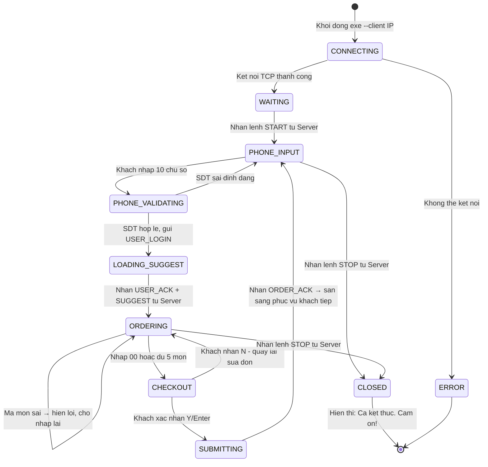

---

## 13. STATE MACHINE — SERVER

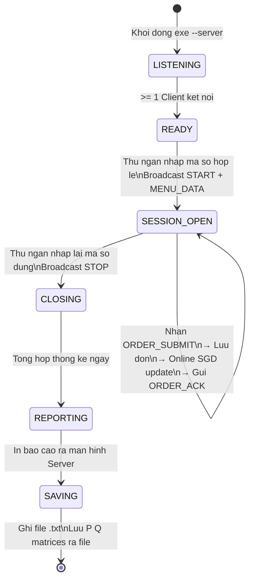

---

## 14. CAU TRUC DU AN

```
restaurant-order-app/
│
├── server/
│   ├── main_server.cpp          # Entry --server, khoi tao TCP, vong lap chinh
│   ├── socket_server.h/.cpp     # TCP listener, xu ly tung lenh tu Client
│   ├── session.h/.cpp           # Quan ly ca lam viec
│   ├── order_store.h/.cpp       # Luu tru don hang (parallel arrays)
│   ├── user_store.h/.cpp        # Quan ly SDT va lich su dat mon
│   ├── lfm.h/.cpp               # Latent Factor Model (SGD, predict, update)
│   ├── phone_validator.h/.cpp   # Kiem tra SDT hop le
│   ├── file_manager.h/.cpp      # Xuat file bao cao + luu model
│   └── menu.h/.cpp              # Quan ly menu ma mon
│
├── client/
│   ├── main_client.cpp          # Entry --client IP, ket noi TCP, vong lap UI
│   ├── socket_client.h/.cpp     # Gui/nhan lenh TCP
│   ├── order_builder.h/.cpp     # Tao don hang, kiem tra ma mon
│   ├── input_handler.h/.cpp     # Xu ly nhap lieu (chi so + ma ASCII)
│   └── display.h/.cpp           # Hien thi menu, goi y, hoa don
│
├── shared/
│   ├── protocol.h               # Enum lenh mang + parser
│   ├── menu_item.h              # Struct MenuItem (dung chung)
│   └── utils.h/.cpp             # Tien ich (thoi gian, chuoi, so...)
│
├── cli/                         # React Ink UI wrapper
│   ├── package.json
│   └── src/
│       ├── ServerApp.jsx        # UI may thu ngan
│       ├── ClientApp.jsx        # UI may ban khach
│       └── components/
│           ├── WaitingScreen.jsx      # "Cho thu ngan mo ca..."
│           ├── PhoneInput.jsx         # Nhap SDT (chi nhan so)
│           ├── MenuDisplay.jsx        # Menu + ma mon
│           ├── SuggestPanel.jsx       # Goi y LFM voi thanh score
│           ├── OrderSummary.jsx       # Tom tat don hien tai
│           ├── Invoice.jsx            # Hoa don hoan chinh
│           └── DailySummary.jsx       # Thong ke cuoi ca
│
├── data/
│   ├── menu.txt                 # Du lieu menu
│   ├── users.dat                # Lich su SDT (nhi phan)
│   ├── lfm_P.dat                # Ma tran P luu giua cac ca
│   ├── lfm_Q.dat                # Ma tran Q luu giua cac ca
│   └── reports/
│       └── report_YYYY-MM-DD.txt
│
├── CMakeLists.txt
└── README.md
```

---

## 15. THIET KE GIAO DIEN CLI

### Man hinh Server — Thu ngan

```
+----------------------------------------------------------+
|  NHA HANG VIET PHONG  —  MAY CHU THU NGAN               |
+----------------------------------------------------------+
|  Server: 192.168.1.100:8888    [DANG CHAY]               |
|  Clients: [Ban 1: OK] [Ban 2: OK] [Ban 3: CHO...]        |
+----------------------------------------------------------+
|  Nhap MA SO de MO CA (chi so):                           |
|  > [____]                                                |
+----------------------------------------------------------+
|  Don hom nay: 12   Doanh thu: 4.520.000d                |
|  Goi y LFM dung: 47 lan   Ti le chap nhan: 63%          |
+----------------------------------------------------------+
```

### Man hinh Client — Nhap so dien thoai

```
+----------------------------------------------+
|   NHA HANG VIET PHONG  —  BAN 02             |
+----------------------------------------------+
|                                              |
|   Chao mung! Vui long nhap so dien thoai:    |
|                                              |
|   SDT (10 chu so):  > [__________]           |
|                                              |
|   Luu y: Chi nhap chu so, khong can go dau   |
|   Vi du: 0901234567                          |
|                                              |
+----------------------------------------------+
```

### Man hinh Client — Khach quen

```
+----------------------------------------------+
|   NHA HANG VIET PHONG  —  BAN 02             |
+----------------------------------------------+
|   Chao mung tro lai! SDT: 0901234567         |
|   Ban da dat 7 lan. Mon yeu thich: Pho Bo    |
+----------------------------------------------+
|   MA MON  | TEN MON              | GIA       |
|   --------+----------------------+-----------|
|   P01     | Pho Bo Tai           | 65.000d   |
|   P02     | Pho Ga               | 55.000d   |
|   B01     | Bun Bo Hue           | 60.000d   |
|   C01     | Com Tam Suon Bi      | 75.000d   |
|   D01     | Tra Da               | 15.000d   |
|   D02     | Nuoc Ngot            | 20.000d   |
|   [Enter MA MON de xem them]                 |
+----------------------------------------------+
|   GỢI Y CHO BAN (dua tren lich su):          |
|   C01  Com Tam    ████████░  0.91            |
|   D01  Tra Da     ███████░░  0.85            |
|   T01  Che        █████░░░░  0.72            |
+----------------------------------------------+
|   Da chon: [P01 x1] [D01 x1]  Con lai: 3    |
|   Nhap: [MA MON] [SO LUONG]  00 = Xong       |
|   > [___] [_]                                |
+----------------------------------------------+
```

### Man hinh hoa don

```
+--------------------------------------------------+
|              HOA DON — BAN 02                    |
|     Ma GD: 1234   23/04/2026 10:35              |
|     SDT: 0901234567                             |
+------+------------------+----+--------+----------+
| STT  | Ma  | Ten mon    | SL | Don gia| T.tien   |
+------+-----+------------+----+--------+----------+
|  1   | P01 | Pho Bo Tai |  2 | 65.000 | 130.000  |
|  2   | D01 | Tra Da     |  2 | 15.000 |  30.000  |
+------+-----+------------+----+--------+----------+
|                     Tam tinh:       160.000d     |
|                     Giam gia:             0d     |
|                     TONG CONG:     160.000d     |
+--------------------------------------------------+
|  Xac nhan gui len Server?  Y = Co / N = Sua lai  |
|  > [_]                                           |
+--------------------------------------------------+
```

---

## 16. DINH DANG FILE XUAT

```
==============================================================
   BAO CAO NGAY 23/04/2026
   Ma giao dich : 1234
   Ca lam viec  : 07:00 - 22:00
   So may ban   : 3
==============================================================

DON #001 | Ban 02 | SDT: 0901234567 | 09:15
--------------------------------------------------------------
  P01  Pho Bo Tai    x2   65.000d  =  130.000d
  D01  Tra Da        x2   15.000d  =   30.000d
  Tam tinh: 160.000d | Giam: 0d | Tong: 160.000d
  [Goi y LFM duoc dung: D01]

DON #002 | Ban 01 | SDT: 0912345678 | 11:30
--------------------------------------------------------------
  C01  Com Tam Suon Bi   x5   75.000d  =  375.000d
  A01  Cha Gio           x20  80.000d  = 1.600.000d
  G01  Goi Cuon          x10  55.000d  =   550.000d
  Tam tinh: 2.525.000d | Giam 25%: 631.250d | Tong: 1.893.750d
  [Goi y LFM duoc dung: A01, G01]

==============================================================
TONG KET NGAY
  Tong so don        : 12
  Tong doanh thu     : 8.340.000d
  Tong giam gia      : 1.240.000d
  Don duoc giam      : 3 / 12
  So SDT khac nhau   : 9
  Goi y LFM su dung  : 47 / 75 (63%)
  Mon ban chay       : P01 (28 lan), C01 (19 lan), D01 (17 lan)
==============================================================
LFM MODEL STATS
  Tong users da hoc  : 42
  Latent dimensions  : K=10
  Online updates     : 12 (ca nay)
==============================================================
```

---

## 17. BANG CONG NGHE

| Thanh phan | Cong nghe | Ghi chu |
|---|---|---|
| Core logic | C/C++ | Xu ly nghiep vu, tinh toan, mang |
| TCP Socket | Winsock2 (Win) / POSIX (Linux) | Giao tiep da may LAN |
| CLI UI | React Ink (Node.js) | Giao dien terminal |
| Latent Factor ML | C++ thuan (khong thu vien) | SGD, ma tran, predict |
| Validate SDT | C++ regex / thu cong | Kiem tra 10 chu so |
| File I/O | C++ fstream | Bao cao .txt, luu model .dat |
| Build | CMake + Node.js | Compile C++ + bundle React Ink |

---

## 18. CHECKLIST TINH NANG

**Core:**
- [x] Mo ca voi ma so (chi so, khong tieng Viet)
- [x] Hien thi menu voi MA MON 3 ky tu (P01, B01...)
- [x] Dat toi da 5 mon / don bang nhap MA MON
- [x] Ket thuc chon mon bang 00 hoac du 5 mon
- [x] Tinh tong + giam gia 25% khi >= 2.000.000d
- [x] In hoa don ra man hinh Client
- [x] Thong ke tong ket cuoi ca
- [x] Xuat bao cao ra file .txt

**Mang:**
- [x] Server TCP lang nghe nhieu Client dong thoi
- [x] Broadcast START/STOP + MENU_DATA
- [x] Moi don gui ve Server theo thoi gian thuc
- [x] Heartbeat kiem tra ket noi moi 5 giay
- [x] Server xac nhan don (ORDER_ACK)

**So dien thoai:**
- [x] Bat buoc nhap SDT truoc khi dat mon
- [x] Validate: dung 10 chu so, bat dau bang 0, chi chu so
- [x] Nhan dien khach quen / khach moi
- [x] SDT la user_id trong LFM
- [x] Hien thi lich su so don cua khach quen

**Latent Factor Model:**
- [x] Ma tran P[users x K] va Q[items x K]
- [x] Huan luyen SGD tu lich su don hang lich su
- [x] Online update sau moi don hoan thanh
- [x] Predict score ca nhan hoa theo SDT
- [x] Goi y top-3 moi khi khach them mon
- [x] Goi y mac dinh (mon pho bien) cho khach moi
- [x] Luu model P, Q ra file giua cac ca
- [x] Bao cao ti le goi y duoc su dung cuoi ngay

**UX khong tieng Viet:**
- [x] Tat ca nhap lieu chi dung so va ma ASCII
- [x] Chon tuy chon bang so (1/2/3)
- [x] Xac nhan bang Y / Enter, huy bang N
- [x] Ma mon 3 ky tu (P01, B01...) de nho, de go
- [x] Ma so ca lam viec la so thuan tuy
- [x] Ket thuc chon mon bang 00

---

*Tai lieu phan tich day du nghiep vu, kien truc mang LAN, Latent Factor Model SGD,*
*va thiet ke UX toi gian hoa nhap lieu tieng Viet cho De 702.*
